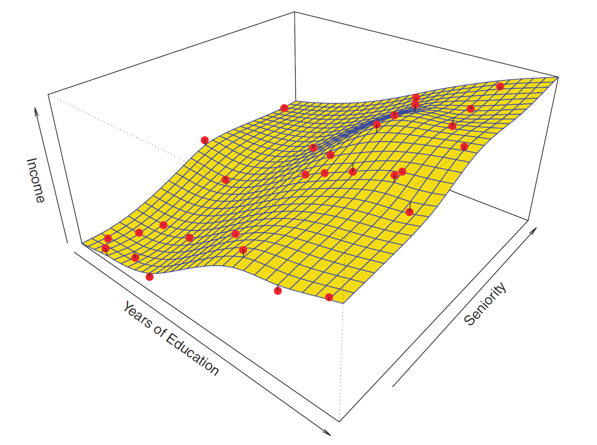

# What is Machine Learning?

* Machine Learning is the study of tools/techniques for understanding complex datasets.

* The name machine learning was coined in 1959 by Arthur Samuel.

    + "Field of study that gives computers the ability to learn without being explicitly programmed."
    

```{r , echo=FALSE}
library(tidyverse)
```


## What is Machine Learning?

Tom M. Mitchell (1998) defined algorithms studied in the machine learning field as

"A computer program is said to learn from experience E with respect to some class of tasks T and performance measure P if its performance at tasks in T, as measured by P, improves with experience E."

<!-- ## But, Textbook is Not About Machine Learning??!!! -->

<!-- Statisticians focus on the statistical aspect of problems. -->

<!-- ```{r , echo=FALSE,  fig.align='center', fig.cap="Authors of ISL", out.width = '70%'} -->
<!-- knitr::include_graphics("EFT/Authors.jpg") -->
<!-- ``` -->

## <span style="color:blue">Question!!!</span>

Suppose your email program watches which emails you do or do not mark as spam, and based on that learns how to better filter spam. According to Tom Mitchell's definition, what is the task T, experience E, and performance measure P in this setting?

* The number (or fraction) of emails correctly classified as spam/ham.
* Classifying emails as spam or ham (not spam)
* Watching you label emails as spam or ham.
  
## Statistical Learning vs Machine Learning vs Data Science

* Machine learning arose as a subfield of Artificial Intelligence.
* Statistical learning arose as a subfield of Statistics.
* There is much overlap, a great deal of "cross-fertilization".
* "Data Science" - Reflects the fact that both statistical and machine learning are about data.
* "Machine learning" or "Data Science" are "fancier" terms.


## Notations

* Matrices - Bold, Upper-case $\mathbf{X}$

* Vectors - Bold, Lower-case $\mathbf{x}$

* Scalars - Normal, Lower-case $x$

* Random Variables - Normal, Upper-case $X$

* No. of data points/observations - $n$

* No. of variables - $p$

## Notations

```{r , echo=FALSE,  fig.align='center', fig.cap="A matrix of dimension n x p", out.width = '40%'}
knitr::include_graphics("EFT/DataMatrix1.png")
```

```{r , echo=FALSE,  fig.align='center', fig.cap="A n-dimensional vector", out.width = '15%'}
knitr::include_graphics("EFT/Vector.png")
```

```{r , echo=FALSE,  fig.align='center', fig.cap="Matrix", out.width = '40%'}
knitr::include_graphics("EFT/DataMatrix2.png")
```

## <span style="color:blue">Question!!!</span>

Suppose you are given the following feature matrix.

$$
\mathbf{X}=\begin{pmatrix}
8.5 & 11.2 & 7.0 & 9.3 \\
8.0 & 11.5 & 13.1 & 7.4 \\
6.4 & 9.6 & 7.0 & 6.8 \\
9.5 & -3.2 & 14.4 & 1.6
\end{pmatrix}
$$

* What are the corresponding values of $n$ and $p$?

* What will be the dimension of the corresponding response vector \(\mathbf{y}\)?

* What is the value of the 3rd feature for the 2nd observation?

## <span style="color:blue">Question!!!</span>

Suppose you have information about 867 cancer patients on their age, tumor size, clump thickness of the tumor, uniformity of cell size, and whether the tumor is malignant or benign. Based on these data, you are interested in building a model to predict the type of tumor (malignant or benign) for future cancer patients. 

* What are the values of $n$ and $p$ in this dataset?

* What are the inputs/features?

## Supervised vs Unsupervised

```{r , echo=FALSE,  fig.align='center', fig.cap="Machine Learning Tasks", out.width = '100%'}
knitr::include_graphics("EFT/SupUnsup.png")
```

## Supervised Learning

* Labeled **training data**

* Inputs/Features/Regressors/Covariates/Independent Variables

```{r , echo=FALSE,  fig.align='center', out.width = '40%'}
knitr::include_graphics("EFT/DataMatrix1.png")
```

* Response/Target/Dependent Variable

```{r , echo=FALSE,  fig.align='center', out.width = '20%'}
knitr::include_graphics("EFT/Vector.png")
```

## Supervised Learning

The objective is to learn the overall pattern of the relationship between the inputs ($\mathbf{X}$) and response ($\mathbf{y}$) in order to

* Investigate the relationship between inputs and response.
* Predict for potential unseen **test** cases.
* Assess the quality of predictions.


Supervised Learning problems can be categorized into

* **Regression** problems (response is quantitative, continuous)
* **Classification** problems (response is qualitative, categorical)

## Unsupervised Learning

* No outcome variable, just $\mathbf{X}$.
* Understand structure within data.
    + find similar groups of observations based on features (**clustering**)
    + find a smaller subset of features with the most variation (**dimensionality reduction**)
* No gold-standard.
* Easier to collect unlabeled data.
* Useful pre-processing step for supervised learning.

<!-- ## Supervised Learning -->

<!-- *Advertising* dataset -->

<!-- ```{r, echo=FALSE} -->
<!-- Advertising=read.csv("Advertising.csv") -->
<!-- Advertising$X=NULL -->
<!-- names(Advertising)=c("TV","Radio","Newspaper","Sales") -->
<!-- head(Advertising,15) -->
<!-- ``` -->

<!-- * Inputs - *TV*, *Radio*, *Newspaper* -->
<!-- * Response - *Sales* -->

<!-- ## Supervised Learning -->

<!-- ```{r , echo=FALSE,  fig.align='center', out.width = '100%'} -->
<!--  -->
<!-- ``` -->

<!-- Shown are *Sales* vs *TV*, *Radio* and *Newspaper*, with a blue straight line fit separately to each. Can we predict *Sales* using these three? -->

<!-- We could use a model -->
<!-- $$\text{Sales} \approx f(TV,Radio,Newspaper)$$ -->

## <span style="color:blue">Question!!!</span>

Some of the problems below are best addressed using a supervised learning algorithm, while others with an unsupervised learning algorithm. In each case, identify whether the problem belongs to the supervised or unsupervised learning paradigm. (Assume some appropriate dataset is available for your algorithm to "learn" from.)

* Examine the statistics of two football teams, and predict which team will win tomorrow's match (given historical data of teams' wins/losses to learn from).

* Given genetic (DNA) data from a person, predict the odds of the person developing diabetes over the next 10 years.

* Take a collection of 1000 essays written on the US economy, and find a way to automatically group these essays into a small number of groups of essays that are somehow "similar" or "related".

* Examine a large collection of emails that are known to be spam, to discover if there are sub-types of spam email.

* Suppose you have information about 867 cancer patients on their age, tumor size, clump thickness of the tumor, uniformity of cell size, and whether the tumor is malignant or benign. Based on these data, you are interested in building a model to predict the type of tumor (malignant or benign) for future cancer patients.

* Examine data on the income and years of education of adults in a neighborhood and build a model to predict the income from years of education.

## Supervised Learning

More mathematically, the "true"/population model can be represented by

$$Y=f(\mathbf{X}) + \epsilon$$

where $\epsilon$ is a **random** error term (includes measurement error, other discrepancies) independent of $\mathbf{X}$ and has mean zero.

## Supervised Learning

The primary objective is to:

* **Regression**: response $Y$ is quantitative

Build a model $\hat{Y} = \hat{f}(\mathbf{X})$

* **Classification**: response $Y$ is qualitative

Build a classifier $\hat{Y}=\hat{C}(\mathbf{X})$

## Supervised Learning

**Income dataset**

```{r , echo=FALSE,  fig.align='center', out.width = '100%'}
knitr::include_graphics("EFT/2.2.png")
```

## Supervised Learning

**Income dataset**

```{r , echo=FALSE,  fig.align='center', out.width = '85%'}
knitr::include_graphics("EFT/2.3.png")
```

## Supervised Learning: Why Estimate $f(\mathbf{X})$?

We wish to know about $f(\mathbf{X})$ for two reasons:

* Prediction at new unseen data points $x_0$

$$\hat{y}_0=\hat{f}(x_0) \ \ \ \text{or} \ \ \ \hat{y}_0=\hat{C}(x_0)$$

* Inference: Understand the relationship between $\mathbf{X}$ and $Y$.

* An ML algorithm that is developed mainly for predictive purposes is often termed as a **Black Box** algorithm.

## Supervised Learning: Prediction and Inference

**Income dataset**

```{r , echo=FALSE,  fig.align='center', out.width = '100%'}
knitr::include_graphics("EFT/2.2.png")
```

<!-- ## Supervised Learning: Inference -->

<!-- ```{r , echo=FALSE,  fig.align='center', out.width = '100%'} -->
<!--  -->
<!-- ``` -->

## Supervised Learning: Prediction and Inference

**Income dataset**

```{r , echo=FALSE,  fig.align='center', out.width = '85%'}
knitr::include_graphics("EFT/2.4.png")
```

<!-- ## Supervised Learning: What is a Good Choice of $\hat{f}(\mathbf{X})$? -->

<!-- ```{r , echo=FALSE,  fig.align='center', out.width = '80%'} -->
<!-- knitr::include_graphics("EFT/SLfig.png") -->
<!-- ``` -->

<!-- What is a good value of $\hat{f}(\mathbf{X})$, say at $\mathbf{X}=x=4$? A possible value is -->

<!-- $$\hat{f}(\mathbf{X})=E(Y|\mathbf{X}=4)$$ -->

<!-- $E(Y|\mathbf{X}=4)$ means **expected value** (average) of $Y$ ate $\mathbf{X}=4$. -->

## Supervised Learning: Prediction

When we estimate $f(\mathbf{X})$ using $\hat{f}(\mathbf{X})$, then,

$$E\left[Y-\hat{Y}\right]^2=E\left[f(\mathbf{X})+\epsilon - \hat{f}(\mathbf{X})\right]^2=\underbrace{\left[f(\mathbf{X})-\hat{f}(\mathbf{X})\right]^2}_{Reducible} + \underbrace{Var(\epsilon)}_{Irreducible}$$

$E\left[Y-\hat{Y}\right]^2$: Expected (average) squared difference between predicted and actual (observed) response.

We will focus on techniques for estimating $f(\mathbf{X})$ with the objective of minimizing the reducible error.

## <span style="color:blue">Question!!!</span>

Which of the following statements are true for the random error term $\epsilon$ in the expression $Y=f(\mathbf{X})+\epsilon$?

* $\epsilon$ depends on $\mathbf{X}$ and has mean zero.

* $Var(\epsilon)$ is also known as the irreducible error.

* $\epsilon$ is independent of $\mathbf{X}$ and has mean zero.

* $\epsilon$ is some fixed but unknown function of $\mathbf{X}$.
  
  
## Supervised Learning: How Do We Estimate $f(\mathbf{X})$?

Broadly speaking, we have two approaches.

* Parametric and Structured Methods
    + A functional form of $f(\mathbf{X})$ is assumed, such as $$f(\mathbf{X})=\beta_0 + \beta_1 \mathbf{x}_1 + \beta_2 \mathbf{x}_2 + \ldots + \beta_p \mathbf{x}_p$$
    + We estimate the parameters $\beta_0, \beta_1, \ldots, \beta_p$ by fitting the model to labeled training data.

## Supervised Learning: Parametric Methods

**Income dataset**

```{r , echo=FALSE,  fig.align='center', out.width = '100%'}
knitr::include_graphics("EFT/2.2.png")
```

## Supervised Learning: Parametric Methods

**Income dataset**

```{r fig1, fig.show = "hold", fig.cap=c("Linear Model Fit to Income Data"), out.width = "50%", fig.align = "center", echo=FALSE}
knitr::include_graphics("EFT/2.3.png")
knitr::include_graphics("EFT/2.4.png")
```

$$\text{Income} \approx \beta_0 + \beta_1 \times \text{Years of Education} + \beta_2 \times \text{Seniority}$$

## Supervised Learning: Non-parametric Methods

Non-parametric approaches do not make any explicit assumptions about the functional form of $f(\mathbf{X})$. A very large number of observations (compared to a parametric approach) is required to fit a model using the non-parametric approach.

**Income dataset**

```{r fig2, fig.show = "hold", fig.cap=c("Smooth Thin-plate Spline Fit to Income Data"), out.width = "50%", fig.align = "center", echo=FALSE}
knitr::include_graphics("EFT/2.3.png")

```

## Supervised Learning: Flexibility of Models

Flexibility refers to the smoothness of functions. (More theoretically, flexibility depends on the number of parameters of the function).

```{r , echo=FALSE,  fig.align='center', out.width = '80%'}
knitr::include_graphics("EFT/2.2.png")
```

More flexible $\implies$ More complex $\implies$ Less Smooth $\implies$ Less Restrictive $\implies$ Less Interpretable

## Supervised Learning: Some Trade-offs

* Prediction Accuracy versus Interpretability

* Good Fit versus Over-fit or Under-fit


## Supervised Learning: Some Trade-offs

```{r , echo=FALSE,  fig.align='center', out.width = '100%'}
knitr::include_graphics("EFT/2.7.png")
```

