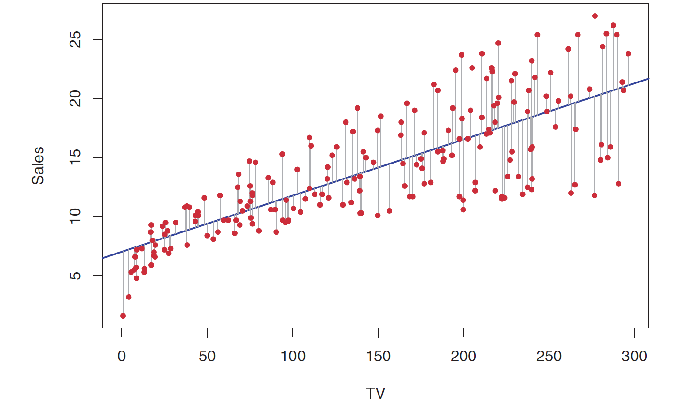

# Supervised Learning: Assessing Model Accuracy

Why are we going to study so many different ML techniques?

**There is no free lunch in statistics**: No one method dominates all others over all possible datasets.


## Supervised Learning: Assessing Model Accuracy

Suppose we have labeled training data $(x_1,y_1), (x_2, y_2), \ldots, (x_n,y_n)$, i.e, $n$ training data points/observations.

We fit/train a model $\hat{y}=\hat{f}(x)$ (or, a classifier $\hat{y}=\hat{C}(x)$) on the training data and obtain estimates $\hat{f}(x_1), \hat{f}(x_2), \ldots, \hat{f}(x_n)$ (or, $\hat{C}(x_1), \hat{C}(x_2), \ldots, \hat{C}(x_n)$).

We could then compute the

* **Regression**

$$\text{Training MSE}=\text{Average}_{Training} \left(y-\hat{f}(x)\right)^2 = \frac{1}{n} \displaystyle \sum_{i=1}^{n} \left(y_i-\hat{f}(x_i)\right)^2$$


* **Classification**

$$\text{Training Error Rate}=\text{Average}_{Training} \ \left[I \left(y\ne\hat{C}(x)\right) \right]= \frac{1}{n} \displaystyle \sum_{i=1}^{n} \ I\left(y_i \ne \hat{C}(x_i)\right)$$


## Supervised Learning: Assessing Model Accuracy

But in general, we are not interested in how the method works on the training data. We want to measure the accuracy of the method on previously unseen test data.

Suppose, if possible, we have fresh test data, $(x_1^{test},y_1^{test}), (x_2^{test},y_2^{test}), \ldots, (x_m^{test},y_m^{test})$. Then we can compute,

* **Regression**

$$\text{Test MSE}=\text{Average}_{Test} \left(y-\hat{f}(x)\right)^2 = \frac{1}{m} \displaystyle \sum_{i=1}^{m} \left(y_i^{test}-\hat{f}(x_i^{test})\right)^2$$


* **Classification**

$$\text{Test Error Rate}=\text{Average}_{Test} \ \left[I \left(y\ne\hat{C}(x)\right) \right]= \frac{1}{m} \displaystyle \sum_{i=1}^{m} \ I\left(y_i^{test} \ne \hat{C}(x_i^{test})\right)$$


## Supervised Learning: Assessing Model Accuracy

In the following slides, we look at three different examples with simulated toy datasets. We work within the regression setting (but the ideas also extend to the classification setting) and three different $\hat{f}(.)$'s.

* Linear Regression (Orange)
* Smoothing Spline 1 (Blue)
* More flexible Smoothing Spline 2 (Green)

The "true" function (simulated) is $f(.)$ (black).


## Supervised Learning: Assessing Model Accuracy

**Simulated toy dataset**

```{r , echo=FALSE,  fig.align='center', out.width = '100%'}
knitr::include_graphics("EFT/2.9.png")
```

## Supervised Learning: Assessing Model Accuracy

**Simulated toy dataset**

```{r , echo=FALSE,  fig.align='center', out.width = '100%'}

```

## Supervised Learning: Assessing Model Accuracy

**Simulated toy dataset**

```{r , echo=FALSE,  fig.align='center', out.width = '100%'}

```

## Supervised Learning: Bias-Variance Trade-off

Why is the Test MSE U-shaped?

Suppose we have fit a model $\hat{f}(x)$ to some training data. Let the "true" model be $Y=f(x)+\epsilon$. Let $(x_0, y_0)$ be a test observation.

We have,

$$\underbrace{E\left(y_0-\hat{f}(x_0)\right)^2}_{total \ error}=\underbrace{Var\left(\hat{f}(x_0)\right)}_{source \ 3} + \underbrace{\left[Bias\left(\hat{f}(x_0)\right)\right]^2}_{source \ 2}+\underbrace{Var(\epsilon)}_{source \ 1}$$

where $Bias\left(\hat{f}(x_0)\right)=E\left(\hat{f}(x_0)\right)-f(x_0)$

## Supervised Learning: Bias-Variance Trade-off

* source 1: how $y$ differs from "true" $f(x)$

* source 2: how $\hat{f}(x)$ (when fitted to the test data) differs from $f(x)$

* source 3: how $\hat{f}(x)$ varies among different randomly selected possible training data

## Supervised Learning: Bias-Variance Trade-off

```{r , echo=FALSE,  fig.align='center', out.width = '100%'}
knitr::include_graphics("EFT/2.12.png")
```


## <span style="color:blue">Question!!!</span>

As the flexibility of a model $\hat{f}(\mathbf{X})$ increases,

* its variance $\underline{\hspace{5cm}}$ (increases/decreases)

* its bias $\underline{\hspace{5cm}}$ (increases/decreases)

* its training MSE $\underline{\hspace{5cm}}$ (increases/decreases)

* its test MSE $\underline{\hspace{5cm}}$ (increases/decreases/U-shaped)


<!-- ## Supervised Learning: Classification -->

<!-- Here the response $Y$ is qualitative (categorical). -->

<!-- The objectives are -->

<!-- * Build a classifier $\hat{Y}=\hat{C}(\mathbf{X})$ that assigns a class label to a future unlabeled observation. -->
<!-- * Assess the performance $\hat{C}(\mathbf{X})$. -->
<!-- * Understand relationship between $\mathbf{X}$ and $Y$. -->

<!-- ## Supervised Learning: Classification Error Rates -->

<!-- Suppose we have training data $(x_1,y_1), (x_2, y_2), \ldots, (x_n,y_n)$. We fit a classifier $\hat{y}=\hat{C}(x)$. Similar to regression settings, we have -->

<!-- $$\text{Training Error Rate}=\text{Average}_{Training} \ \left[I \left(y\ne\hat{C}(x)\right) \right]= \frac{1}{n} \displaystyle \sum_{i=1}^{n} \ I\left(y_i \ne \hat{C}(x_i)\right)$$ -->

<!-- Suppose, if possible, we have fresh test data, $(x_1^{test},y_1^{test}), (x_2^{test},y_2^{test}), \ldots, (x_m^{test},y_m^{test})$. Then, -->

<!-- $$\text{Test Error Rate}=\text{Average}_{Test} \ \left[I \left(y\ne\hat{C}(x)\right) \right]= \frac{1}{m} \displaystyle \sum_{i=1}^{m} \ I\left(y_i^{test} \ne \hat{C}(x_i^{test})\right)$$ -->

<!-- ## Supervised Learning: Bayes Classifier -->

<!-- Suppose we have training data $(x_1,y_1), (x_2, y_2), \ldots, (x_n,y_n)$ and there are $K$ possible classes numbered $1,2, \ldots, K$. -->

<!-- Define, **conditional class probabilities** -->

<!-- $$p_k(x)=P(Y=k | X=x), \ \ \ k=1,2,\ldots,K$$ -->

<!-- For a test data point $(x_0,y_0)$, the Bayes classifier is -->

<!-- $$\hat{y}=\hat{C}(x_0)=j \ \ \text{if} \ \ p_j(x_0)=\text{max}\{p_1(x_0), p_2(x_0), \ldots, p_K(x_0)\}$$ -->

<!-- The Bayes classifier has smallest possible test error rate, called **Bayes error rate**. -->

<!-- ## Supervised Learning: Bayes Classifier -->

<!-- ```{r , echo=FALSE,  fig.align='center', out.width = '80%'} -->
<!--  -->
<!-- ``` -->

<!-- ## Linear Regression -->

<!-- * Supervised Learning -->

<!-- * Regression problem -->

<!-- * Parametric Approach (assumes a linear relationship between response and features) -->

<!-- * Simple approach, building block to more sophisticated statistical learning approaches. -->

<!-- ## Linear Regression -->

<!-- ```{r , echo=FALSE,  fig.align='center', out.width = '100%'} -->
<!-- knitr::include_graphics("EFT/2.1.png") -->
<!-- ``` -->

<!-- ## Linear Regression -->

<!-- Questions we might ask: -->

<!-- * Is there a relationship between advertising budget and -->
<!-- sales? -->
<!-- * How strong is the relationship between advertising budget -->
<!-- and sales? -->
<!-- * Which media contribute to sales? -->
<!-- * How accurately can we predict future sales? -->
<!-- * Is the relationship linear? -->
<!-- * Is there synergy among the advertising media? -->

## Simple Linear Regression (SLR)

Response $Y$ and a single predictor variable $X$. We assume

$$Y=f(\mathbf{X}) + \epsilon=\beta_0 + \beta_1 X+ \epsilon$$

Parameters/Coefficients: $\beta_0$ (intercept) and $\beta_1$ (slope)

Training data: $(x_1,y_1), (x_2, y_2), \ldots, (x_n,y_n)$

We use training data to find $\hat{\beta}_0$ and $\hat{\beta}_1$ such that

$$\hat{y}=\hat{\beta}_0 + \hat{\beta}_1 \ x$$

## <span style="color:blue">Question!!!</span>

Linear regression is

* $\underline{\hspace{5cm}}$ (supervised/unsupervised)

* $\underline{\hspace{5cm}}$ (regression/classification)

* $\underline{\hspace{5cm}}$ (parametric/non-parametric)


## SLR: Estimating Parameters

Training data: $(x_1,y_1), (x_2, y_2), \ldots, (x_n,y_n)$

Observed response: $y_i$ for $i=1,\ldots,n$

Predicted response: $\hat{y}_i$ for $i=1, \ldots, n$

Residual: $e_i=y_i - \hat{y}_i$ for $i=1, \ldots, n$

Residual Sum of Squares (RSS): $RSS =e^2_1+e^2_2+\ldots+e^2_n$

Problem: Find $\hat{\beta}_0$ and $\hat{\beta}_1$ which minimizes $RSS$

<!-- ## SLR: Estimating Parameters -->

<!-- ```{r , echo=FALSE,  fig.align='center', out.width = '100%'} -->
<!--  -->
<!-- ``` -->

## SLR: Estimating Parameters

```{r , echo=FALSE,  fig.cap="Three-dimensional plot of RSS", fig.align='center', out.width = '60%'}
knitr::include_graphics("EFT/3.2.png")
```

## SLR: Estimating Parameters

The **least squares** regression coefficient estimates are

$$\hat{\beta}_1=\dfrac{\displaystyle\sum_{i=1}^n (x_i-\bar{x})(y_i-\bar{y})}{\displaystyle\sum_{i=1}^n (x_i-\bar{x})^2}$$

$$\hat{\beta}_0=\bar{y}- \hat{\beta}_1 \ \bar{x}$$
 where $\bar{y}=\dfrac{1}{n} \displaystyle\sum_{i=1}^n y_i$ and $\bar{x}=\dfrac{1}{n} \displaystyle\sum_{i=1}^n x_i$.


## Ames Housing Dataset

Contains data on 881 properties in Ames, IA.

```{r}
ames <- readRDS("AmesHousing.rds")   # read in the dataset after specifying directory
```


## Ames Housing dataset  {.smaller}

Variable descriptions:

* `Sale_Price`: Property sale price in USD
* `Gr_Liv_Area`: Above grade (ground) living area square feet
* `Garage_Type`: Garage location
* `Garage_Cars`: Size of garage in car capacity
* `Garage_Area`: Size of garage in square feet
* `Street`: Type of road access to property
* `Utilities`: Type of utilities available
* `Pool_Area`: Pool area in square feet
* `Neighborhood`: Physical locations within Ames city limits
* `Screen_Porch`: Screen porch area in square feet
* `Overall_Qual`: Rates the overall material and finish of the house
* `Lot_Area`: Lot size in square feet
* `Lot_Frontage`: Linear feet of street connected to property
* `MS_SubClass`: Identifies the type of dwelling involved in the sale.
* `Misc_Val`: Dollar value of miscellaneous feature
* `Open_Porch_SF`: Open porch area in square feet
* `TotRms_AbvGrd`: Total rooms above grade (does not include bathrooms)
* `First_Flr_SF`: First Floor square feet
* `Second_Flr_SF`: Second floor square feet
* `Year_Built`: Original construction date


<!-- ## Simple Linear Regression (SLR)  -->

<!-- **FootHeight dataset** -->

<!-- Data recorded from crime scenes on the footprint (in cms) and height (in inches) for 20 randomly selected people who were identified as criminals. -->

<!-- ```{r, echo=FALSE} -->
<!-- Advertising=read.csv("Advertising.csv") -->
<!-- Advertising$X=NULL -->
<!-- names(Advertising)=c("TV","Radio", "Newspaper","Sales") -->
<!-- head(Advertising[,c(1,4)],15) -->
<!-- ``` -->


<!-- ## Simple Linear Regression (SLR)  -->

<!-- **FootHeight dataset** -->

<!-- ```{r} -->
<!-- library(tidyverse)   # load the tidyverse package -->
<!-- fh <- read_csv("FootHeight.csv")   # read in the dataset after specifying directory -->
<!-- head(fh, 10)   # prints the first 10 observations -->
<!-- ``` -->


## SLR: Estimating Parameters

**Ames Housing dataset**

```{r}
slrfit <- lm(Sale_Price ~ Gr_Liv_Area, data = ames)   # fit the SLR model
summary(slrfit)   # produce result summaries of the SLR model
```

## SLR: Model

**Ames Housing dataset**

We have, $\hat{\beta}_0=10546.305$ and $\hat{\beta}_1=114.504$.

The **least squares regression model** is

$$\widehat{\text{Sale_Price}} = 10546.305 + 114.504 \times \text{Gr_Liv_Area}$$

## SLR: Model

**Ames Housing dataset**

```{r, fig.align='center', fig.height=5, fig.width=8}
ggplot(data = ames, aes(x = Gr_Liv_Area, y = Sale_Price)) +
  geom_point() +   # create scatterplot
  geom_smooth(method = "lm", se = FALSE)   # add the SLR line
```


## SLR: Prediction

**Ames Housing dataset**

For a house with `Gr_Liv_Area` equaling 1000 square feet, we have

$$\widehat{\text{Sale_Price}} = 10546.305 + 114.504 \times \text{Gr_Liv_Area} = 10546.305 + 114.504 \times 1003 \approx 125393.8 \ \text{USD}$$

```{r}
predict(slrfit, newdata = data.frame(Gr_Liv_Area = 1003))   # predict response for a given value of x
```

The observed sale price of a property with `Gr_Liv_Area` equaling 1000 square feet is 142500 USD. Then, 

$\text{residual} = \text{observed}-\text{predicted} \approx 142500 - 125393.6 \approx  17106.4$

**Note**: We should not attempt to predict the response for a value of the predictor that lies outside the range of our data. This is called **extrapolation**, and the predictions tend to be unreliable.


## SLR: Interpreting Parameters

**Ames Housing dataset**

* $\hat{\beta}_0=10546.305$: When `Gr_Liv_Area` is 0 square feet, the predicted sale price is approximately 10546.305 USD.

* $\hat{\beta}_1=114.504$: For every 1 square foot increase in `Gr_Liv_Area`, `Sale_Price` is expected to increase by approximately 114.504 USD.


<!-- ## SLR: Assessing Accuracy of Parameter Estimates -->

<!-- $$SE\left(\hat{\beta}_0\right)^2=\sigma^2\left(\frac{1}{n}+\frac{\bar{x}^2}{\sum_{i=1}^n (x_i-\bar{x})^2}\right)$$ -->
<!-- $$SE\left(\hat{\beta}_1\right)^2=\dfrac{\sigma^2}{\sum_{i=1}^n (x_i-\bar{x})^2}$$ -->

<!-- where $\sigma^2=Var(\epsilon)$ -->

<!-- ## SLR: Assessing Accuracy of Parameter Estimates -->

<!-- 95% approximate **confidence interval** for $\beta_1$ is -->

<!-- $$\left[\hat{\beta}_1-2 \cdot SE\left(\hat{\beta}_1\right), \hat{\beta}_1+2 \cdot SE\left(\hat{\beta}_1\right)\right]$$ -->

<!-- ```{r, echo=FALSE} -->
<!-- confint(slrfit) -->
<!-- ``` -->

<!-- ## SLR: Assessing Accuracy of Parameter Estimates -->

<!-- **Hypothesis Testing** -->

<!-- Null hypothesis $H_0$: There is no relationship between $\mathbf{x}$ and $Y$. -->

<!-- Alternative hypothesis $H_a$: There is some relationship between $\mathbf{x}$ and $Y$. -->

<!-- $$H_0: \beta_1=0 \ \ \ \text{versus} \ \ \ H_0: \beta_1 \ne 0$$ -->

<!-- We compute a $t$-statistic $$t=\dfrac{\hat{\beta}_1-0}{SE\left(\hat{\beta}_1\right)}$$ -->

<!-- ## SLR: Assessing Accuracy of Parameter Estimates -->

<!-- Assuming $H_0$ is true $\left(\beta_1=0\right)$, the above $t$-statistic follows a $t$ distribution with $n-2$ degrees of freedom. -->

<!-- Assuming $H_0$ is true, we can compute the probability of observing any value as or more extreme than $|t|$, called the **p-value**. -->

<!-- Small p-value implies there is an association/relationship between the predictor and the response. -->

<!-- ## SLR: Assessing Accuracy of Parameter Estimates -->

<!-- ```{r, echo=FALSE} -->
<!-- summary(slrfit) -->
<!-- ``` -->

## SLR: Assessing Accuracy of Model

* **Residual Standard Error (RSE)**

$$RSE=\sqrt{\dfrac{RSS}{n-2}}$$

RSE is considered as a measure of the **lack of fit** of the linear model to the data. It is the average amount that the response will deviate from the true regression line. It is measured in the units of the response variable.

<!-- ## SLR: Assessing Accuracy of Model -->

* $R^2$ **statistic**

$$R^2=\dfrac{TSS-RSS}{TSS}$$

where $TSS=\sum_{i=1}^n \left(y_i-\bar{y}\right)^2$

$R^2$ measures the proportion of variability in the response that is explained by the linear regression model using the predictor variable.

$R^2$ is unitless, $0 < R^2 < 1$, and is generally expressed as a percentage.


## SLR: Assessing Accuracy of Model

**Ames Housing dataset**

```{r}
summary(slrfit)  # produce result summaries of the SLR model
```


## <span style="color:blue">Your Turn!!!</span>

The **Advertising.csv** dataset contains data on the **sales** (in 1000 units) of a product in 200 different markets, along with advertising budgets (in \$1000) for the product for three different media: **TV**, **radio**, and **newspaper**.

1. Create an SLR model `slrfit1` with **sales** as response and **TV** as predictor. Display the least squares regression line on a scatterplot.

2. Create another SLR model `slrfit2` with **sales** as response and **radio** as predictor. Predict the sales when the radio advertising budgets are \$20,000 and \$40,000.

3. Between `slrfit1` and `slrfit2`, which model is better in terms of the variability explained within **sales**?

4. Between TV and radio advertising budgets, which would result in a higher increase in sales for an additional \$1000 investment?


## <span style="color:blue">Question!!!</span>

Consider the population model $Y = \beta_0 + \beta_1 X + \epsilon$. The estimated model is $\hat{y} = \hat{\beta}_0 + \hat{\beta}_1 x$. Reflecting on the concepts from week 1, fill in the blanks below.

* If $\beta_0$ and $\beta_1$ were known ("truth" known), the discrepancy between response $Y$ and $\beta_0 + \beta_1 X$ is related to the $\underline{\hspace{5cm}}$ (irreducible/reducible) error.

* The inaccuracy of $\hat{\beta}_0$ and $\hat{\beta}_1$ as estimates of $\beta_0$ and $\beta_1$ is related to the $\underline{\hspace{5cm}}$ (irreducible/reducible) error.


## <span style="color:blue">Question!!!</span>

The least squares approach

* minimizes the sum of squared predictor values.

* minimizes the sum of squared response values.

* minimizes the sum of squared residuals.

* maximizes the sum of squared residuals.


## <span style="color:blue">Question!!!</span>

Geometrically, the residual for the $i^{th}$ observation in a regression model is the

* horizontal distance between the observed response and the vertical axis.

* distance of the predicted response from the horizontal axis.

* distance of the predicted response from the vertical axis.

* vertical distance between the observed response and predicted response.


## Regression: Conditional Averaging

**Ames Housing dataset**

```{r, fig.align='center', fig.height=4, fig.width=7}
ggplot(data = ames, aes(x = Gr_Liv_Area, y = Sale_Price)) +
  geom_point() +   # create scatterplot
  geom_smooth(method = "lm", se = FALSE)   # add the SLR line
```


<!-- ```{r , echo=FALSE,  fig.align='center', out.width = '80%'} -->
<!-- knitr::include_graphics("EFT/SLfig.png") -->
<!-- ``` -->

What is a good value of $\hat{f}(x)$, say at $x=1008$?


## Regression: Conditional Averaging

What is a good value of $\hat{f}(x)$, say at $x=1008$? A possible value is

$$\hat{f}(x)=E(Y|x=1008)$$

$E(Y|x=1008)$ means **expected value**, or, the **average of the observed responses** at $x=1008$.

But we may not observe responses for certain $x$ values.

<!-- ## K-Nearest Neighbors -->

<!-- * Non-parametric approach -->

<!-- * Can be used for both regression and classification problems -->

## K-Nearest Neighbors Regression

* Non-parametric approach

* Given a value for $K$ and a test data point $x_0$,

$$\hat{f}(x_0)=\dfrac{1}{K} \sum_{x_i \in \mathcal{N}_0} y_i=\text{Average} \ \left(y_i \ \text{for all} \ i:\ x_i \in \mathcal{N}_0\right) $$

where $\mathcal{N}_0$ is known as the **neighborhood** of $x_0$.


* The method is based on the concept of closeness of $x_i$'s from $x_0$ for inclusion in the neighborhood $\mathcal{N}_0$. Usually, the **Euclidean distance** is used as a measure of closeness. The Euclidean distance between two $p$-dimensional vectors $\mathbf{a}=(a_1, a_2, \ldots, a_p)$ and $\mathbf{b}=(b_1, b_2, \ldots, b_p)$ is 

$$||\mathbf{a}-\mathbf{b}||_2 = \sqrt{(a_1-b_1)^2 + (a_2-b_2)^2 + \ldots + (a_p-b_p)^2}$$

## K-Nearest Neighbors Regression: Fit

**Ames Housing dataset**

```{r, message=FALSE}
library(caret)   # load the caret package

knnfit1 <- knnreg(Sale_Price ~ Gr_Liv_Area, data = ames, k = 1)   # 1-nn regression

knnfit5 <- knnreg(Sale_Price ~ Gr_Liv_Area, data = ames, k = 5)  # 5-nn regression
```


## K-Nearest Neighbors Regression: Prediction

**Ames Housing dataset**

```{r}
nearest_neighbors <- ames %>% 
  select(Sale_Price, Gr_Liv_Area) %>%
  mutate(distance = sqrt((1008-Gr_Liv_Area)^2)) %>%   # calculate distance
  arrange(distance)   # sort by increasing distance

predict(knnfit1, newdata = data.frame(Gr_Liv_Area = 1008))  # 1-nn prediction

predict(knnfit5, newdata = data.frame(Gr_Liv_Area = 1008))  # 5-nn prediction
```


## Regression Methods: Comparison

**Ames Housing dataset**

```{r, echo=FALSE, fig.align='center', fig.height=5, fig.width=8, fig.cap="dashed cyan: 1-nn fit, dotted red: 5-nn fit, blue: linear regression fit"}
# obtain predictions for all training data points
knn_1 <- predict(knnfit1, newdata = data.frame(Gr_Liv_Area = min(ames$Gr_Liv_Area, na.rm = TRUE):max(ames$Gr_Liv_Area, na.rm = TRUE)))
knn_5 <- predict(knnfit5, newdata = data.frame(Gr_Liv_Area = min(ames$Gr_Liv_Area, na.rm = TRUE):max(ames$Gr_Liv_Area, na.rm = TRUE)))
p <-  predict(slrfit, newdata = data.frame(Gr_Liv_Area = min(ames$Gr_Liv_Area, na.rm = TRUE):max(ames$Gr_Liv_Area, na.rm = TRUE)))

# column bind original data with predicted values
# ames1 <- ames %>% select(Sale_Price, Gr_Liv_Area) %>% filter(!is.na(Gr_Liv_Area))
predictions <- data.frame(Gr_Liv_Area = min(ames$Gr_Liv_Area, na.rm = TRUE):max(ames$Gr_Liv_Area, na.rm = TRUE), 
                          linear = p, knn_1, knn_5)

# plot the three models
ggplot(data = ames, aes(x = Gr_Liv_Area, y = Sale_Price)) + 
  geom_point() + 
  geom_line(data = predictions, aes(x = Gr_Liv_Area, y = knn_1), color = "cyan", linetype = "dashed", linewidth = 1) +   # 1-nn regression
  geom_line(data = predictions, aes(x = Gr_Liv_Area, y = knn_5), color = "red", linetype = "dotted", linewidth = 1) +   # 5-nn regression
  geom_line(data = predictions, aes(x = Gr_Liv_Area, y = linear), color = "blue", linewidth = 1)
```


## <span style="color:blue">Your Turn!!!</span>

For the **Advertising.csv** dataset, create a 10-nearest neighbors fit **knnfit10** with **sales** as response and **TV** as predictor. Obtain the predicted **sales** for $\text{TV} = 225,000$.


## <span style="color:blue">Question!!!</span>

As $k$ in KNN regression increases,

* the flexibility of the fit $\underline{\hspace{5cm}}$ (increases/decreases)

* the bias of the fit $\underline{\hspace{5cm}}$ (increases/decreases)

* the variance of the fit $\underline{\hspace{5cm}}$ (increases/decreases)


<!-- ```{r , echo=FALSE,  fig.align='center', out.width = '90%'} -->
<!-- knitr::include_graphics("EFT/SL1.png") -->
<!-- ``` -->


<!-- ## Linear Regression vs K-Nearest Neighbors -->

<!-- ```{r , echo=FALSE,  fig.align='center', out.width = '70%'} -->
<!-- knitr::include_graphics("EFT/3.17.png") -->
<!-- ``` -->

<!-- ```{r , echo=FALSE,  fig.align='center', out.width = '70%'} -->
<!-- knitr::include_graphics("EFT/3.18.png") -->
<!-- ``` -->

<!-- ## Linear Regression vs K-Nearest Neighbors -->

<!-- ```{r , echo=FALSE,  fig.align='center', out.width = '70%'} -->
<!-- knitr::include_graphics("EFT/3.19.png") -->
<!-- ``` -->

<!-- ## Linear Regression vs K-Nearest Neighbors -->

<!-- ```{r , echo=FALSE,  fig.align='center', out.width = '100%'} -->
<!-- knitr::include_graphics("EFT/3.20.png") -->
<!-- ``` -->

<!-- * Nearest neighbor averaging can be pretty good for small $p$, that is, $p \le 4$ and large $n$. -->

<!-- * Performance of nearest neighbor deteriorates as $p$ increases - curse of dimensionality. -->

<!-- ## Curse of Dimensionality -->

<!-- ```{r , echo=FALSE,  fig.align='center', out.width = '60%'} -->
<!-- knitr::include_graphics("EFT/SL2.png") -->
<!-- ``` -->


