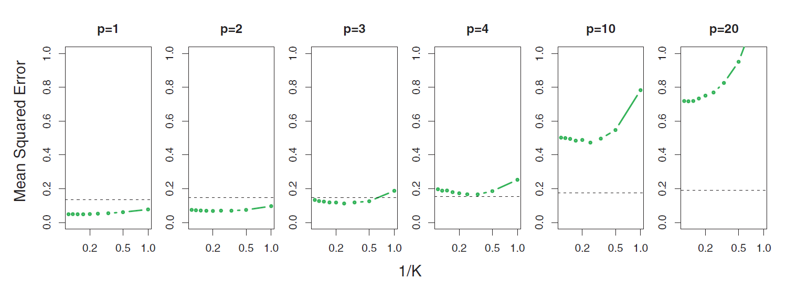
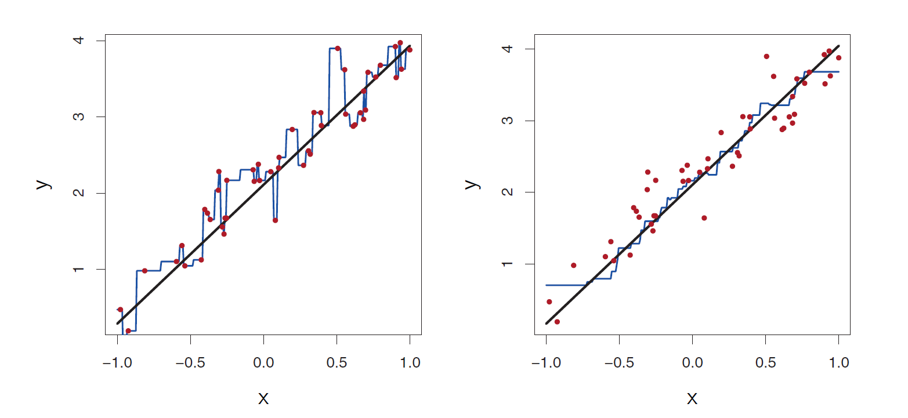
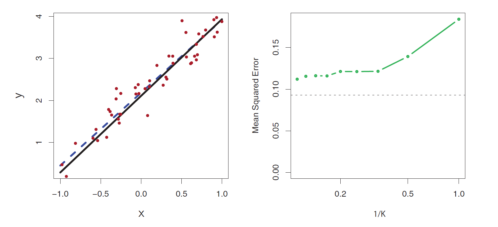
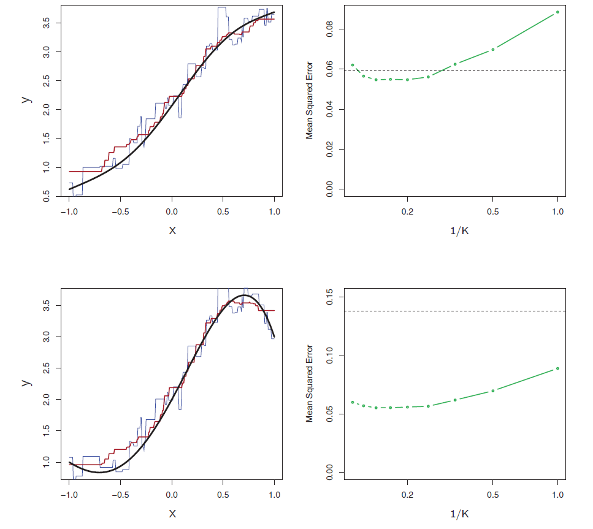

# Multiple Linear Regression (MLR)

Response $Y$ and more than one predictor variable. We assume

$$Y=f(\mathbf{X}) + \epsilon=\beta_0 + \beta_1 X_1 + \beta_2 X_2 + \ldots + \beta_p X_p + \epsilon$$

$\beta_j$ quantifies the association between the $j^{th}$ predictor and the response.


## MLR: Estimating Parameters

We use training data to find $\hat{\beta}_0,  \hat{\beta}_1, \ldots, \hat{\beta}_p$ such that

$$\hat{y}=\hat{\beta}_0 + \hat{\beta}_1 \ x_1 + \ldots + \hat{\beta}_p \ x_p$$
Observed response: $y_i$ for $i=1,\ldots,n$

Predicted response: $\hat{y}_i$ for $i=1, \ldots, n$

Residual: $e_i=y_i - \hat{y}_i$ for $i=1, \ldots, n$

Residual Sum of Squares (RSS): $RSS =e^2_1+e^2_2+\ldots+e^2_n$

Problem: Find $\hat{\beta}_0,  \hat{\beta}_1, \ldots, \hat{\beta}_p$ which minimizes $RSS$

## MLR: Estimating Parameters

```{r , echo=FALSE,  fig.align='center', out.width = '60%'}
knitr::include_graphics("EFT/3.4.png")
```


## MLR: Estimating Parameters

**Ames Housing dataset**

```{r}
ames <- readRDS("AmesHousing.rds")   # read in the dataset after specifying directory
```

```{r}
mlrfit <- lm(Sale_Price ~ Gr_Liv_Area + Year_Built, data = ames)   # fit the MLR model
summary(mlrfit)   # produce result summaries of the MLR model
```


## MLR: Interpreting Parameters

**Ames Housing dataset**

* $\hat{\beta}_0=-2.242e+06$: With `Gr_Liv_Area` equaling 0 square feet, and `Year_Built` equaling 0, the predicted `Sale_Price` is approximately -2.242e+06 USD. The interpretation is not meaningful in this context.

* $\hat{\beta}_1=9.781e+01$: With `Year_Built` remaining fixed, an additional 1 square foot of `Gr_Liv_Area` leads to an increase in `Sale_Price` by approximately 98 USD.

* $\hat{\beta}_2=1.155e+03$: With `Gr_Liv_Area` remaining fixed, an additional 1 year on `Year_Built` leads to an increase in `Sale_Price` by approximately 1155 USD.

## MLR: Prediction

**Ames Housing dataset**

Prediction of `Sale_Price` when `Gr_Liv_Area` is 1000 SF for a house built in 1990.

```{r}
predict(mlrfit, newdata = data.frame(Gr_Liv_Area = 1000, Year_Built = 1990))   # obtain prediction
```


## MLR: Assessing Accuracy of Model {.smaller}

* Residual Standard Error

$$RSE=\sqrt{\dfrac{RSS}{n-p-1}}$$

<!-- ```{r} -->
<!-- rss <- sum(mlrfit$residuals^2)   # obtain RSS -->
<!-- rss -->

<!-- rse <- sqrt(rss/(200 - 2 - 1))   # obtain RSE -->
<!-- rse -->
<!-- ``` -->

* $R^2$ statistic

$$R^2=\dfrac{TSS-RSS}{TSS} = 1 - \dfrac{RSS}{TSS}$$


* Adjusted $R^2$ statistic

$$\text{Adjusted} \ R^2 = 1 - \dfrac{RSS/(n-p-1)}{TSS/(n-1)}$$


## <span style="color:blue">Your Turn!!!</span>

With the **Advertising** dataset, create two additional models with **sales** as response:

* `mlrfit1`: MLR model with **TV** and **radio** as predictors 

* `mlrfit2`: MLR model with **TV**, **radio**, and **newspaper** as predictors

For each model, note $p$ (the number of predictors), $R^2$, $\text{Adjusted} \ R^2$, $RSS$, and $RSE$.


## MLR: Assessing Accuracy of Model

```{r, echo=FALSE}
advertising <- readRDS("Advertising.rds")   # read in the dataset after specifying directory
```

```{r}
cor(advertising)   # obtain correlation matrix
```

## <span style="color:blue">Question!!!</span>

As we add variables to the linear regression model, (Select all that apply)

* the RSE always decreases.

* the RSS always decreases.

* the $R^2$ always increases.

* the $\text{Adjusted} \ R^2$ always increases.

* the number of parameters always increases.


## K-Nearest Neighbors Regression (multiple predictors)

It is important to **scale (subtract mean and divide by standard deviation)** the predictors when considering KNN regression so that the Euclidean distance is not dominated by a few of them with large values.

**Ames Housing dataset**

```{r}
ames_scaled <- ames %>% 
  dplyr::select(Sale_Price, Gr_Liv_Area, Year_Built) %>%    # select required variables
  mutate(Gr_Liv_Area_scaled = scale(Gr_Liv_Area),
         Year_Built_scaled = scale(Year_Built))   # scale predictors

head(ames_scaled)
```


## K-Nearest Neighbors Regression (multiple predictors)

**Ames Housing dataset**

```{r, message=FALSE}
library(caret)   # load library

knnfit10 <- knnreg(Sale_Price ~ Gr_Liv_Area_scaled + Year_Built_scaled, data = ames_scaled, k = 10)   # 10-nn regression
```

It is also important to apply scaling to test data points before prediction. Suppose, you want predictions for `Gr_Liv_Area` = 1000 SF, and `Year_Built` = 1990, then

```{r}
# obtain 10-nn prediction
predict(knnfit10, newdata = data.frame(Gr_Liv_Area_scaled = (1000 - mean(ames$Gr_Liv_Area, na.rm = TRUE))/sd(ames$Gr_Liv_Area, na.rm = TRUE),
                                     Year_Built_scaled = (1990 - mean(ames$Year_Built))/sd(ames$Year_Built)))
```


## Linear Regression vs K-Nearest Neighbors

<!-- ```{r , echo=FALSE,  fig.align='center', out.width = '100%'} -->
<!--  -->
<!-- ``` -->

* Linear regression is a parametric approach (with restrictive assumptions), KNN is non-parametric.

* Linear regression works for regression problems ($Y$ numerical), KNN can be used for both regression and classification ($Y$ qualitative).

* Linear regression is interpretable, KNN is not.

* Linear regression can accommodate qualitative predictors and can be extended to include interaction terms as well. Using Euclidean distance with KNN does not allow for qualitative predictors.

* In terms of prediction, KNN can be pretty good for small $p$, that is, $p \le 4$ and large $n$. Performance of KNN deteriorates as $p$ increases - curse of dimensionality.

<!-- ## Curse of Dimensionality -->

<!-- ```{r , echo=FALSE,  fig.align='center', out.width = '60%'} -->
<!-- knitr::include_graphics("EFT/SL2.png") -->
<!-- ``` -->


<!-- ## MLR: Interpreting Parameters -->

<!-- But predictors usually change together !!! -->

<!-- * Example 1: $Y$= total amount of change in your pocket; -->
<!-- $X_1$ = # of coins; $X_2$ = # of pennies, nickels and dimes. By itself, regression coefficient of $Y$ on $X_2$ will be > 0. But how about with $X_1$ in model? -->


<!-- * Example 2: $Y$ = number of tackles by a football player in a season; $W$ and $H$ are his weight and height. Fitted regression model is $\hat{y} = \hat{\beta}_0 + 0.50 \ W - 0.10 \ H$. How do we interpret $\hat{\beta}_2< 0$? -->

<!-- ## MLR: Interpreting Parameters -->

<!-- ```{r , echo=FALSE,  fig.align='center', out.width = '70%'} -->
<!-- knitr::include_graphics("EFT/t3.4.png") -->
<!-- ``` -->

<!-- ```{r , echo=FALSE,  fig.align='center', out.width = '70%'} -->
<!-- knitr::include_graphics("EFT/t3.5.png") -->
<!-- ``` -->

<!-- Correlations amongst predictors cause -->

<!-- * Unusually large variance of regression coefficients -->

<!-- * Interpretations are hazardous -->

<!-- ## MLR: Important Questions -->

<!-- 1. Is at least one of the predictors useful in predicting the response? -->

<!-- 2. Do all the predictors help to explain the response, or is only a subset of the predictors useful? -->

<!-- 3. How well does the model fit the data? (Assessing accuracy of the model) -->

<!-- ## MLR: Is at least one of the predictors useful? -->

<!-- $$H_0: \beta_1=\ldots=\beta_p=0 \ \ \ \text{versus} \ \ \ H_a: \text{at least one} \ \beta_j \ \text{is non-zero}$$ -->

<!-- We compute the $F$-statistic, -->

<!-- $$F=\dfrac{(TSS-RSS)/p}{RSS/(n-p-1)}$$ -->

<!-- ## MLR: Is at least one of the predictors useful? -->

<!-- ```{r, echo=FALSE} -->
<!-- summary(mlrfit) -->
<!-- ``` -->

<!-- ## MLR: Deciding on the Important Variables -->

<!-- **Variable Selection** is the task of determining which predictors are associated with the response, in order to fit a single model involving only those predictors. -->

<!-- Some approaches: -->

<!-- * All subsets/Best subsets regression. (Crude) -->

<!-- * Using statistics such as Mallow's $C_p$, AIC, BIC, Adjusted $R^2$. (Chapter 6) -->

<!-- * Automated approaches: Forward Selection, Backward Selection. (Chapter 6) -->


<!-- ## MLR: Assessing Accuracy of Model -->

<!-- ```{r, echo=FALSE} -->
<!-- summary(mlrfit) -->
<!-- ``` -->

<!-- ## MLR: Assessing Accuracy of Model -->

<!-- ```{r , echo=FALSE,  fig.align='center', out.width = '70%'} -->
<!-- knitr::include_graphics("EFT/t3.4.png") -->
<!-- ``` -->

<!-- <center> -->
<!-- | Predictor(s) |  $R^2$ | $RSE$ | -->
<!-- |-----------|----------|----------- -->
<!-- | TV | 0.6119 |  3.259  | -->
<!-- | TV+Radio | 0.8972 |  1.681 | -->
<!-- | TV+Radio+Newspaper | 0.8972 |  1.686 | -->
<!-- </center> -->
<!-- \ -->


<!-- ## Linear Regression: Qualitative Predictors -->

<!-- * In practice, we will have predictors that are qualitative. -->

<!-- * These are also called **categorical predictors** or **factor variables**. -->

<!-- * The possible categories of a qualitative predictor are called **levels**. -->

<!-- ## Linear Regression: Qualitative Predictors -->

<!-- **Credit dataset** -->

<!-- ```{r} -->
<!-- credit <- read_csv("Credit.csv")   # read in the dataset -->
<!-- str(credit)   # structure of variables -->
<!-- ``` -->

<!-- ## Linear Regression: Qualitative Predictors -->

<!-- **Credit dataset** -->

<!-- Variables must be converted to factor variables. -->

<!-- ```{r} -->
<!-- # convert character to factor variables -->
<!-- credit <- credit %>% mutate(Gender = as.factor(Gender), -->
<!--                             Student = as.factor(Student), -->
<!--                             Married = as.factor(Married), -->
<!--                             Ethnicity = as.factor(Ethnicity)) -->

<!-- str(credit) -->
<!-- ``` -->

<!-- ## Linear Regression: Qualitative Predictors {.smaller} -->

<!-- **Credit dataset** -->

<!-- ```{r} -->
<!-- table(credit$Gender)   # frequency table of Gender -->

<!-- table(credit$Student)   # frequency table of Student -->

<!-- table(credit$Married)   # frequency table of Married -->

<!-- table(credit$Ethnicity)   # frequency table of Ethnicity -->
<!-- ``` -->

<!-- ## Linear Regression: Qualitative Predictors -->

<!-- **Dummy variable** -->

<!-- * R creates a **dummy/indicator variable** for each factor variable. -->

<!-- * **Nunber of dummy variables = Number of levels - 1** -->

<!-- ```{r} -->
<!-- contrasts(credit$Gender)   # identify dummy variable -->
<!-- ``` -->

<!-- <center> -->
<!-- $x_i=\begin{cases} -->
<!-- 1; & \text{if} \  i^{th} \ \text{person is male} \\ -->
<!-- 0; & \text{if} \  i^{th} \ \text{person is female} -->
<!-- \end{cases}$ -->
<!-- </center> -->
<!-- \ -->

<!-- ## Linear Regression: Qualitative Predictors -->

<!-- **Dummy variable** -->

<!-- The regression model, -->

<!-- <center> -->
<!-- $y_i=\beta_0+\beta_1 \ x_i + \epsilon_i = \begin{cases} -->
<!-- \beta_0+\beta_1+ \epsilon_i; & \text{if} \  i^{th} \ \text{person is male} \\ -->
<!-- \beta_0+\epsilon_i; & \text{if} \  i^{th} \ \text{person is female} -->
<!-- \end{cases}$ -->
<!-- <center> -->


<!-- ## Linear Regression: Qualitative Predictors -->

<!-- ```{r} -->
<!-- qfit <- lm(Balance ~ Gender, data = credit)   # fit linear model with qualitative predictor -->
<!-- summary(qfit)   # obtain summary -->
<!-- ``` -->

<!-- * $\beta_0$: average credit card balance among males -->

<!-- * $\beta_0+\beta_1$: average credit card balance among females -->

<!-- * $\beta_1$: difference in average credit card balance between females and males -->

<!-- ```{r , echo=FALSE,  fig.align='center', out.width = '90%'} -->
<!-- knitr::include_graphics("EFT/t3.7.png") -->
<!-- ``` -->

<!-- ## Linear Regression: Qualitative Predictors -->

<!-- **Credit dataset** -->

<!-- The resulting regression model, -->

<!-- <center> -->
<!-- $\hat{y}_i=\hat{\beta}_0+\hat{\beta}_1 \ x_i = \begin{cases} -->
<!-- \hat{\beta}_0+\hat{\beta}_1; & \text{if} \  i^{th} \ \text{person is male} \\ -->
<!-- \hat{\beta}_0; & \text{if} \  i^{th} \ \text{person is female} -->
<!-- \end{cases}$ -->
<!-- <center> -->

<!-- Thus, -->

<!-- * $\hat{\beta}_0=\$ 529.54$: Estimated credit card balance for females -->

<!-- * $\hat{\beta}_1=\$ 19.73$: Estimated difference in credit card balance between genders -->

<!-- * $\hat{\beta}_0+\hat{\beta}_1=\$ (529.54 - 19.73)$: Estimated credit card balance for males -->


<!-- ## Qualitative Predictors: Coding Schemes -->

<!-- * Option 1: -->

<!-- <center> -->
<!-- $x_i=\begin{cases} -->
<!-- 1; & \text{if} \  i^{th} \ \text{person is male} \\ -->
<!-- 0; & \text{if} \  i^{th} \ \text{person is female} -->
<!-- \end{cases}$ -->
<!-- </center> -->
<!-- \ -->


<!-- * Option 2: -->

<!-- <center> -->
<!-- $x_i=\begin{cases} -->
<!-- 1; & \text{if} \  i^{th} \ \text{person is female} \\ -->
<!-- -1; & \text{if} \  i^{th} \ \text{person is male} -->
<!-- \end{cases}$ -->
<!-- </center> -->
<!-- \ -->


<!-- ## <span style="color:blue">Your Turn!!!</span> -->

<!-- Create an SLR model between **Balance** and **Ethnicity** from the **Credit** dataset.  -->

<!-- * How many dummy variables would be created for **Ethnicity**? -->

<!-- * What is the baseline for the **Ethnicity** variable? -->

<!-- * Interpret the regression coefficients obtained. -->

<!-- We create two dummy variables, -->

<!-- <center> -->
<!-- $x_{i1}=\begin{cases} -->
<!-- 1; & \text{if} \  i^{th} \ \text{person is Asian} \\ -->
<!-- 0; & \text{if} \  i^{th} \ \text{person is not Asian} -->
<!-- \end{cases}$ -->
<!-- </center> -->
<!-- \ -->

<!-- <center> -->
<!-- $x_{i2}=\begin{cases} -->
<!-- 1; & \text{if} \  i^{th} \ \text{person is Caucasian} \\ -->
<!-- 0; & \text{if} \  i^{th} \ \text{person is not Caucasian} -->
<!-- \end{cases}$ -->
<!-- </center> -->
<!-- \ -->

<!-- **No. of dummy variables=No. of levels -1** -->

<!-- ## Qualitative Predictors: More than Two Levels -->

<!-- The resulting regression model, -->

<!-- <center> -->
<!-- $y_i=\beta_0+\beta_1 \ x_{i1} + \beta_1 \ x_{i2} + \epsilon_i = \begin{cases} -->
<!-- \beta_0+\beta_1+ \epsilon_i; & \text{if} \  i^{th} \ \text{person is Asian} \\ -->
<!-- \beta_0+\beta_2+\epsilon_i; & \text{if} \  i^{th} \ \text{person is Caucasian} \\ -->
<!-- \beta_0+\epsilon_i; & \text{if} \  i^{th} \ \text{person is AA} -->
<!-- \end{cases}$ -->
<!-- <center> -->

<!-- ## Qualitative Predictors: More than Two Levels -->

<!-- **Interpretations** -->

<!-- ```{r , echo=FALSE,  fig.align='center', out.width = '90%'} -->
<!-- knitr::include_graphics("EFT/t3.8.png") -->
<!-- ``` -->

<!-- * $\hat{\beta}_0=\$ 531$: Estimated credit card balance for AA -->

<!-- * $\hat{\beta}_1= - \$ 18.69$: Estimated difference in credit card balance between Asians and AAs -->

<!-- * $\hat{\beta}_2= - \$ 12.50$: Estimated difference in credit card balance between Caucasians and AAs -->

<!-- * $\hat{\beta}_0+\hat{\beta}_1=\$ (531 - 18.69)$: Estimated credit card balance for Asians -->

<!-- * $\hat{\beta}_0+\hat{\beta}_2=\$ (531 - 12.50)$: Estimated credit card balance for Caucasians -->

<!-- ## Extensions of the Linear Model -->

<!-- The standard linear regression model makes two highly restrictive assumptions. -->

<!-- * **Additive**: Changes in response caused by changes in $j^{th}$ predictor is independent of values of other predictors -->

<!-- * **Linear**: Change in response for unit increase in $j^{th}$ predictor is constant, regardless of the value of $j^{th}$ predictor -->

<!-- ## Extensions of the Linear Model: Interactions -->

<!-- **Interaction** or **synergy** effect (Advertising dataset) -->

<!-- Instead of using, -->

<!-- $$\text{Sales}=\beta_0+\beta_1 \cdot \text{TV}+\beta_2 \cdot \text{Radio} + \epsilon$$ -->

<!-- we use, -->
<!-- $$\text{Sales} =\beta_0+\beta_1 \cdot \text{TV}+\beta_2 \cdot \text{Radio} + \beta_3 \cdot \text{TV} \cdot \text{Radio} + \epsilon$$ -->
<!-- $$\implies \text{Sales} = \beta_0+\left(\beta_1 + \beta_3 \cdot \text{Radio}\right) \cdot \text{TV}+\beta_2 \cdot \text{Radio} + \epsilon$$ -->


<!-- Effect of $\text{TV}$ on $\text{Sales}$: $\beta_1 + \beta_3 \cdot \text{Radio}$ -->

<!-- ## Extensions of the Linear Model: Interactions -->

<!-- **Advertising dataset** -->

<!-- ```{r} -->
<!-- ifit <- lm(sales ~ TV*radio, data = ad)   # fit linear model with interactions -->
<!-- summary(ifit)   # obtain summary -->
<!-- ``` -->


<!-- ```{r , echo=FALSE,  fig.align='center', out.width = '70%'} -->
<!-- knitr::include_graphics("EFT/t3.9.png") -->
<!-- ``` -->

<!-- <center> -->
<!-- | Predictor(s) |  $R^2$ | $RSE$ | -->
<!-- |-----------|----------|----------- -->
<!-- | TV+Radio | 0.8972 |  1.681 | -->
<!-- | TV+Radio+TV*Radio | 0.9678 |  0.9435 | -->
<!-- </center> -->
<!-- \ -->
<!-- \ -->

<!-- ## Extensions of the Linear Model: Interactions -->

<!-- **Advertising dataset** -->

<!-- Increase $\text{TV}$ by \$1000 $\implies \text{Sales}$ change by $\left(\hat{\beta}_1 + \hat{\beta}_3 \cdot \text{Radio}\right) \times 1000=19+1.1\times \text{Radio}$ units -->


<!-- Increase $\text{Radio}$ by \$1000 $\implies \text{Sales}$ change by $\left(\hat{\beta}_2 + \hat{\beta}_3 \cdot \text{TV}\right) \times 1000=29+1.1\times \text{TV}$ units -->


<!-- ## Extensions of the Linear Model: Interactions -->

<!-- Sometimes, an interaction term has a significant effect on the response, but the associated **main effects** do not. -->

<!-- **Hierarchy Principle** -->

<!-- If we include an interaction in a model, we should also include the main effects, even if the p-values associated with their coefficients are not significant. -->

<!-- ## Interactions Between Quantitative and Qualitative Predictors -->

<!-- **Credit dataset** -->

<!-- Suppose response: $\text{balance}$ and predictors: $\text{income}$ and $\text{student}$ -->

<!-- Without interaction term, -->

<!-- <center> -->
<!-- $y_i=\beta_0+\beta_1 \cdot x_{i1} + \beta_2 \cdot x_{i2} + \epsilon_i = \begin{cases} -->
<!--  \left(\beta_0+\beta_2\right) + \beta_1 \cdot x_{i1} + \epsilon_i; & \text{if student} \\ -->
<!-- \beta_0 + \beta_1 \cdot x_{i1} + \epsilon; & \text{if not student} -->
<!-- \end{cases}$ -->
<!-- </center> -->
<!-- \ -->

<!-- With interaction term, -->

<!-- <center> -->
<!-- $y_i=\beta_0+\beta_1 \cdot x_{i1} + \beta_2 \cdot x_{i2} + \beta_3 \cdot x_{i1} \cdot x_{i2} + \epsilon_i \\ -->
<!-- = \begin{cases} -->
<!--  \left(\beta_0+\beta_2\right) + \left(\beta_1 + \beta_3\right) \cdot x_{i1} + \epsilon_i; & \text{if} \  i^{th} \ \text{person is a student} \\ -->
<!-- \beta_0 + \beta_1 \ x_{i1} + \epsilon; & \text{if} \  i^{th} \ \text{person is not a student} -->
<!-- \end{cases}$ -->
<!-- <center> -->

<!-- ## Interactions Between Quantitative and Qualitative Predictors -->

<!-- **Credit dataset** -->

<!-- ```{r , echo=FALSE,  fig.align='center', out.width = '90%'} -->
<!--  -->
<!-- ``` -->

<!-- ## Extensions of the Linear Model: Polynomial Regression -->

<!-- **Auto dataset** -->

<!-- ```{r , echo=FALSE,  fig.align='center', out.width = '90%'} -->
<!--  -->
<!-- ``` -->

<!-- ## Extensions of the Linear Model: Polynomial Regression -->

<!-- * **Linear**: $$\text{mpg}=\beta_0+\beta_1 \cdot \text{horsepower} + \epsilon$$ -->

<!-- * **Quadratic**: $$\text{mpg}=\beta_0+\beta_1 \cdot \text{horsepower} + \beta_2 \cdot \text{horsepower}^2 + \epsilon$$ -->

<!-- ```{r , echo=FALSE,  fig.align='center', out.width = '90%'} -->
<!-- knitr::include_graphics("EFT/t3.10.png") -->
<!-- ``` -->

<!-- ## Week 2 Review -->

<!-- ## Week 2 Review -->

<!-- ## K-Nearest Neighbors -->

<!-- * Non-parametric approach -->

<!-- * Can be used for both regression and classification problems -->

<!-- ## K-Nearest Neighbors Regression -->

<!-- Given a value for $K$ and a test data point $x_0$, -->
<!-- $$\hat{f}(x_0)=\dfrac{1}{K} \sum_{x_i \in \mathcal{N}_0} y_i=\text{Average} \ \left(y_i \ \text{for all} \ i:\ x_i \in \mathcal{N}_0\right) $$ -->

<!-- where $\mathcal{N}_0$ is known as the **neighborhood** of $x_0$. -->

<!-- ```{r , echo=FALSE,  fig.align='center', out.width = '90%'} -->
<!-- knitr::include_graphics("EFT/SL1.png") -->
<!-- ``` -->


<!-- ## Linear Regression vs K-Nearest Neighbors -->

<!-- ```{r , echo=FALSE,  fig.align='center', out.width = '70%'} -->
<!--  -->
<!-- ``` -->

<!-- ```{r , echo=FALSE,  fig.align='center', out.width = '70%'} -->
<!--  -->
<!-- ``` -->

<!-- ## Linear Regression vs K-Nearest Neighbors -->

<!-- ```{r , echo=FALSE,  fig.align='center', out.width = '70%'} -->
<!--  -->
<!-- ``` -->

<!-- ## Linear Regression vs K-Nearest Neighbors -->

<!-- ```{r , echo=FALSE,  fig.align='center', out.width = '100%'} -->
<!--  -->
<!-- ``` -->

<!-- * Nearest neighbor averaging can be pretty good for small $p$, that is, $p \le 4$ and large $n$. -->

<!-- * Performance of nearest neighbor deteriorates as $p$ increases - curse of dimensionality. -->

<!-- ## Curse of Dimensionality -->

<!-- ```{r , echo=FALSE,  fig.align='center', out.width = '60%'} -->
<!-- knitr::include_graphics("EFT/SL2.png") -->
<!-- ``` -->

## Classification Problems

* Response $Y$ is qualitative (categorical).

* The objective is to build a classifier $\hat{Y}=\hat{C}(\mathbf{X})$ that assigns a class label to a future unlabeled (unseen) observation and understand the relationship between the predictors and response.

* There can be two types of predictions based on the research problem.

  + Class probabilities
  
  + Class labels

<!-- Often we are more interested in estimating the probabilities than actual class labels. -->

## Classification Problems: Example

<!-- ## Logistic Regression -->

<!-- * Supervised learning -->

<!-- * Classification (even though the term contains "Regression") -->

<!-- * Parametric approach -->

**Default dataset**

```{r, echo = FALSE, message=FALSE}
library(ISLR2)   # load library
data("Default")   # load dataset

head(Default)   # print first six observations
```

```{r,message=FALSE}
table(Default$default)
```


## Classification Problems: Example

For some algorithms, we might need to convert the categorical response to numeric values.

**Default dataset**

```{r,message=FALSE}
Default$default_id <- ifelse(Default$default == "Yes", 1, 0)   # create 0/1 variable

head(Default, 10)   # print first ten observations
```


<!-- ## <span style="color:blue">Your Turn!!!</span> -->

<!-- Create an SLR model with **default** as the response and **balance** as the predictor. -->

<!-- Is there anything ususual with this model? -->


## Why Not Linear Regression? {.smaller}

**Default dataset**

```{r}
slrfit <- lm(default_id ~ balance, data = Default)   # fit SLR
summary(slrfit$fitted.values)   # summary of y_hats
```

```{r, echo=FALSE,  fig.align='center', fig.width=7, fig.height=4.5}
ggplot(data = Default, aes(x = balance, y = default_id)) +
  geom_point() +
  geom_smooth(method = "lm", se = FALSE)
```

Linear regression does not model probabilities well. Linear regression might produce probabilities less than zero or bigger than one.


## Why Not Linear Regression?

Suppose we have a response $Y$,

<center>
$Y=\begin{cases}
1; & \text{if stroke} \\
2; & \text{if drug overdose} \\
3; & \text{if epileptic seizure}
\end{cases}$
</center>
\

Linear regression suggests an ordering, and in fact implies that the difference between stroke and drug overdose is the same as between drug overdose and epileptic seizure.

<!-- ## Logistic Regression -->


<!-- ```{r , echo=FALSE,  fig.align='center', out.width = '80%'} -->
<!--  -->
<!-- ``` -->

<!-- Consider, response -->

<!-- <center> -->
<!-- $Y=\begin{cases} -->
<!-- 1; & \text{default = "Yes"} \\ -->
<!-- 0; & \text{default = "No"} -->
<!-- \end{cases}$ -->
<!-- </center> -->
<!-- \ -->

<!-- ```{r, message=FALSE} -->
<!-- contrasts(Default$default) -->
<!-- ``` -->

## Logistic Regression

Consider a one-dimensional two-class problem.

* Transform the linear model $\beta_0 + \beta_1 \ X$ so that the output is a probability.

* Use **logistic** or **sigmoid** function $$g(t)=\dfrac{e^t}{1+e^t} \ \ \ \text{for} \ t \in \mathcal{R}$$

* Suppose $p(X)=P(Y=1|X)$. Then, $$p(X)=g\left(\beta_0 + \beta_1 \ X\right)=\dfrac{e^{\beta_0 + \beta_1 \ X}}{1+e^{\beta_0 + \beta_1 \ X}}$$

* $e \approx 2.71828$ is a mathematical constant (Euler's number).


## Logistic Regression

**Default dataset**

```{r , fig.align='center', fig.width=7, fig.height=4.5, echo = FALSE}
logregfit <- glm(default ~ balance, data = Default, family = binomial)   # fit logistic regression model

ggplot(data = Default, aes(x = balance, y = default_id)) +
  geom_point() +
  geom_line(aes(y = logregfit$fitted.values), color = "blue")
```


## <span style="color:blue">Your Turn!!!</span>

Consider $p(X)=P(Y=1|X) = \dfrac{e^{\beta_0 + \beta_1 \ X}}{1+e^{\beta_0 + \beta_1 \ X}}$. Find

* $1-p(X)$

* $\ln \left(\dfrac{p(X)}{1-p(X)}\right)$


<!-- ## Logistic Regression: Interpretations -->

<!-- We can show, -->

<!-- $$\ln \left(\dfrac{p(X)}{1-p(X)}\right)=\beta_0 + \beta_1 \ X$$ -->

<!-- The monotone transformation above is called the **log odds** or **logit** transformation of $p(X)$. -->


<!-- $\beta_1$ represents the change in log odds for a unit increase in $X$. -->


## Logistic Regression: Example

**Attrition dataset**

```{r,message=FALSE}
library(modeldata)   # load library

data("attrition")   # load dataset
```

We will consider `Attrition` as the response variable.

To mimic real-world ML practices, we will split the dataset into a tranining and test set. We will build our model on the training set and evaluate its performance on the test set.

```{r, message = FALSE}
set.seed(011723)  # fix the random number generator for reproducibility

library(caret)  # load library

train_index <- createDataPartition(y = attrition$Attrition, p = 0.8, list = FALSE) # split available data into 80% training and 20% test datasets

attrition_train <- attrition[train_index,]   # training data, use this dataset to build model

attrition_test <- attrition[-train_index,]   # test data, use this dataset to evaluate model's performance
```


## Logistic Regression: Estimating Parameters 

**Attrition dataset**

Let's build a logistic regression model with `MonthlyIncome` as the predictor.

```{r, message=FALSE}
logregfit <- glm(Attrition ~ MonthlyIncome, data = attrition_train, family = binomial)   # fit logistic regression model
summary(logregfit)   # obtain results
```


<!-- Consider a one-dimensional two-class problem. Let $y_1, y_2, \ldots, y_n$ represent the training responses. -->

<!-- The **likelihood function** is then defined as, -->

<!-- $$l\left(\beta_0, \beta_1\right)=\displaystyle \prod_{i:y_i=1} p(x_i) \prod_{i:y_i=0} \big(1-p(x_i)\big)$$ -->

<!-- The parameter estimates $\hat{\beta}_0$ and $\hat{\beta}_1$ are chosen to **maximize** the likelihood function. -->

<!-- **Default dataset** -->

<!-- ```{r , echo=FALSE,  fig.align='center', out.width = '90%'} -->
<!-- knitr::include_graphics("EFT/t4.1.png") -->
<!-- ``` -->

## Logistic Regression: Individual Predictions

<!-- ```{r , echo=FALSE,  fig.align='center', out.width = '90%'} -->
<!-- knitr::include_graphics("EFT/t4.1.png") -->
<!-- ``` -->

**Attrition dataset**

For `MonthlyIncome`=\$5000,

$$\hat{p}(X)=\dfrac{e^{\hat{\beta}_0+\hat{\beta}_1 X}}{1+e^{\hat{\beta}_0+\hat{\beta}_1 X}}=\dfrac{e^{-0.904 + (-0.0001307 \times 5000)}}{1+e^{-0.904 + (-0.0001307 \times 5000)}}=0.174$$

```{r, message=FALSE}
predict(logregfit, newdata = data.frame(MonthlyIncome = 5000))   # obtain log-odds predictions

predict(logregfit, newdata = data.frame(MonthlyIncome = 5000), type = "response")   # obtain probability predictions
```


## Logistic Regression: Test Set Predictions

<!-- ```{r , echo=FALSE,  fig.align='center', out.width = '90%'} -->
<!-- knitr::include_graphics("EFT/t4.1.png") -->
<!-- ``` -->

**Attrition dataset**

To predict **probabilities** for observations in the test set, we use

```{r, message=FALSE}
logreg_prob_preds <- predict(logregfit, newdata = attrition_test, type = "response")   # obtain probability predictions

head(logreg_prob_preds)   # predicted probabilities for first six observations in test set
```


## Logistic Regression: Test Set Predictions

**Attrition dataset**

Set a threshold to obtain predicted **class labels**. The following uses a threshold of 0.5.

```{r}
threshold <- 0.5   # set threshold

logreg_class_preds <- factor(ifelse(logreg_prob_preds > threshold, "Yes", "No"))   # obtain class predictions
```

<!-- ```{r} -->
<!-- table(predicted = class_preds, true = attrition$Attrition)   # create confusion matrix -->
<!-- ``` -->

## Logistic Regression: Performance {.smaller}

**Attrition dataset**

<!-- ```{r} -->
<!-- table(predicted = class_preds, true = attrition$Attrition)   # create confusion matrix -->

<!-- mean(class_preds != attrition$Attrition)   # misclassification rate -->
<!-- ``` -->

```{r}
library(caret)   # load package 'caret'

# create confusion matrix

levels(logreg_class_preds) = c("No", "Yes")   # create 'Yes' factor level (not always required)

confusionMatrix(data = relevel(logreg_class_preds, ref = "Yes"), 
                reference = relevel(attrition_test$Attrition, ref = "Yes"))
```


<!-- For $\text{balance}=\$2000$, -->

<!-- $$\hat{p}(X)=\dfrac{e^{\hat{\beta}_0+\hat{\beta}_1 X}}{1+e^{\hat{\beta}_0+\hat{\beta}_1 X}}=\dfrac{e^{-10.6513 + 0.0055 \times 2000}}{1+e^{-10.6513 + 0.0055 \times 2000}}=0.586$$ -->

## Confusion Matrix Terms

<!-- <center> -->
<!-- |  | Predicted class labels | -->
<!-- |-----------|----------|----------- -->
<!-- |  |  0 | 1 | -->
<!-- |-----------|----------|----------- -->
<!-- | 0 | True Negative |  False Positive  | -->
<!-- | 1 | False Negative |  True Positive | -->
<!-- </center> -->
<!-- \ -->

<center>
|  | Reference class labels |
|-----------|----------|-----------
|  |  1 | 0 |
|-----------|----------|-----------
| 1 |  |  |
| 0 |  |  |
</center>
\

