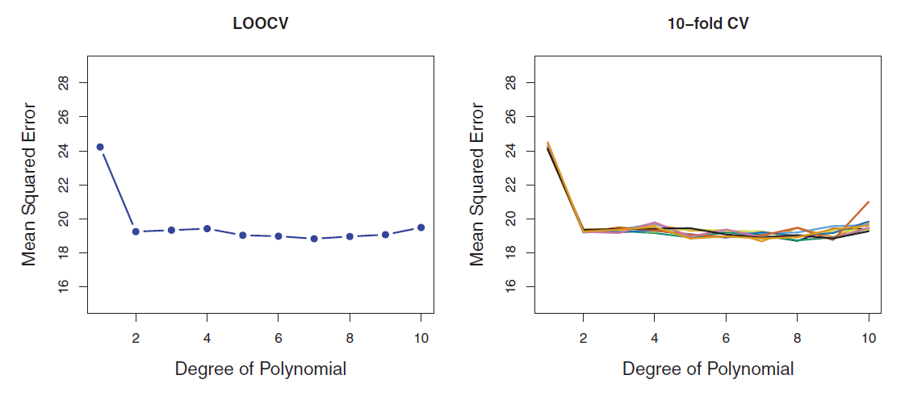

<!-- ## <span style="color:blue">Your Turn!!!</span> -->

<!-- **Default dataset** -->

<!-- ```{r,message=FALSE} -->
<!-- library(ISLR2)   # load library -->

<!-- data("Default")   # load dataset -->
<!-- ``` -->

<!-- Consider `default` as the response. Split the dataset into a training and test set. Consider a 70-30 split. -->

<!-- With the training data, create two logistic regression models: -->

<!-- * **fit1**: `student` as the predictor, and -->

<!-- * **fit2**: `balance` and `student` as predictors. -->

<!-- 1) From **fit1**, between students and non-students, which group has a higher probability of default? What is the difference in the default rates (probabilities of default)? -->

<!-- 2) Compare the coefficients in models **fit1** and **fit2**. Any observations? -->

<!-- 3) Using models **fit1** and **fit2** from above, obtain class predictions on the test set for a threshold of 0.5.  -->

<!-- 4) Create respective confusion matrices and compare. -->

<!-- ## <span style="color:blue">Your Turn!!!</span> -->

<!-- ```{r} -->
<!-- # logistic regression model with 'student' -->
<!-- fit1 = glm(default ~ student, data = Default_train, family = binomial) -->
<!-- summary(fit1) -->
<!-- ``` -->

<!-- ## <span style="color:blue">Your Turn!!!</span> -->


<!-- ```{r} -->
<!-- # logistic regression model with 'balance' and 'student'  -->
<!-- fit2 = glm(default ~ balance + student, data = Default_train, family = binomial) -->
<!-- summary(fit2)  -->
<!-- ``` -->

<!-- 3) Suppose you are a consultant with a credit card company that is trying to determine to whom they should offer credit.  -->

<!-- * A student is riskier than a non-student if no information about the student’s credit card balance is available.  -->

<!-- * However, that student is less risky than a non-student with the same credit card balance -->


<!-- ## Logistic Regression: Categorical Predictors -->

<!-- **Default dataset** -->

<!-- For $\text{student}$, define -->

<!-- <center> -->
<!-- $x_i=\begin{cases} -->
<!-- 1; & \text{if student} \\ -->
<!-- 0; & \text{if not student} -->
<!-- \end{cases}$ -->
<!-- </center> -->
<!-- \ -->

<!-- ```{r , echo=FALSE,  fig.align='center', out.width = '90%'} -->
<!-- knitr::include_graphics("EFT/t4.2.png") -->
<!-- ``` -->

<!-- $$\hat{p}(\text{student})=\dfrac{e^{-3.5041 + 0.4049 \times 1}}{1+e^{-3.5041 + 0.4049 \times 1}}=0.043$$ -->

<!-- $$\hat{p}(\text{non-student})=\dfrac{e^{-3.5041 + 0.4049 \times 0}}{1+e^{-3.5041 + 0.4049 \times 0}}=0.029$$ -->


<!-- ## Multiple Logistic Regression -->

<!-- $$p(X)=\dfrac{e^{\beta_0 + \beta_1 \ X_1+ \ldots + \beta_p \ X_p}}{1+e^{\beta_0 + \beta_1 \ X_1+\ldots \beta_p \ X_p}}$$ -->

<!-- $$\ln \left(\dfrac{p(X)}{1-p(X)}\right)=\beta_0 + \beta_1 \ X_1+ \ldots + \beta_p \ X_p$$ -->

<!-- **Default dataset** -->

<!-- ```{r , echo=FALSE,  fig.align='center', out.width = '90%'} -->
<!-- knitr::include_graphics("EFT/t4.3.png") -->
<!-- ``` -->


<!-- ## Multiple Logistic Regression: Confounding -->

<!-- ```{r , echo=FALSE,  fig.align='center', fig.width=10, fig.height=6} -->
<!-- set.seed(011723)  # fix the random number generator for reproducibility -->

<!-- train_index <- createDataPartition(y = Default$default, p = 0.7, list = FALSE) # split available data into 80% training and 20% test datasets -->

<!-- Default_train <- Default[train_index,]   # training data, use this dataset to build model -->

<!-- Default_test <- Default[train_index,]   # test data, use this dataset to evaluate model's performance -->

<!-- # contrasts(Default$student)   # identify baseline for categorical predictor  -->
<!-- fit1 = glm(default ~ student, data = Default_train, family = binomial) -->
<!-- # summary(fit1)   # slide 117 -->

<!-- # predict(fit3, newdata = data.frame(student = "No"), type = "response")   # predict log odds -->
<!-- # predict(fit3, newdata = data.frame(student = 0), type = "response")   # throws error -->


<!-- fit2 = glm(default ~ balance + student, data = Default_train, family = binomial) -->
<!-- # summary(fit2)   # slide 117 -->

<!-- df <- cbind(Default_train, fit1_preds = fit1$fitted.values, fit2_preds = fit2$fitted.values) -->

<!-- g1 <- ggplot(data = df, aes(x = balance, y = fit1_preds)) + -->
<!--   geom_line(aes(color = student), linetype = "dashed") + -->
<!--   geom_line(aes(y = fit2_preds, color = student)) + -->
<!--   ylab("default rate") -->

<!-- g2 <- ggplot(data = df, aes(x = balance, y = student)) + -->
<!--   geom_boxplot(aes(fill = student)) + -->
<!--   theme(legend.position = "none") -->

<!-- grid.arrange(g1, g2, ncol=2) -->
<!-- ``` -->


<!-- * **Misclassification rate:** -->

<!-- * **False positive rate:** -->

<!-- * **False negative rate:** -->


<!-- Calculate the **misclassification rate**, **false positive rate**, and **false negative rate**. -->

<!-- ```{r} -->
<!-- Default$class_preds_2 <- ifelse(fit$fitted.values > 0.2, "Yes", "No")   # obtain class predictions -->
<!-- table(true = Default$default, predicted = Default$class_preds_2)   # create confusion matrix -->
<!-- ``` -->

<!-- ## Logistic Regression: Performance -->

<!-- **Default dataset** -->

<!-- ```{r , echo=FALSE,  fig.align='center', out.width = '90%'} -->
<!-- knitr::include_graphics("EFT/SL6.png") -->
<!-- ``` -->


<!-- ## Multiclass Logistic Regression -->

<!-- Also referred to as **multinomial regression**. -->

<!-- Define a linear function for each class. Then, -->

<!-- $$P(Y=k|X)=\dfrac{e^{\beta_{0k}+\beta_{1k}X_1+\ldots+\beta_{pk}X_p}}{\sum_{l=1}^K e^{\beta_{0l}+\beta_{1l}X_1+\ldots+\beta_{pl}X_p}}$$ -->

<!-- ## Multiclass Logistic Regression -->

<!-- ```{r , echo=FALSE,  fig.align='center', out.width = '90%'} -->
<!-- knitr::include_graphics("EFT/one-vs-all.jpeg") -->
<!-- ``` -->


<!-- ## Classification Review -->

<!-- * Which framework are we in? -->

<!-- * What types of problems are we solving? -->

<!-- * What is our response variable? -->

<!-- * What techniques have we discussed so far? -->

<!-- * Theoretically, is there a best technique (in terms of the test error)? -->

<!-- * Do you identify a similarity in the approaches discussed so far? -->

<!-- ## Classification Review -->

<!-- * Which framework are we in? - **Supervised Learning** -->

<!-- * What types of problems are we solving? - **Classification ** -->

<!-- * What is our response variable? - **Categorical (Qualitative)** -->

<!-- * What techniques have we discussed so far? - **Bayes classifier, K-NN, Logistic Regression** -->

<!-- * Theoretically, is there a best technique (in terms of the test error)? - **Bayes optimal classifier** -->

<!-- * Do you identify a similarity in the approaches discussed so far? -->

<!-- ## Classification Review -->

<!-- * Do you identify a similarity in the approaches discussed so far? -->

<!-- Suppose we have a one-dimensional two-class problem. -->

<!-- $$\text{Bayes Classifier}: p_1(x_0)=P(Y=1 | X=x_0)$$ -->

<!-- $$\text{K-NN}: p_1(x_0)=P(Y=1 | X=x_0) = \dfrac{1}{K} \sum_{x_i \in \mathcal{N}_0} I(y_i = 1)$$ -->

<!-- $$\text{Logistic Regression}: p_1(x_0)=P(Y=1 | X=x_0) = \dfrac{e^{\beta_0 + \beta_1 \ x_0}}{1+e^{\beta_0 + \beta_1 \ x_0}}$$ -->

# K-Nearest Neighbors Classifier

Given a value for $K$ and a test data point $x_0$,
$$P(Y=j | X=x_0)=\dfrac{1}{K} \sum_{x_i \in \mathcal{N}_0} I(y_i = j)$$

where $\mathcal{N}_0$ is known as the **neighborhood** of $x_0$.

## <span style="color:blue">Your Turn!!!</span>

Build a 10-NN classifier with the `Default` dataset. Consider `default` as the response variable and `balance` as the predictor. Follow the steps below.

* Load the dataset into R. Observe the dataset, specifically the response variable.

* Perform a 70-30 split of the original dataset.

* With the training data, construct a 10-NN classifier. See help page of function `knn3`.

* Predict class probabilities on the test data points. See help page of function `predict.knn3`. Look carefully at the object that is created.

* Obtain predicted class labels for a threshold of 0.3.

* Create the confusion matrix between the observed and predicted class labels.


## K-Nearest Neighbors Classifier: Split Data

**Default dataset**

```{r,message=FALSE}
library(ISLR2)   # load library

data("Default")   # load dataset
```


```{r, message = FALSE}
set.seed(012423)  # fix the random number generator for reproducibility

library(caret)  # load library

train_index <- createDataPartition(y = Default$default, p = 0.7, list = FALSE) # split available data into 70% training and 30% test datasets

Default_train <- Default[train_index,]   # training data, use this dataset to build model

Default_test <- Default[-train_index,]   # test data, use this dataset to evaluate model's performance
```


## K-Nearest Neighbors Classifier: Build Model

**Default dataset**

```{r}
library(caret)   # load package 'caret'

knnfit <- knn3(default ~ balance, data = Default_train, k = 10)   # fit 10-nn model
```


## K-Nearest Neighbors Classifier: Predictions

**Default dataset**

```{r}
knn_prob_preds <- predict(knnfit, newdata = Default_test, type = "prob")   # obtain predictions as probabilities
```


```{r}
threshold <- 0.3   # set threshold

knn_class_preds <- factor(ifelse(knn_prob_preds[,2] > threshold, "Yes", "No"))   # obtain predictions as class labels
```


## K-Nearest Neighbors Classifier: Performance  {.smaller}

**Default dataset**

```{r}
# create confusion matrix

confusionMatrix(data = relevel(knn_class_preds, ref = "Yes"), 
                reference = relevel(Default_test$default, ref = "Yes"))  
```


## ROC Curve and AUC

The **ROC (Receiver Operating Characteristics)** curve is a popular graphic for comparing different classifiers across all possible thresholds. The ROC curve plots the Specificity (1-false positive rate) along the x-axis and the Sensitivity (true positive rate) along the y-axis.

Another popular metric for comparing classifiers is the **AUC (Area Under the ROC Curve)**. An ideal ROC curve will hug the top left corner, so the larger the AUC the better the classifier. 


## ROC Curve and AUC  {.smaller}

**Default dataset**

```{r, fig.align='center', fig.width=4, fig.height=4}
library(pROC)   # load library

# create object for ROC curve for KNN fit

roc_object_knn <- roc(response = Default_test$default, predictor = knn_prob_preds[,2])

# plot ROC curve

plot(roc_object_knn, col = "red")

# obtain AUC's

auc(roc_object_knn)
```


<!-- ## K-Nearest Neighbors Classifier {.smaller} -->

<!-- **Default dataset** -->

<!-- ```{r} -->
<!-- # knn classification with multiple predictors -->

<!-- # scale the inputs -->
<!-- Default_scaled <- Default %>% mutate(balance_scaled = scale(balance), -->
<!--                                      income_scaled = scale(income)) -->

<!-- knnfit <- knn3(default ~ balance_scaled + income_scaled, data = Default_scaled, k = 100)   # fit 100-nn model -->

<!-- # obtain predictions and evaluate performance -->

<!-- threshold = 0.5   # set threshold -->

<!-- knn_preds <- predict(knnfit, newdata = Default_scaled)   # obtain predictions as probabilities -->

<!-- Default_scaled$knn_preds <- ifelse(knn_preds[,2] > threshold, "Yes", "No")   # obtain predictions as class labels -->

<!-- table(true = Default_scaled$default, predicted = Default_scaled$knn_preds)  # create confusion matrix -->

<!-- mean(Default_scaled$default != Default_scaled$knn_preds)    # calculate misclassification rate -->
<!-- ``` -->


<!-- ## Discriminant Analysis -->

<!-- * Logistic regression involves directly modeling $P(Y = k|X = \mathbf{x})$ using the logistic function. -->

<!-- * In **discriminant analysis**, we model the distribution of the predictors $X$ separately in each of the response classes (that is, for each value of $Y$). We then use Bayes’ theorem to flip these around into estimates for $P(Y = k|X = \mathbf{x})$. -->


<!-- ## Why Discriminant Analysis? -->

<!-- * When the classes are well-separated, the parameter estimates for the logistic regression model are surprisingly unstable. Linear discriminant analysis does not suffer from this problem. -->

<!-- * When $n$ is small and the distribution of the predictors $X$ is approximately normal in each of the classes, the linear discriminant model is again more stable than the logistic regression model. -->

<!-- * Linear discriminant analysis is popular when we have more than two response classes. -->


<!-- ## Univariate Normal/Gaussian Distribution -->

<!-- A continuous random variable $X$ is said to have the **normal distribution** with mean $\mu$ and standard deviation $\sigma$ if its pdf is given by -->

<!-- $$f(x)=\frac{1}{\sqrt{2\pi}\sigma}e^{-\frac{1}{2\sigma^2}(x-\mu)^2}, \ \text{where} \ \ -\infty < x < \infty$$ -->

<!-- Notation: $X\sim \text{N}(\mu,\sigma^2)$ -->

<!-- ## Univariate Normal Distribution -->

<!-- ```{r, echo=FALSE, fig.width=7, fig.height=7, warning=FALSE, fig.align='center'} -->
<!-- # library(ggplot2) -->
<!-- p <- ggplot(data = data.frame(x = 0), mapping = aes(x = x)) -->
<!-- fun.1 <- function(x) dnorm(x, mean=0, sd=1) -->
<!-- p1 <- p + stat_function(fun = fun.1) + xlim(-4,4)+ylim(0,.65)+ggtitle(expression(paste( mu, "=0, ", sigma, "=1"))) + ylab("f(x)") -->
<!-- fun.1 <- function(x) dnorm(x, mean=2, sd=1) -->
<!-- p2 <- p + stat_function(fun = fun.1) + xlim(-2,6)+ylim(0,.65)+ggtitle(expression(paste( mu, "=2, ", sigma, "=1"))) + ylab("f(x)") -->
<!-- fun.1 <- function(x) dnorm(x, mean=0, sd=2) -->
<!-- p3 <- p + stat_function(fun = fun.1) + xlim(-4,4)+ylim(0,.65)+ggtitle(expression(paste( mu, "=0, ", sigma, "=2"))) + ylab("f(x)") -->
<!-- fun.1 <- function(x) dnorm(x, mean=0, sd=0.7) -->
<!-- p4 <- p + stat_function(fun = fun.1) + xlim(-4,4)+ylim(0,.65)+ggtitle(expression(paste( mu, "=0, ", sigma, "=0.7"))) + ylab("f(x)") -->

<!-- # library(gridExtra) -->
<!-- grid.arrange(p1,p2,p3,p4, ncol=2) -->
<!-- ``` -->


<!-- ## Multivariate Normal Distribution -->

<!-- A $p$-dimensional random variable $X$ has a multivariate normal/Gaussian distribution with mean vector $\mathbf{\mu}$ (a $p$-dimensional vector) and covariance matrix $\mathbf{\Sigma}$ (a $p$ x $p$ dimensional matrix) if its pdf is given by -->

<!-- ```{r , echo=FALSE,  fig.align='center', out.width = '90%'} -->
<!--  -->
<!-- ``` -->

<!-- Notation: $X\sim \text{N}(\mathbf{\mu},\mathbf{\Sigma})$ -->


<!-- ## Multivariate Normal Distribution -->

<!-- ```{r , echo=FALSE,  fig.align='center', out.width = '90%'} -->
<!-- knitr::include_graphics("EFT/4.5.png") -->
<!-- ``` -->

<!-- This [website](http://socr.umich.edu/HTML5/BivariateNormal/) gives a visualization of the bivariate normal distribution. -->


<!-- ## Bayes' Theorem -->

<!-- Thomas Bayes was a famous mathematician whose name -->
<!-- represents a big subfield of statistical and probabilistic modeling. -->

<!-- Bayes' Theorem states, -->

<!-- $$P(Y=k|X=x)=\dfrac{P(X=x|Y=k) \cdot P(Y=k)}{P(X=x)}$$ -->
<!-- $$\implies P(Y=k|X=x)=\dfrac{P(X=x|Y=k) \cdot P(Y=k)}{\displaystyle \sum_l P(X=x|Y=l) \cdot P(Y=l)}$$ -->

<!-- ## Linear Discriminant Analysis (LDA) -->

<!-- Uses Bayes' theorem and assuming $P(X=x|Y=k)$ follows a normal distribution. -->

<!-- **Notations** -->

<!-- * $f_k(x) = P(X=x|Y=k)$: **density** of $X$ in class $k$ -->

<!-- * $\pi_k = P(Y=k)$: **prior** probability for class $k$. -->

<!-- * $p_k(x)$: **posterior** probability of an observation $X=x$ belonging to class $k$. -->

<!-- We have, -->

<!-- $$p_k(x)=P(Y=k|X=x)=\dfrac{P(X=x|Y=k) \cdot P(Y=k)}{\displaystyle \sum_l P(X=x|Y=l) \cdot P(Y=l)}$$ -->

<!-- $$\implies p_k(x)=P(Y=k|X=x)=\dfrac{f_k(x) \cdot \pi_k}{\displaystyle \sum_l f_l(x) \cdot \pi_l}$$ -->

<!-- ## LDA for $p=1$ -->

<!-- Suppose $p=1$ (one predictor). -->

<!-- $$p_k(x)=P(Y=k|X=x)=\dfrac{f_k(x) \cdot \pi_k}{\displaystyle \sum_l f_l(x) \cdot \pi_l}$$ -->

<!-- Let $\mu_k$ and $\sigma^2_k$ be mean and variance for $k^{th}$ class. Further, assume $\sigma^2_k=\sigma^2$ for all $k$. Then, -->

<!-- ```{r , echo=FALSE,  fig.align='center', out.width = '90%'} -->
<!--  -->
<!-- ``` -->

<!-- ## LDA for $p=1$ -->

<!-- Consider a one-dimensional two-class problem. -->

<!-- **Discriminant function** -->

<!-- ```{r , echo=FALSE,  fig.align='center', out.width = '60%'} -->
<!--  -->
<!-- ``` -->

<!-- **Decision boundary** -->

<!-- $$x=\dfrac{\mu^2_1-\mu^2_2}{2\left(\mu_1-\mu_2\right)}=\dfrac{\mu_1+\mu_2}{2}$$ -->


<!-- ## LDA for $p=1$: Estimating Parameters -->

<!-- **Parameters**: $\mu_1, \ldots, \mu_k, \sigma^2, \pi_1, \ldots, \pi_k$ -->

<!-- $$\hat{\pi}_k=\dfrac{n_k}{n}$$ -->

<!-- ```{r , echo=FALSE,  fig.align='center', out.width = '60%'} -->
<!--  -->
<!-- ``` -->

<!-- ```{r , echo=FALSE,  fig.align='center', out.width = '55%'} -->
<!--  -->
<!-- ``` -->

<!-- ## LDA for $p=1$ -->

<!-- **Default dataset** -->

<!-- ```{r , echo=FALSE,  fig.align='center', fig.width=10, fig.height=6} -->
<!-- ggplot(data = Default, aes(x = balance)) +  -->
<!--   geom_histogram(aes(y = after_stat(density)), fill = "lightblue") + -->
<!--   geom_density() + -->
<!--   facet_grid(~ default) -->

<!-- #  -->
<!-- ``` -->

<!-- Example with $\mu_1=-1.25, \mu_2=1.25, \pi_1=\pi_2=0.5, \sigma^2=1$ -->

<!-- ## LDA for $p=1$ -->

<!-- **Default dataset** -->

<!-- ```{r, eval=FALSE} -->
<!-- # install.packages("MASS")   # install package 'MASS' -->
<!-- library(MASS)   # load package 'MASS' -->

<!-- ?lda   # help function for function 'lda' -->
<!-- ``` -->

<!-- ```{r} -->
<!-- ldafit = lda(default ~ balance, data = Default)   # fit LDA -->
<!-- ldafit   # summary of the fit -->
<!-- ``` -->


<!-- ## LDA for $p=1$: Class Predictions -->

<!-- **Default dataset** -->

<!-- ```{r} -->
<!-- threshold = 0.5   # set threshold -->

<!-- preds <- predict(ldafit, newdata = Default)   # obtain predictions as probabilities -->

<!-- Default$ldapreds <- ifelse(preds$posterior[,2] > threshold, "Yes", "No")   # obtain predictions as class labels -->

<!-- table(true = Default$default, predictions = Default$ldapreds)   # create confusion matrix -->

<!-- mean(Default$default != Default$ldapreds)   # calculate misclassification rate -->
<!-- ``` -->


<!-- ## LDA for $p>1$ -->

<!-- Use multivariate normal. -->

<!-- ```{r , echo=FALSE,  fig.align='center', out.width = '90%'} -->
<!--  -->
<!-- ``` -->

<!-- **Discriminant function** -->

<!-- ```{r , echo=FALSE,  fig.align='center', out.width = '90%'} -->
<!--  -->
<!-- ``` -->

<!-- ## <span style="color:blue">Your Turn!!!</span> -->

<!-- Perform LDA on the **Default** dataset with  -->
<!-- ## LDA for $p>1$ -->

<!-- **Decision boundary** -->

<!-- ```{r , echo=FALSE,  fig.align='center', out.width = '70%'} -->
<!-- knitr::include_graphics("EFT/e4.20.png") -->
<!-- ``` -->

<!-- ```{r , echo=FALSE,  fig.align='center', out.width = '70%'} -->
<!--  -->
<!-- ``` -->


<!-- ## LDA: Why Discriminant Analysis? -->

<!-- * When the classes are well-separated, the parameter -->
<!-- estimates for the logistic regression model are surprisingly unstable. Linear discriminant analysis does not suffer from this problem. -->

<!-- * When $n$ is small and the distribution of the predictors $X$ is approximately normal in each of the classes, the linear discriminant model is again more stable than the logistic regression model. -->

<!-- * Linear discriminant analysis is popular when we have more than two response classes. -->

<!-- ## LDA: Class Predictions -->

<!-- **Default dataset** -->

<!-- ```{r} -->
<!-- table(true = Default$default, predicted = Default$class_preds)   # create confusion matrix -->
<!-- ``` -->

<!-- ## <span style="color:blue">Your Turn!!!</span> -->

<!-- Perform LDA with **default** as the response, and **balance** and **income** as predictors. -->

<!-- Obtain class predictions by for a threshold of 0.2. Calculate the **misclassification rate**, **false positive rate**, and **false negative rate**. -->

<!-- ## <span style="color:blue">Your Turn!!!</span> -->

<!-- ```{r} -->
<!-- # LDA with multiple predictors -->

<!-- ldafit1 = lda(default ~ balance + income, data = Default)   # fit LDA -->
<!-- ldafit1  # summary of the fit -->
<!-- ``` -->

<!-- ## <span style="color:blue">Your Turn!!!</span> -->

<!-- ```{r} -->
<!-- # obtain predictions and evaluate performance -->

<!-- threshold = 0.2   # set threshold -->

<!-- preds1 <- predict(ldafit1, newdata = Default)   # obtain predictions as probabilities -->

<!-- Default$ldapreds1 <- ifelse(preds1$posterior[,2] > threshold, "Yes", "No")   # obtain predictions as class labels -->

<!-- table(true = Default$default, predictions = Default$ldapreds1)   # create confusion matrix -->

<!-- mean(Default$default != Default$ldapreds1)   # calculate misclassification rate -->
<!-- ``` -->


<!-- We use $\hat{Y} = 1$ if $P(Y=1|X)> 0.5$, then -->

<!-- ```{r , echo=FALSE,  fig.align='center', out.width = '70%'} -->
<!-- knitr::include_graphics("EFT/t4.4.png") -->
<!-- ``` -->

<!-- * Misclassification rate $=\frac{23+252}{10000}=2.75\%$ -->

<!-- * If we always classified $\text{No}$, then error rate 3.33%. -->

<!-- * For true $\text{No}$'s, error rate 0.2%, for true $\text{Yes}$'s error rate 75.7%. -->

<!-- ## Types of Errors -->

<!-- **False positive rate**: fraction of true $0$'s that are classified $1$ - 0.2% for the dataset. -->

<!-- **False negative rate**: fraction of true $1$'s that are classified $0$ - 75.7% for the dataset. -->

<!-- We can change the two error rates by changing the threshold from 0.5 to some other value in [0,1]. -->

<!-- If we use $\hat{Y} = 1$ if $P(Y=1|X)> 0.2$, then -->

<!-- ```{r , echo=FALSE,  fig.align='center', out.width = '70%'} -->
<!-- knitr::include_graphics("EFT/t4.5.png") -->
<!-- ``` -->

<!-- ## Types of Errors -->

<!-- <center> -->
<!-- |  | True class labels | -->
<!-- |-----------|----------|----------- -->
<!-- |  |  0 | 1 | -->
<!-- |-----------|----------|----------- -->
<!-- | 0 | True Negative |  False Negative  | -->
<!-- | 1 | False Positive |  True Positive | -->
<!-- </center> -->
<!-- \ -->


<!-- ## Performance of Binary Classifiers: Types of Errors -->

<!-- **Default dataset** -->

<!-- ```{r , echo=FALSE,  fig.align='center', out.width = '90%'} -->
<!-- knitr::include_graphics("EFT/SL6.png") -->
<!-- ``` -->


<!-- ## Performance of Binary Classifiers: ROC Curve -->

<!-- The ROC curve is a popular graphic for simultaneously displaying two types of errors for all possible thresholds. The name "ROC" is an acronym for **receiver operating characteristics**. The overall performance of a classifier, summarized over all possible thresholds, is given by the area under the curve (AUC). -->

<!-- ```{r, eval=FALSE} -->
<!-- install.packages("pROC")   # install package 'pROC' -->
<!-- library(pROC)   # load package 'pROC' -->
<!-- ``` -->

<!-- ```{r} -->
<!-- # create an object by specifying observed class labels and  -->
<!-- # vector of predicted probabilities for each class -->
<!-- r <- roc(Default$default, preds$posterior[,2])    -->

<!-- r   # obtain AUC -->
<!-- ``` -->

<!-- ## Performance of Binary Classifiers: ROC Curve -->


<!-- ```{r, fig.align='center'} -->
<!-- plot(r)   # plot ROC curve -->
<!-- ``` -->


<!-- ## <span style="color:blue">Your Turn!!!</span> -->

<!-- Consider the **iris** dataset. This is a multi-class classification problem. -->

<!-- ```{r, eval=FALSE} -->
<!-- data("iris")   # load the iris dataset -->

<!-- ?iris   # help page for iris dataset -->
<!-- ``` -->

<!-- Implement KNN with $K=1, 10, 50$ (remember to scale the inputs) and LDA. Obtain the respective misclassification rates on the training data. -->

<!-- ## <span style="color:blue">Your Turn!!!</span> -->


<!-- ```{r} -->
<!-- # multi-class classification problem -->

<!-- # LDA -->

<!-- ldafit_iris = lda(Species ~ Sepal.Length + Sepal.Width + Petal.Length + Petal.Width, data = iris)   # fit LDA -->

<!-- # obtain predictions and evaluate performance -->

<!-- lda_preds_iris <- predict(ldafit_iris, newdata = iris)   # obtain predictions as probabilities -->

<!-- lda_class_preds_iris <- lda_preds_iris$class   # obtain predictions as class labels -->

<!-- table(true = iris$Species, predictions = lda_class_preds_iris)   # create confusion matrix -->

<!-- mean(iris$Species != lda_class_preds_iris)   # calculate misclassification rate -->
<!-- ``` -->


<!-- ## <span style="color:blue">Your Turn!!!</span> {.smaller} -->


<!-- ```{r} -->
<!-- # multi-class classification problem -->

<!-- # KNN -->

<!-- # scale the inputs -->

<!-- iris_scaled <- iris %>% mutate(Sepal.Length_scaled = scale(Sepal.Length), -->
<!--                                Sepal.Width_scaled = scale(Sepal.Width), -->
<!--                                Petal.Length_scaled = scale(Petal.Length), -->
<!--                                Petal.Width_scaled = scale(Petal.Width)) -->

<!-- knnfit_iris = knn3(Species ~ Sepal.Length_scaled + Sepal.Width_scaled +  -->
<!--                     Petal.Length_scaled + Petal.Width_scaled, data = iris_scaled, k = 10)   # fit 10-nn -->

<!-- # obtain predictions and evaluate performance -->

<!-- knn_preds_iris <- predict(knnfit_iris, newdata = iris_scaled)   # obtain predictions as probabilities -->

<!-- knn_class_preds_iris <- predict(knnfit_iris, newdata = iris_scaled, type = "class")   # obtain predictions as class labels -->

<!-- table(true = iris$Species, predictions = knn_class_preds_iris)   # create confusion matrix -->

<!-- mean(iris$Species != knn_class_preds_iris)   # calculate misclassification rate -->
<!-- ``` -->


<!-- **Default dataset** -->

<!-- Receiver Operating Characteristics Curve -->

<!-- ```{r , echo=FALSE,  fig.align='center', out.width = '50%'} -->
<!--  -->
<!-- ``` -->

<!-- AUC (area under the curve) is used to summarize the overall performance. -->

<!-- ## Quadratic Discriminant Analysis (QDA) -->

<!-- Assumes each class has its own covariance matrix $\mathbf{\Sigma}_k$. The discriminant function takes the form -->

<!-- ```{r , echo=FALSE,  fig.align='center', out.width = '80%'} -->
<!--  -->
<!-- ``` -->

<!-- ## Quadratic Discriminant Analysis (QDA) -->


<!-- ```{r , echo=FALSE,  fig.align='center', out.width = '90%'} -->
<!--  -->
<!-- ``` -->


<!-- ## K-Nearest Neighbors Classifier -->

<!-- ```{r , echo=FALSE,  fig.align='center', out.width = '60%'} -->
<!-- knitr::include_graphics("EFT/SL3.png") -->
<!-- ``` -->

<!-- ```{r , echo=FALSE,  fig.align='center', out.width = '60%'} -->
<!--  -->
<!-- ``` -->

<!-- ## K-Nearest Neighbors Classifier -->

<!-- ```{r , echo=FALSE,  fig.align='center', out.width = '70%'} -->
<!-- knitr::include_graphics("EFT/2.15.png") -->
<!-- ``` -->

<!-- ## K-Nearest Neighbors Classifier -->

<!-- ```{r , echo=FALSE,  fig.align='center', out.width = '100%'} -->
<!--  -->
<!-- ``` -->

<!-- ## K-Nearest Neighbors Classifier -->

<!-- ```{r , echo=FALSE,  fig.align='center', out.width = '80%'} -->
<!--  -->
<!-- ``` -->


<!-- ## Classification Summary -->

<!-- * K-NN delivers good performance for most classification problems, however, its performance degrades for large $p$. -->

<!-- * Logistic regression is also a popular tool for classification, especially when $K = 2$. -->

<!-- * LDA is useful when $n$ is small, or the classes are well separated, and Gaussian assumptions are reasonable. Also when $K > 2$. -->

<!-- * Naive Bayes is useful when $p$ is very large. -->

<!-- * Section 4.5 compares logistic regression, LDA, and K-NN. -->

<!-- # create ROC curve -->

<!-- install.packages("pROC")   # install package 'pROC' -->
<!-- library(pROC)   # load package 'pROC' -->

<!-- ?roc   # help page for function 'roc' -->

<!-- # create an object by specifying observed class labels and  -->
<!-- # vector of predicted probabilities for each class -->
<!-- r <- roc(Default$default, preds$posterior[,2])    -->

<!-- r   # obtain AUC -->

<!-- plot(r)   # plot ROC curve -->

## Data Splitting

Available data split into **training** and **test** datasets.

* **Training set:** these data are used to develop feature sets, train our algorithms, tune parameters, compare models, and all of the other activities required to choose a final model (e.g., the model we want to put into production).

* **Test set:** having chosen a final model, these data are used to obtain an unbiased estimate of the model’s performance.

**It is critical that the test set not be used prior to selecting your final model.** Assessing results on the test set prior to final model selection biases the model selection process since the testing data will have become part of the model development process.


<!-- ## Resampling Methods -->

<!-- ```{r} -->
<!-- # load required packages -->
<!-- library(tidyverse) -->
<!-- library(caret) -->
<!-- library(ISLR) -->

<!-- data("Auto")   # load 'Auto' daatset -->

<!-- # split available data into training and test data -->

<!-- set.seed(04192022)   # fix the random number generator for reproducibility -->

<!-- # response: 'mpg' -->
<!-- train_index <- createDataPartition(Auto$mpg, p = 0.8, list = FALSE) # split available data into 80% training and 20% test datasets -->

<!-- Auto_train <- Auto[train_index,]   # training data, we will work with this to choose our final model -->

<!-- Auto_test <- Auto[-train_index,]   # test data, KEEP IT ASIDE, use only after choosing final model -->
<!-- ``` -->


## Resampling Methods

* **Idea:** Repeatedly draw samples from the training data and refit a model on each sample, and evaluate its performance on the other parts.

* **Objective:** To obtain additional information about the fitted model.

* **Cross-Validation (CV)** is probably the most widely used resampling method. It is a general approach that can be applied to almost any statistical learning method.


## Cross-Validation (CV)

Used for

* **model selection**: select the optimum level of flexibility (tune hyperparameters) or compare different models to choose the best one

* **model assessment**: evaluate the performance of a model (estimate its test error)

We will talk about

<!-- * Validation Set Approach -->

* Leave-One-Out Cross-Validation (LOOCV)

* $k$-Fold Cross-Validation

<!-- ## Training Error vs Test Error -->

<!-- * **Training Error**: Calculated by applying the statistical learning method to the observations used in its training. -->

<!-- * **Test Error**: Average error that results from using a -->
<!-- statistical learning method to predict the response on a new unseen observation. -->

<!-- **Test Error Estimates** -->

<!-- * From a large designated test set. -->

<!-- * Making a mathematical adjustment to the training error. (Chapter 6) -->

<!-- * By **holding out** a subset of the training dataset, then assessing model performance on the held out observations. -->


<!-- ## Training Error vs Test Error -->

<!-- ```{r , echo=FALSE,  fig.align='center', out.width = '90%'} -->
<!--  -->
<!-- ``` -->


<!-- ## Validation Set Approach -->

<!-- * Randomly divide the available set of observations into: a **training set** and a **validation/hold-out set**. -->

<!-- * Model fit on the training set. Fitted model is used to predict the responses for the observations in the -->
<!-- validation set. -->

<!-- ```{r , echo=FALSE,  fig.align='center', out.width = '90%'} -->
<!--  -->
<!-- ``` -->

<!-- ## Validation Set Approach -->

<!-- **Auto dataset** -->

<!-- ```{r, echo=FALSE, fig.align='center'} -->
<!-- data("Auto") -->
<!-- plot(Auto$horsepower,Auto$mpg,ylab="mpg",xlab="horsepower") -->
<!-- ``` -->

<!-- Randomly split the 392 observations into two sets, a training set containing 196 data points, and a validation set containing the remaining 196 observations. -->

<!-- ## Validation Set Approach -->


<!-- ```{r , echo=FALSE,  fig.align='center', out.width = '90%'} -->
<!-- knitr::include_graphics("EFT/5.2.PNG") -->
<!-- ``` -->

<!-- Potential drawbacks: -->

<!-- * The validation set estimate of the test error can be highly variable. -->

<!-- * Only a subset of the observations (those that are in the training set) are used to fit the model. This suggests that the validation set error may tend to overestimate the test error for the model fit on the entire data set. -->

<!-- * Yields different results due to randomness in training and validation datasets. -->

## Leave-One-Out Cross-Validation (LOOCV)

<!-- * Closely related to the validation set approach. Attempts to address its drawbacks. -->

```{r , echo=FALSE,  fig.align='center', out.width = '70%'}
knitr::include_graphics("EFT/5.3.PNG")
```

<!-- ```{r , echo=FALSE,  fig.align='center', out.width = '30%'} -->
<!--  -->
<!-- ``` -->

<!-- ## Leave-One-Out Cross-Validation (LOOCV) -->

<!-- ```{r, fig.align='center', fig.height=6, fig.width=8} -->
<!-- # comparing 4 polynomial (regression) models with LOOCV (response: 'mpg', predictor: 'horsepower') -->

<!-- ggplot(data = Auto, aes(x = horsepower, y = mpg)) +   # quick visual check -->
<!--   geom_point() -->
<!-- ``` -->


<!-- ## Leave-One-Out Cross-Validation (LOOCV): Implementation -->

<!-- ```{r,message=FALSE} -->
<!-- ames <- readRDS("AmesHousing.rds")   # load dataset -->
<!-- ``` -->

<!-- Consider `Sale_Price` as the response variable. Split the data into training and test data. -->

<!-- ```{r, message = FALSE} -->
<!-- set.seed(012423)  # fix the random number generator for reproducibility -->

<!-- library(caret)  # load library -->

<!-- train_index <- createDataPartition(y = ames$Sale_Price, p = 0.8, list = FALSE) # split available data into 80% training and 20% test datasets -->

<!-- ames_train <- ames[train_index,]   # training data, use this dataset to build model -->

<!-- ames_test <- ames[-train_index,]   # test data, use this dataset to evaluate model's performance -->
<!-- ``` -->


<!-- ## Leave-One-Out Cross-Validation (LOOCV): Implementation -->

<!-- Define CV specifications. -->

<!-- ```{r} -->
<!-- cv_specs_loocv <- trainControl(method = "LOOCV")   # specify CV method -->
<!-- ``` -->

<!-- We will compare the following three linear regression models: -->

<!-- * with `Garage_Area` as the only predictor; -->

<!-- * with `Overall_Qual` as the only predictor; -->

<!-- * with `Garage_Area`, `Year_Built`, and `Overall_Qual` as predictors. -->


<!-- ## Leave-One-Out Cross-Validation (LOOCV): Implementation -->

<!-- Implement LOOCV with the first model. -->

<!-- ```{r} -->
<!-- m1 <- train(form = Sale_Price ~ Garage_Area,    # specify model -->
<!--             data = ames_train,   # specify dataset -->
<!--             method = "lm",       # specify type of model -->
<!--             trControl = cv_specs_loocv, # CV specifications -->
<!--             metric = "RMSE")   # metric to evaluate model -->

<!-- m1   # summary of LOOCV -->
<!-- ``` -->


<!-- ## Leave-One-Out Cross-Validation (LOOCV): Implementation -->

<!-- Implement LOOCV with the second model. -->

<!-- ```{r} -->
<!-- m2 <- train(form = Sale_Price ~ Overall_Qual,   -->
<!--             data = ames_train,           -->
<!--             method = "lm",               -->
<!--             trControl = cv_specs_loocv,        -->
<!--             metric = "RMSE")            -->

<!-- m2 -->
<!-- ``` -->


<!-- ## Leave-One-Out Cross-Validation (LOOCV): Implementation -->

<!-- Implement LOOCV with the third model. -->

<!-- ```{r} -->
<!-- m3 <- train(form = Sale_Price ~ Garage_Area + Year_Built + Overall_Qual,   -->
<!--             data = ames_train, -->
<!--             method = "lm", -->
<!--             trControl = cv_specs_loocv, -->
<!--             metric = "RMSE") -->

<!-- m3 -->
<!-- ``` -->


<!-- ## Leave-One-Out Cross-Validation (LOOCV): Results -->

<!-- Compare LOOCV results for different models. -->

<!-- ```{r, fig.align='center', fig.height=6, fig.width=8} -->
<!-- # create data frame to plot results -->

<!-- df <- data.frame(model_number = 1:3, RMSE = c(m1$results$RMSE,   -->
<!--                                              m2$results$RMSE, -->
<!--                                              m3$results$RMSE)) -->

<!-- # plot results from LOOCV -->

<!-- ggplot(data = df, aes(x = model_number, y =  RMSE)) +    -->
<!--   geom_point() + geom_line() -->

<!-- ``` -->


## Leave-One-Out Cross-Validation (LOOCV)

**Advantages**

* LOOCV will give approximately unbiased estimates of the test error, since each training set contains $n−1$ observations, which is almost as many as the number of observations in the full training dataset.

<!-- * Has far less bias than the validation set approach, since the training sets (used to fit the model) are almost as big as the original dataset. -->

* Performing LOOCV multiple times will always yield the same results.

**Disadvantages**

* Can be potentially expensive to implement, specially for large $n$.

* LOOCV error estimate can have high variance. 


## $k$-Fold Cross-Validation

* Randomly divide the training data into $k$ groups or **folds** (approximately equal size).

* Consider one of these folds as the validation set. Fit the model on the remaining $k-1$ folds combined, and obtain predictions for the $k^{th}$ fold. Repeat for all $k$ folds.

```{r , echo=FALSE,  fig.align='center', out.width = '70%'}
knitr::include_graphics("EFT/5.5.PNG")
```


## $k$-Fold Cross-Validation: Implementation

**Ames Housing dataset**

```{r,message=FALSE}
ames <- readRDS("AmesHousing.rds")   # load dataset
```

Consider `Sale_Price` as the response variable. We will compare the following three linear regression models:

* with `Garage_Area` as the only predictor;

* with `Overall_Qual` as the only predictor;

* with `Garage_Area`, `Year_Built`, and `Overall_Qual` as predictors.


## $k$-Fold Cross-Validation: Implementation

**Ames Housing dataset**

Split the data into training and test data.

```{r, message = FALSE}
set.seed(012423)  # fix the random number generator for reproducibility

library(caret)  # load library

train_index <- createDataPartition(y = ames$Sale_Price, p = 0.8, list = FALSE) # split available data into 80% training and 20% test datasets

ames_train <- ames[train_index,]   # training data, use this dataset to build model

ames_test <- ames[-train_index,]   # test data, use this dataset to evaluate model's performance
```


## $k$-Fold Cross-Validation: Implementation

**Ames Housing dataset**

Define CV specifications.

```{r}
cv_specs_kcv <- trainControl(method = "repeatedcv",   # CV method
                             number = 10,    # number of folds
                             repeats = 5)     # each repeated 5 times
```


## $k$-Fold Cross-Validation: Implementation

**Ames Housing dataset**

Implement $k$-fold CV with the first model.

```{r}
m1 <- train(form = Sale_Price ~ Garage_Area,    # specify model
            data = ames_train,   # specify dataset
            method = "lm",       # specify type of model
            trControl = cv_specs_kcv, # CV specifications
            metric = "RMSE")   # metric to evaluate model

m1   # summary of LOOCV

m1$results  # estimate and variability of metrics
```


## $k$-Fold Cross-Validation: Implementation

**Ames Housing dataset**

Implement $k$-fold CV with the second model.

```{r}
m2 <- train(form = Sale_Price ~ Overall_Qual,  
            data = ames_train,          
            method = "lm",              
            trControl = cv_specs_kcv,       
            metric = "RMSE")           

m2

m2$results
```


## $k$-Fold Cross-Validation: Implementation

**Ames Housing dataset**

Implement $k$-fold CV with the third model.

```{r}
m3 <- train(form = Sale_Price ~ Garage_Area + Year_Built + Overall_Qual,  
            data = ames_train,
            method = "lm",
            trControl = cv_specs_kcv,
            metric = "RMSE")

m3

m3$results
```


## $k$-Fold Cross-Validation: Results 

**Ames Housing dataset**

Compare $k$-fold CV results for different models.

```{r, fig.align='center', fig.height=6, fig.width=8}
# create data frame to plot results
df <- data.frame(model_number = 1:3, RMSE = c(m1$results$RMSE,  
                                             m2$results$RMSE,
                                             m3$results$RMSE))

# plot results from LOOCV
ggplot(data = df, aes(x = model_number, y =  RMSE)) +   
  geom_point() + geom_line()

```


<!-- ## $k$-Fold Cross-Validation -->

<!-- ```{r} -->
<!-- # comparing 4 polynomial (regression) models with k-fold CV (response: 'mpg', predictor: 'horsepower') -->

<!-- set.seed(041920221)   # fix the random number generator for reproducibility -->

<!-- # CV specifications (method, number of folds k, number of repetitions) -->
<!-- cv_specs <- trainControl(method = "repeatedcv", number = 10, repeats = 5)  -->

<!-- m1 <- train(mpg ~ horsepower,   # model: y = beta_0 + beta_1 x -->
<!--             data = Auto_train, -->
<!--             method = "lm", -->
<!--             trControl = cv_specs, -->
<!--             metric = "RMSE") -->

<!-- m1   # summary of model with LOOCV -->
<!-- ``` -->


<!-- ## $k$-Fold Cross-Validation -->

<!-- ```{r} -->
<!-- m2 <- train(mpg ~ poly(horsepower,2),   # model: y = beta_0 + beta_1 x + beta_2 x^2 -->
<!--             data = Auto_train, -->
<!--             method = "lm", -->
<!--             trControl = cv_specs, -->
<!--             metric = "RMSE") -->

<!-- m3 <- train(mpg ~ poly(horsepower, 3),   # model: y = beta_0 + beta_1 x + beta_2 x^2 + beta_3 x^3 -->
<!--             data = Auto_train, -->
<!--             method = "lm", -->
<!--             trControl = cv_specs, -->
<!--             metric = "RMSE") -->

<!-- m4 <- train(mpg ~ poly(horsepower, 4),   # model: y = beta_0 + beta_1 x + beta_2 x^2 + beta_3 x^3 + beta_4 x^4 -->
<!--             data = Auto_train, -->
<!--             method = "lm", -->
<!--             trControl = cv_specs, -->
<!--             metric = "RMSE") -->
<!-- ``` -->


<!-- ## $k$-Fold Cross-Validation -->

<!-- ```{r, fig.align='center', fig.height=6, fig.width=8} -->
<!-- df <- data.frame(poly_degree = 1:4, RMSE = c(m1$results$RMSE,   # create data frame to plot results -->
<!--                                              m2$results$RMSE, -->
<!--                                              m3$results$RMSE, -->
<!--                                              m4$results$RMSE)) -->

<!-- ggplot(data = df, aes(x = poly_degree, y =  RMSE)) +    # plot results from LOOCV -->
<!--   geom_point() + geom_line() -->
<!-- ``` -->


## Final Model and Prediction Error Estimate

**Ames Housing dataset**

```{r}
# after choosing final (optimal) model, refit final model using ALL training data, and obtain estimate of prediction error from test data

m3$finalModel    # final model
```


```{r}
final_model_preds <- predict(m3, newdata = ames_test)   # obtain predictions on test data

pred_error_est <- sqrt(mean((ames_test$Sale_Price - final_model_preds)^2))    # calculate RMSE (estimate of prediction error) from test data
pred_error_est
```


## Variable Importance

**Ames Housing dataset**

```{r, fig.align='center', fig.height=6, fig.width=8}
# variable importance

library(vip)

vip(object = m3,         # CV object 
    num_features = 20,   # maximum number of predictors to show importance for
    method = "model")            # model-specific VI scores
```

<!-- ## $k$-Fold Cross-Validation -->

<!-- Let $n_i$ be the number of observations in  $i^{th}, (i=1,\ldots,k)$ fold. If $n$ is a multiple of $k$, then $n_i=\frac{n}{k}$. -->

<!-- ```{r , echo=FALSE,  fig.align='center', out.width = '40%'} -->
<!--  -->
<!-- ``` -->

<!-- If the folds are not of equal size, -->

<!-- $$CV_{(k)}=\displaystyle \sum_{i=1}^k \dfrac{n_i}{n} MSE_{i}$$ -->

<!-- A good choice is $k=5$ or $10$. LOOCV is a special case of $k$-fold CV. -->

<!-- ## LOOCV and $k$-Fold CV -->

<!-- **Auto dataset** -->

<!-- ```{r , echo=FALSE,  fig.align='center', out.width = '100%'} -->
<!--  -->
<!-- ``` -->

<!-- ## Performance of LOOCV and $k$-Fold CV -->

<!-- <!-- **Figures 2.9-2.11 in Chapter 2** -->

<!-- ```{r , echo=FALSE,  fig.align='center', out.width = '100%'} -->
<!--  -->
<!-- ``` -->


## Bias-Variance Trade-off for LOOCV and $k$-fold CV

* LOOCV has very less bias. Using $k=5$ or $10$ yields more bias than LOOCV.

<!-- , but less than validation set approach. -->

* For LOOCV, the error estimates for each fold are highly (positively) correlated. $k$-fold CV error estimates are somewhat less correlated. LOOCV error estimate has higher variance than $k$-fold CV error estimate.

* Typically, $k=5$ or $10$ is chosen.


## <span style="color:blue">Your Turn!!!</span> 

**Auto dataset**

Load the dataset.

```{r,message=FALSE}
library(ISLR2)  # load library

data("Auto")   # load dataset
```

Consider `mpg` as the response and `horsepower` as the predictor. 

**Objective**: Find the optimum choice of $K$ in the KNN approach with 5-fold CV repeated 5 times. You can use the following steps.

* Split the data into training and test data (80-20 split).

* Specify CV specifications using **trainControl**.

* Create an object **k_grid** using the following code.

```{r}
k_grid <- expand.grid(k = seq(1, 100, by = 1))  # creates a grid of k values to be used (1 to 100 in this case)
```

* Use the **train** function to run CV. Use **method = "knn"**, **tuneGrid = k_grid**, and **metric = "RMSE"**.

* Obtain the results and plot them. What is the optimum $k$ chosen?

* Create the final model using the optimum $k$ and estimate its prediction error from the test data.


## <span style="color:blue">Your Turn!!!</span>: Split Data

**Auto dataset**

```{r, message = FALSE}
set.seed(012423)  # fix the random number generator for reproducibility

library(caret)  # load library

train_index <- createDataPartition(y = Auto$mpg, p = 0.8, list = FALSE) # split available data into 80% training and 20% test datasets

Auto_train <- Auto[train_index,]   # training data, use this dataset to build model

Auto_test <- Auto[-train_index,]   # test data, use this dataset to evaluate model's performance
```


## <span style="color:blue">Your Turn!!!</span>: Perform CV

**Auto dataset**

```{r}
set.seed(012423)  # fix the random number generator for reproducibility

# CV specifications
cv_specs <- trainControl(method = "repeatedcv", number = 5, repeats = 5)

# specify grid of 'k' values to search over
k_grid <- expand.grid(k = seq(1, 100, by = 1))

# train the KNN model to find optimal 'k'
knn_cv <- train(form = mpg ~ horsepower, 
                 data = Auto_train, 
                 method = "knn",
                 trControl = cv_specs, 
                 tuneGrid = k_grid,
                 metric = "RMSE")
```


<!-- ## <span style="color:blue">Your Turn!!!</span>  -->

<!-- ```{r} -->
<!-- knn_fit   # model training results -->
<!-- ``` -->


## <span style="color:blue">Your Turn!!!</span>: Observe CV Results

**Auto dataset**

```{r, eval=FALSE}
knn_cv   # model training results
```

```{r, fig.align='center'}
ggplot(knn_cv)   # plot the model training results for different 'k'
```


## <span style="color:blue">Your Turn!!!</span>: Final Model

**Auto dataset**

```{r}
# final model with optimal 'k' chosen from 'knn_fit' results

knn_cv$finalModel   # final model

# obtain predictions on test data
final_model_preds <- predict(knn_cv, newdata = Auto_test)

# estimate prediction error using RMSE
sqrt(mean((Auto_test$mpg - final_model_preds)^2))    # RMSE
```


## Mid-Term Check

* Are you comfortable with the concepts? Are you comfortable with the coding aspect? Explain.

* What study habits have been working for you with this course? What habits haven't worked?

* Please mention any comments about the course in general (classwork, live coding, homework, quizzes, course structure and workflow, grading guidelines, etc.)


