# Review of CV

* **KNN Classification: Toy Example**

<center>
| Obs. | $X_1$ | $X_2$ | Y |
|------|-------|-------|-------|
| 1 | 1033 | 1.7 | Red |
| 2 | 1112 | 1.5 | Red |
| 3 | 1500 | 1 | Red |
| 4 | 999 | 1 | Green |
| 5 | 1012 | 1.5 | Green |
| 6 | 1013 | 1 | Red |
| 7 | 1233 | 1 | Green |
| 8 | 1332 | 1 | Red |
</center>
\


Suppose you implement 4-fold CV. What is the size of each training and validation set? 

Let's say the folds are randomly chosen to be observation pairs (2, 3), (4, 7), (1, 8), and (5, 6).


## Data Leakage (A Serious, Common Problem)

Data leakage is when information from outside the training data set is used to create the model. Data leakage often occurs when the data preprocessing task is implemented with CV. To minimize this, feature engineering should be done in isolation of each resampling iteration.


## Data Preprocessing and Feature Enginnering

Data preprocessing and engineering techniques generally refer to the addition, deletion, or transformation of data. 

We will cover several fundamental and common preprocessing tasks that can potentially significantly improve modeling performance.

* Dealing with zero-variance (zv) and/or near-zero variance (nzv) variables

* Imputing missing entries

* Label encoding ordinal categorical variables

* Standardizing (centering and scaling) numeric predictors

* Lumping predictors

* One-hot/dummy encoding categorical predictors


## Ames Housing Dataset

```{r, message=FALSE}
ames <- readRDS("AmesHousing.rds")   # load dataset

# ames <- ames %>% mutate_if(is.character, as.factor)   # convert all character variables to factor variables

sum(is.na(ames))    # check missing values
```


## Ames Housing Dataset 

```{r}
glimpse(ames)  # check type of variables, missing entries?
```


## Ames Housing Dataset {.smaller}

```{r}
summary(ames)  # check type of variables, missing entries?
```

## Ames Housing Dataset

```{r}
levels(ames$Overall_Qual)   # the levels are NOT properly ordered

# relevel the levels
ames$Overall_Qual <- factor(ames$Overall_Qual, levels = c("Very_Poor", "Poor", "Fair", "Below_Average", 
                                                  "Average", "Above_Average", "Good", "Very_Good", 
                                                  "Excellent", "Very_Excellent"))

levels(ames$Overall_Qual)   # the levels are properly ordered
```


## Ames Housing Dataset 

```{r}
# split the dataset into training and test sets

set.seed(013123)   # set seed

index <- createDataPartition(ames$Sale_Price, p = 0.7, list = FALSE)   # 'Sale_Price' is the response

ames_train <- ames[index,]   # training data

ames_test <- ames[-index,]   # test data
```


## Ames Housing Dataset 

```{r}
# set up the recipe

library(recipes)

ames_recipe <- recipe(Sale_Price ~ ., data = ames_train)   # sets up the type and role of variables

ames_recipe$var_info
```


## Zero-Variance (zv) and/or Near-Zero Variance (nzv) Variables

A rule of thumb for detecting near-zero variance features is:

* The fraction of unique values over the sample size is low (say $\le 10\%$).

* The ratio of the frequency of the most prevalent value to the frequency of the second most prevalent value is large (say $\ge 20\%$).


## Zero-Variance (zv) and/or Near-Zero Variance (nzv) Variables

```{r}
# investigate zv/nzv predictors 

nearZeroVar(ames_train, saveMetrics = TRUE)   # check which predictors are zv/nzv
```


## Zero-Variance (zv) and/or Near-Zero Variance (nzv) Variables

```{r, eval=FALSE}
blueprint <- ames_recipe %>% 
  step_nzv(Street, Utilities, Pool_Area, Screen_Porch, Misc_Val)    # filter out zv/nzv predictors
```


## Imputing Missing Entries

Possible imputation techniques:

* `step_impute_median`

* `step_impute_mean`

* `step_impute_knn`

* `step_impute_mode`


## Imputing Missing Entries {.smaller}


```{r}
summary(ames_train)   # check which predictors have missing entries
```

## Imputing Missing Entries

```{r}
blueprint <- ames_recipe %>% 
  step_nzv(Street, Utilities, Pool_Area, Screen_Porch, Misc_Val) %>%      # filter out zv/nzv predictors
  step_impute_mean(Gr_Liv_Area)       # impute missing entries
```


## Label Encoding Ordinal Categorical Variables

Label encoding is a pure numeric conversion of the levels of a categorical variable. If a categorical variable is a factor and it has pre-specified levels then the numeric conversion will be in level order. If no levels are specified, the encoding will be based on alphabetical order.

We should be careful with label encoding unordered categorical features because most models will treat them as ordered numeric features

<!-- ## Label Encoding Ordinal Categorical Variables -->

<!-- ```{r} -->
<!-- # investigate predictors with possible ordering (label encoding) -->

<!-- ames_train %>% count(MS_SubClass) -->
<!-- ``` -->


## Label Encoding Ordinal Categorical Variables

```{r}
# investigate predictors with possible ordering (label encoding)

ames_train %>% count(Overall_Qual)
```


## Label Encoding Ordinal Categorical Variables

```{r}
blueprint <- ames_recipe %>% 
  step_nzv(Street, Utilities, Pool_Area, Screen_Porch, Misc_Val) %>%    # filter out zv/nzv predictors
  step_impute_mean(Gr_Liv_Area) %>%      # impute missing entries
  step_integer(Overall_Qual)        # numeric conversion of levels of the predictors
```


## Standardizing (centering and scaling) Numeric Predictors

Standardizing features includes **centering** and **scaling** so that numeric variables have zero mean and unit variance, which provides a common comparable unit of measure across all the variables.

Before centering and scaling, it is better to remove zv/nzv variables, and perform necessary imputation and label encoding.


```{r}
blueprint <- ames_recipe %>% 
  step_nzv(Street, Utilities, Pool_Area, Screen_Porch, Misc_Val) %>%      # filter out zv/nzv predictors
  step_impute_mean(Gr_Liv_Area) %>%       # impute missing entries
  step_integer(Overall_Qual) %>%       # numeric conversion of levels of the predictors
  step_center(all_numeric(), -all_outcomes()) %>%      # center (subtract mean) all numeric predictors
  step_scale(all_numeric(), -all_outcomes())           # scale (divide by standard deviation) all numeric predictors
```


## Lumping Predictors

Sometimes features (numerical or categorical) will contain levels that have very few observations (decided by a threshold). It can be beneficial to collapse, or “lump” these into a lesser number of categories.


```{r, eval=FALSE}
# lumping categorical predictors if need be

ames_train %>% count(Neighborhood) %>% arrange(n)   # check frequency of categories
```

```{r}
blueprint <- ames_recipe %>% 
  step_nzv(Street, Utilities, Pool_Area, Screen_Porch, Misc_Val) %>%  # filter out zv/nzv predictors
  step_impute_mean(Gr_Liv_Area) %>%                                   # impute missing entries
  step_integer(Overall_Qual) %>%                                      # numeric conversion of levels of the predictors
  step_center(all_numeric(), -all_outcomes()) %>%                     # center (subtract mean) all numeric predictors
  step_scale(all_numeric(), -all_outcomes()) %>%                      # scale (divide by standard deviation) all numeric predictors
  step_other(Neighborhood, threshold = 0.01, other = "other")         # lumping required predictors
```


## One-hot/dummy Encoding Categorical Predictors

```{r , echo=FALSE,  fig.align='center', fig.cap="Adapted from Hands-on Machine Learning with R, Bradley Boehmke & Brandon Greenwell", out.width = '50%'}
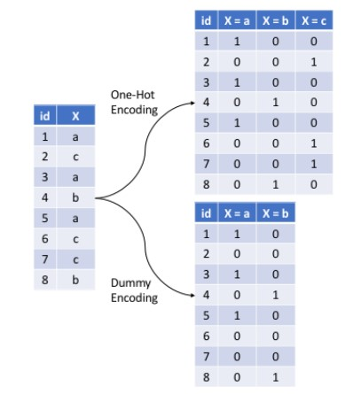
```


## One-hot/dummy Encoding Categorical Predictors

```{r}
blueprint <- ames_recipe %>% 
  step_nzv(Street, Utilities, Pool_Area, Screen_Porch, Misc_Val) %>%  # filter out zv/nzv predictors
  step_impute_mean(Gr_Liv_Area) %>%                                   # impute missing entries
  step_integer(Overall_Qual) %>%                                      # numeric conversion of levels of the predictors
  step_center(all_numeric(), -all_outcomes()) %>%                     # center (subtract mean) all numeric predictors
  step_scale(all_numeric(), -all_outcomes()) %>%                      # scale (divide by standard deviation) all numeric predictors
  step_other(Neighborhood, threshold = 0.01, other = "other") %>%     # lumping required predictors
  step_dummy(all_nominal(), one_hot = TRUE)                           # one-hot/dummy encode nominal categorical predictors
```


## Preprocessing Steps

A suggested order of potential steps that should work for most problems:

1. Filter out zero or near-zero variance features.

2. Perform imputation if required.

3. Label encode ordinal categorical features.

4. Normalize/Standardize (center and scale) numeric features.

5. Lump certain features if required.

6. One-hot or dummy encode categorical features.


## Preprocessing With `recipes` Package

There are three main steps in creating and applying feature engineering with `recipes`:

* **recipe:** where you define your feature engineering steps to create your blueprint.

* **prepare:** estimate feature engineering parameters based on training data.

* **bake:** apply the blueprint to new data.


## Preprocessing With `recipes` Package

```{r}
# finally, after all preprocessing steps have been decided set up the overall blueprint

ames_recipe <- recipe(Sale_Price ~ ., data = ames_train)

blueprint <- ames_recipe %>%    
  step_nzv(Street, Utilities, Pool_Area, Screen_Porch, Misc_Val) %>% 
  step_impute_mean(Gr_Liv_Area) %>%
  step_integer(Overall_Qual) %>%
  step_center(all_numeric(), -all_outcomes()) %>%
  step_scale(all_numeric(), -all_outcomes()) %>%
  step_other(Neighborhood, threshold = 0.01, other = "other") %>%
  step_dummy(all_nominal(), one_hot = TRUE)


prepare <- prep(blueprint, data = ames_train)    # estimate feature engineering parameters based on training data


baked_train <- bake(prepare, new_data = ames_train)   # apply the blueprint to training data for building final/optimal model

baked_test <- bake(prepare, new_data = ames_test)    # apply the blueprint to test data for future use
```


## Training Model  {.smaller}

* **A KNN model**

```{r}
# perform CV to tune K

set.seed(013123)

cv_specs <- trainControl(method = "cv", number = 5)   # 5-fold CV (no repeats)

k_grid <- expand.grid(k = seq(1, 10, by = 2))

knn_fit <- train(blueprint,
                  data = ames_train, 
                  method = "knn",
                  trControl = cv_specs,
                  tuneGrid = k_grid,
                  metric = "RMSE")

knn_fit
```


## Training Model  {.smaller}

* **A KNN model**

```{r, fig.align='center', fig.height=6, fig.width=8}
ggplot(knn_fit)
```


## Training Model  {.smaller}

* **A linear regression model**

```{r}
lm_fit <- train(blueprint,
                  data = ames_train, 
                  method = "lm",
                  trControl = cv_specs,
                  metric = "RMSE")

lm_fit
```


## Final Model and Test Set Error

```{r}
# refit the final/optimal model using ALL modified training data, and obtain estimate of prediction error from modified test data

final_model <- lm(Sale_Price ~ ., data = baked_train)    # build final model 

final_preds <- predict(final_model, newdata = baked_test)   # obtain predictions on test data

sqrt(mean((baked_test$Sale_Price - final_preds)^2))    # calculate test set RMSE
```


## Variable Importance 

```{r, fig.align='center', fig.height=6, fig.width=8}
# variable importance

library(vip)

vip(object = lm_fit,         # CV object 
    num_features = 20,   # maximum number of predictors to show importance for
    method = "model")            # model-specific VI scores
```


## <span style="color:blue">Your Turn!!!</span> {.smaller}

You will work with the `attrition` data from the `modeldata` package. The task is to predict `Attrition` (Yes/No) using the rest of the variables in the data (predictors/features).

```{r}
library(modeldata)   # load package

data(attrition)    # load dataset
```


* **Step 1**: Investigate the dataset

    - What are the types of features? - categorical or numeric
    
    - If categorical, are they ordinal or nominal? If ordinal, are their levels in appropriate order? You can use the `levels` function to check the ordering.
    
    - Are there any features with missing entries?
    
    - Are there any zv/nzv features?
    
* **Step 2**: Split the data into training and test sets (70-30 split)

* **Step 3**: Perform required data preprocessing and create the blueprint. If using `step_dummy()`, set `one_hot = FALSE`.

* **Step 4**: Implement 5-fold CV (no repeats) to compare the performance of the following models. Use `metric = "Accuracy"`.

    - a logistic regression model (`method = "glm"` and `family = "binomial"`)
    
    - a KNN classifier with the optimal `K` chosen by CV (`method = "knn"`). Use a grid of `K` values $1, 2, \ldots, 10$.
    
What is the optimal `K` chosen? How do the models compare in terms of the CV accuracies?

* **Step 5**: Build your final optimal model. Obtain probability and class label predictions for the test set (use threshold of 0.5). Create the corresponding confusion matrix and report the test set accuracy. Also, create the ROC curve for the optimal model and report the AUC.


## <span style="color:blue">Your Turn!!!</span> Step 1 {.smaller}

```{r}
glimpse(attrition)   # types of variables
```

Numerical variables are represented as `<int>`, categorical variables are represented as either `<ord>` or `<fct>`.


## <span style="color:blue">Your Turn!!!</span> Step 1 {.smaller}

```{r}
# checking the levels of ordinal variables 

levels(attrition$BusinessTravel)
levels(attrition$Education)
levels(attrition$EnvironmentSatisfaction)
levels(attrition$JobInvolvement)
levels(attrition$JobSatisfaction)
levels(attrition$PerformanceRating)
levels(attrition$RelationshipSatisfaction)
levels(attrition$WorkLifeBalance)
```


## <span style="color:blue">Your Turn!!!</span> Step 1 

```{r}
# reorder levels of 'BusinessTravel' 

attrition$BusinessTravel <- factor(attrition$BusinessTravel, levels = c("Non-Travel", "Travel_Rarely", "Travel_Frequently"))

levels(attrition$BusinessTravel)
```


## <span style="color:blue">Your Turn!!!</span> Step 1 

```{r}
sum(is.na(attrition))  # check for missing entries
```


## <span style="color:blue">Your Turn!!!</span> Step 1 {.smaller}

```{r}
nearZeroVar(attrition, saveMetrics = TRUE)
```


## <span style="color:blue">Your Turn!!!</span> Step 2 

```{r}
# split data

set.seed(013123)

train_index <- createDataPartition(attrition$Attrition, p = 0.7, list = FALSE)

attrition_train <- attrition[train_index, ]

attrition_test <- attrition[-train_index, ]
```


## <span style="color:blue">Your Turn!!!</span> Step 3 

```{r}
# create recipe, blueprint, prepare, and bake

attrition_recipe <- recipe(formula = Attrition ~ ., data = attrition_train)   # sets up the type and role of variables


blueprint <- attrition_recipe %>%
  step_integer(BusinessTravel, Education, EnvironmentSatisfaction, JobInvolvement, 
               JobSatisfaction, PerformanceRating, RelationshipSatisfaction, 
               WorkLifeBalance) %>%
  step_center(all_numeric()) %>%
  step_scale(all_numeric()) %>%
  step_dummy(all_nominal(), -all_outcomes(), one_hot = FALSE)


prepare <- prep(blueprint, data = attrition_train)    # estimate feature engineering parameters based on training data


baked_train <- bake(prepare, new_data = attrition_train)   # apply the blueprint to training data for building final/optimal model

baked_test <- bake(prepare, new_data = attrition_test)    # apply the blueprint to test data for future use
```


## <span style="color:blue">Your Turn!!!</span> Step 4 {.smaller}

```{r}
# perform CV 

set.seed(013123)

cv_specs <- trainControl(method = "cv", number = 5)   # 5-fold CV (no repeats)


# CV with logistic regression

logistic_fit <- train(blueprint,
                  data = attrition_train, 
                  method = "glm",
                  family = "binomial",
                  trControl = cv_specs,
                  metric = "Accuracy")

logistic_fit
```


## <span style="color:blue">Your Turn!!!</span> Step 4 {.smaller}

```{r}
# CV with KNN

set.seed(013123)

k_grid <- expand.grid(k = seq(1, 10, by = 1))

knn_fit <- train(blueprint,
                  data = attrition_train, 
                  method = "knn",
                  trControl = cv_specs,
                  tuneGrid = k_grid,
                  metric = "Accuracy")

knn_fit
```


## <span style="color:blue">Your Turn!!!</span> Step 4 

```{r, fig.align='center', fig.height=6, fig.width=8}
ggplot(knn_fit)
```


## <span style="color:blue">Your Turn!!!</span> Step 5 

```{r}
# build final optimal model and obtain predictions on test set

final_model <- glm(Attrition ~ ., data = baked_train, family = binomial)    # build final model 

final_model_prob_preds <- predict(object = final_model, newdata = baked_test, type = "response")   # obtain probability predictions on test data

threshold <- 0.5

final_model_class_preds <- factor(ifelse(final_model_prob_preds > threshold, "Yes", "No")) 
```


## <span style="color:blue">Your Turn!!!</span> Step 5 {.smaller}

```{r}
# create confusion matrix

confusionMatrix(data = relevel(final_model_class_preds, ref = "Yes"), 
                reference = relevel(baked_test$Attrition, ref = "Yes")) 
```


## <span style="color:blue">Your Turn!!!</span> Step 5 {.smaller}

```{r, fig.align='center', fig.height=6, fig.width=8}
# create ROC cuvre and compute AUC

roc_object <- roc(response = baked_test$Attrition, predictor = final_model_prob_preds)

plot(roc_object, col = "red")

auc(roc_object)
```


<!-- ## $k$-Fold CV for Classification Problems -->

<!-- * Similar to $k$-fold CV (or LOOCV) for regression problems except -->

<!-- ```{r , echo=FALSE,  fig.align='center', out.width = '40%'} -->
<!-- 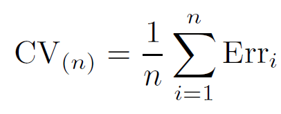 -->
<!-- ``` -->

<!-- or -->

<!-- $$CV_{(k)}=\displaystyle \sum_{i=1}^k \dfrac{n_i}{n} Err_{i}$$ -->

<!-- ## $k$-Fold CV for Classification Problems -->

<!-- **Figure 2.13 in Chapter 2** -->

<!-- ```{r , echo=FALSE,  fig.align='center', out.width = '60%'} -->
<!-- 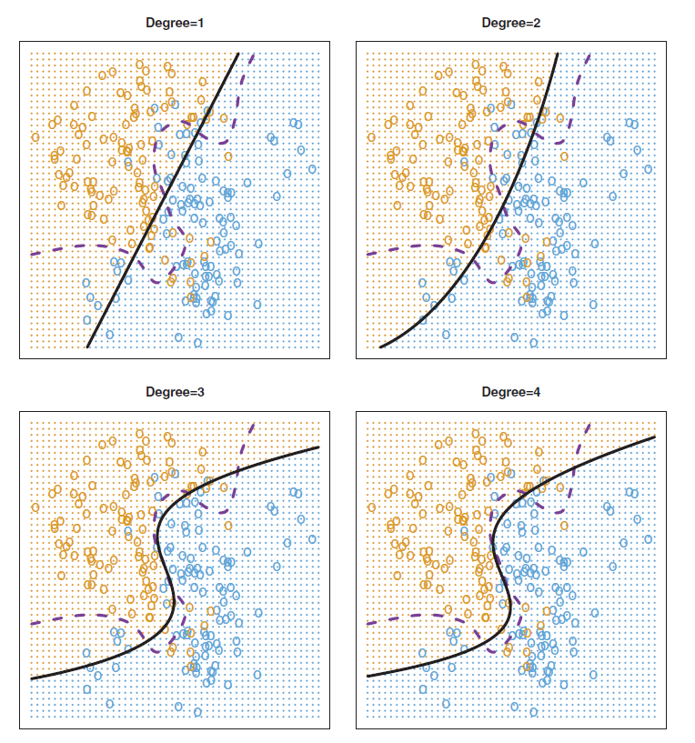 -->
<!-- ``` -->

<!-- ## $k$-Fold CV for Classification Problems -->

<!-- ```{r , echo=FALSE,  fig.align='center', out.width = '100%'} -->
<!-- 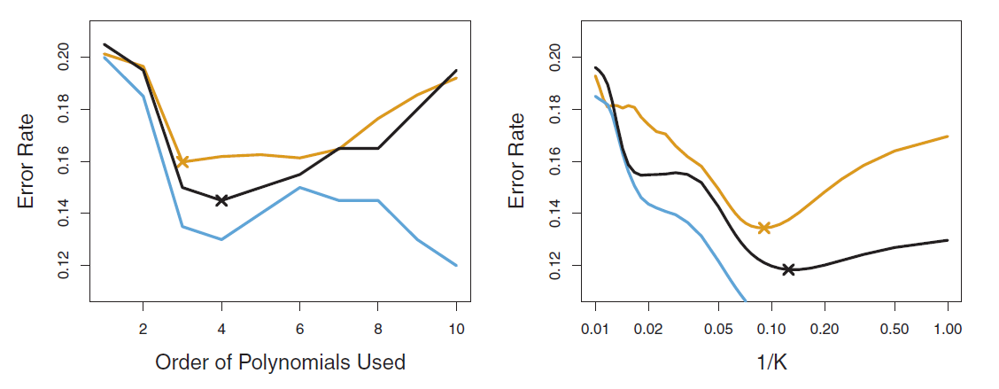 -->
<!-- ``` -->


<!-- ## CV: Right and Wrong Way -->

<!-- Consider a simple classifier applied to some two-class data: -->

<!-- 1. Starting with 5000 predictors and 50 data points, find the 100 predictors having the largest correlation with the class labels. -->
<!-- 2. We then apply a classifier, say logistic regression, using only these 100 predictors. -->


<!-- How do we estimate the test set performance of this -->
<!-- classifier? -->


<!-- How can we apply CV for such a problem? -->

<!-- ## CV: Right and Wrong Way -->

<!-- <span style="color:red">**Wrong Way: Apply CV in step 2.**</span> -->

<!-- ```{r , echo=FALSE,  fig.align='center', out.width = '100%'} -->
<!-- 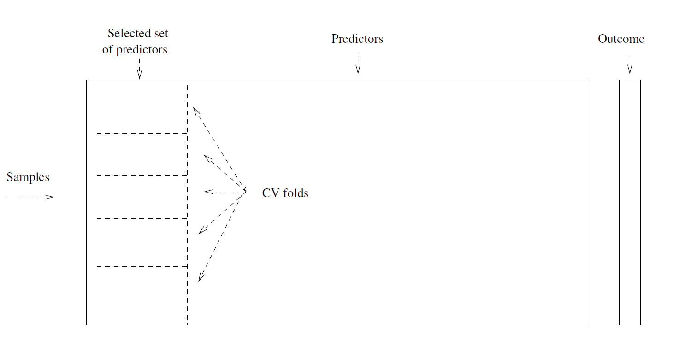 -->
<!-- ``` -->

<!-- ## CV: Right and Wrong Way -->

<!-- <span style="color:blue">**Right Way: Apply CV in steps 1 and 2.**</span> -->

<!-- ```{r , echo=FALSE,  fig.align='center', out.width = '100%'} -->
<!-- 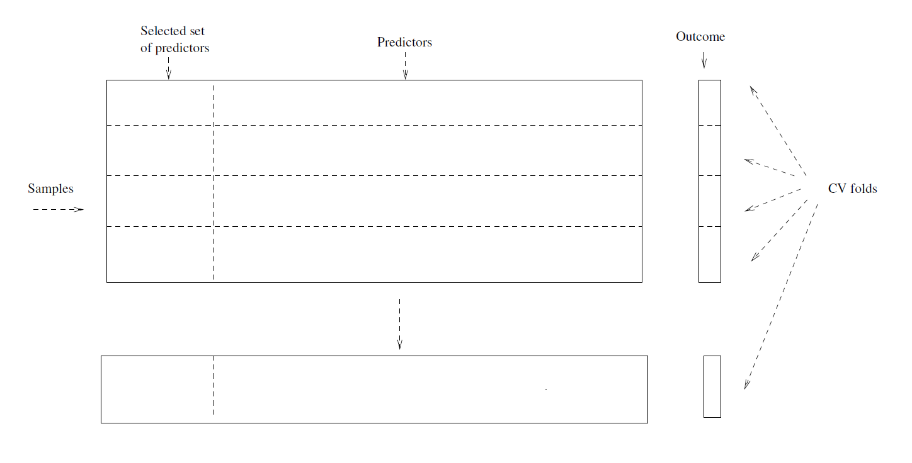 -->
<!-- ``` -->


<!-- ## The Bootstrap -->

<!-- * Another widely used and powerful resampling method. -->

<!-- * Used to quantify uncertainty associated with an estimator or machine learning technique. -->

<!-- * For example, estimate standard errors or obtain confidence intervals for coefficients. -->

<!-- * Can be applied to a wide range of statistical methods. -->

<!-- ## Bootstrap: History -->

<!-- * Derives from the phrase **to pull oneself up by one's bootstraps**, widely thought to be based on one of the eighteenth century fables "The Surprising Adventures of Baron Munchausen" by Rudolph Erich Raspe: -->

<!-- *The Baron had fallen to the bottom of a deep lake. Just -->
<!-- when it looked like all was lost, he thought to pick himself up by his own bootstraps.* -->

<!-- * It is not the same as the term "bootstrap" used in -->
<!-- computer science meaning to "boot" a computer from a set -->
<!-- of core instructions, though the derivation is -->

<!-- * Introduced by Bradley Efron (Stanford University) in his 1979 paper "Bootstrap methods: Another look at the jackknife". -->

<!-- [Interview with Brad Efron](https://www.youtube.com/watch?v=H2tOhMaXWvI) -->

<!-- ## Bootstrap: Toy Example -->

<!-- * Suppose that we wish to invest a fixed sum of money in -->
<!-- two financial assets that yield returns of $X$ and $Y$ , -->
<!-- respectively, where $X$ and $Y$ are random quantities. -->

<!-- * Invest a fraction $\alpha$ in $X$, remaining $1-\alpha$ in $Y$. -->

<!-- * Objective: To choose $\alpha$ to minimize the total risk, or variance, of our investment. -->

<!-- $$\text{Minimize} \ \ Var\left(\alpha X + (1-\alpha) Y\right) \ \ \text{w.r.t} \ \ \alpha$$ -->

<!-- ```{r , echo=FALSE,  fig.align='center', out.width = '50%'} -->
<!-- 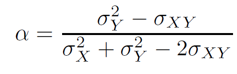 -->
<!-- ``` -->

<!-- where $\sigma^2_X=Var(X)$, $\sigma^2_Y=Var(Y)$, and $\sigma_{XY}=Cov(X,Y)$. -->

<!-- ## Bootstrap: Toy Example -->

<!-- But $\sigma^2_X$, $\sigma^2_Y$, and $\sigma_{XY}$ are unknown (in reality). -->

<!-- Estimate $\hat{\sigma}^2_X$, $\hat{\sigma}^2_Y$, and $\hat{\sigma}_{XY}$ from available data. Then, -->


<!-- ```{r , echo=FALSE,  fig.align='center', out.width = '50%'} -->
<!-- 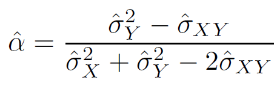 -->
<!-- ``` -->

<!-- ## Bootstrap: Toy Example -->

<!-- Simulation: $\sigma^2_X=1$, $\sigma^2_Y=1.25$, and $\sigma_{XY}=0.5$ ($\alpha=?$) -->

<!-- ```{r , echo=FALSE,  fig.align='center', out.width = '60%'} -->
<!-- 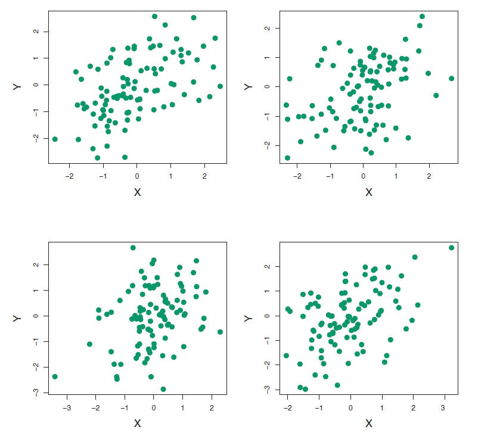 -->
<!-- ``` -->

<!-- $\hat{\alpha}_1=0.576$, $\hat{\alpha}_2=0.532$, $\hat{\alpha}_3=0.657$, $\hat{\alpha}_4=0.651$ -->


<!-- ## Bootstrap: Toy Example -->

<!-- ```{r , echo=FALSE,  fig.align='center', out.width = '60%'} -->
<!-- 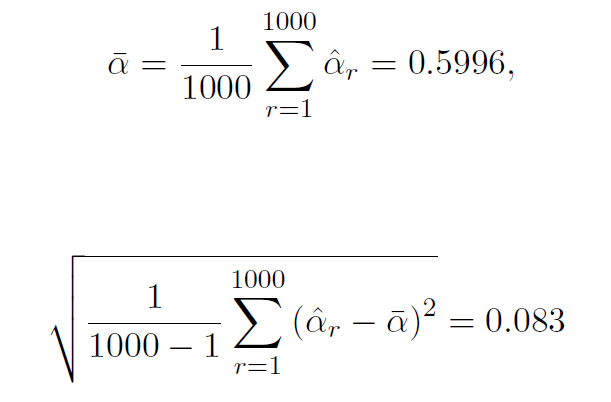 -->
<!-- ``` -->

<!-- ## Bootstrap: Toy Example -->

<!-- ```{r , echo=FALSE,  fig.align='center', out.width = '100%'} -->
<!-- 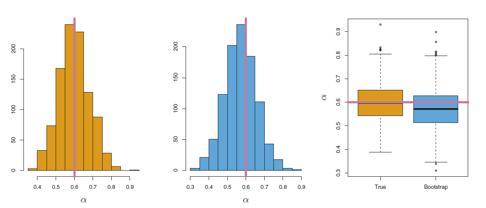 -->
<!-- ``` -->

<!-- ## Bootstrap: Real World -->

<!-- * In real world, we only have a single dataset. Bootstrap mimics the toy example. -->

<!-- * Repeatedly (say $B$ times) sample distinct datasets from the original sample (available data) **with replacement**. -->

<!-- * Each dataset is called **Bootstrap dataset**. -->

<!-- ## Bootstrap: Real World -->

<!-- ```{r , echo=FALSE,  fig.align='center', out.width = '80%'} -->
<!-- 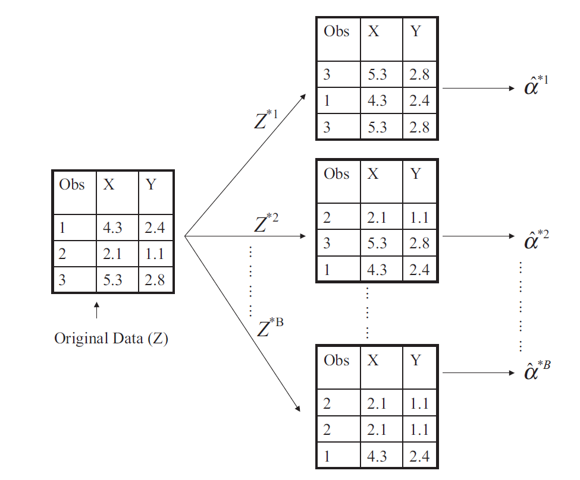 -->
<!-- ``` -->

<!-- ## Bootstrap: Real World -->

<!-- Bootstrap estimate of standard error -->

<!-- ```{r , echo=FALSE,  fig.align='center', out.width = '60%'} -->
<!-- 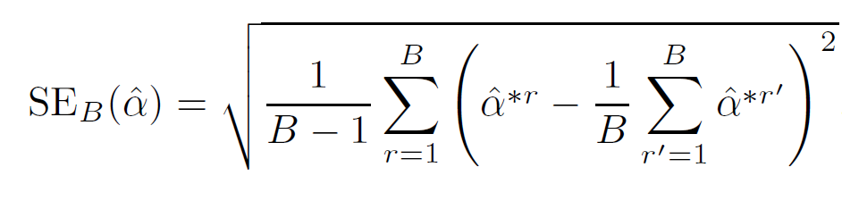 -->
<!-- ``` -->

<!-- ```{r , echo=FALSE,  fig.align='center', out.width = '90%'} -->
<!--  -->
<!-- ``` -->

<!-- ## Bootstrap: Summary -->

<!-- ```{r , echo=FALSE,  fig.align='center', out.width = '100%'} -->
<!-- 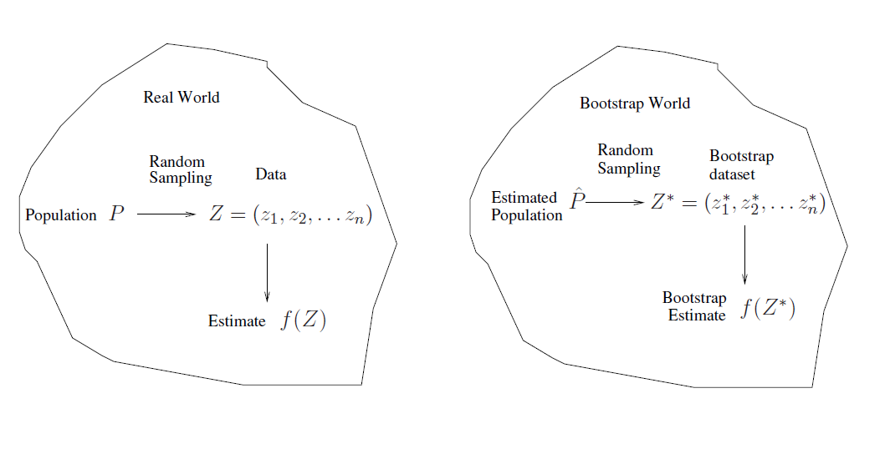 -->
<!-- ``` -->

<!-- ## Bootstrap: Uses -->

<!-- * Primarily used to obtain standard errors of estimates. -->

<!-- * Also, calculate **bootstrap percentile confidence intervals**. -->

<!-- * Can be used to estimate prediction error, but CV is simpler and attractive for this purpose. -->

<!-- ## Week 4 Review -->

<!-- ## Week 4 Review -->

