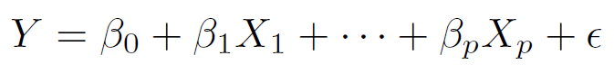

# Linear Model Selection and Regularization

The standard linear model,

```{r , echo=FALSE,  fig.align='center', out.width = '60%'}

```

* **Benefits**: Simple, interpretable, often shows good predictive performance.

* **Limitations**:

  - **Prediction Accuracy**: If $n$ is not big (also when $p>n$), variance can be high resulting in overfitting and poor predictive performance.

  - **Model Interpretability**: Irrelevant features lead to unnecessary model complexity.


## Alternatives to Least Squares

Extensions/Modifications/Improvements to Least Squares:

* **Subset Selection**: Identify a subset of $p$ predictors and then fit a linear model using least squares.

* **Shrinkage/Regularization**: Fit a model using $p$ predictors, but shrink some of the estimated coefficients towards zero. Reduces variance and can also perform variable selection.

* **Dimension Reduction**: Project $p$ predictors onto a $M$-dimensional subspace, where $M<p$. Achieved by computing $M$ different linear combinations or projections of the $p$ predictors. Fit a linear model using these $M$ predictors by least squares.


## Shrinkage/Regularization Methods

Fit a model containing all $p$ predictors using a technique that **shrinks** the coefficient estimates towards zero.

* Ridge Regression

* Lasso

**Shrinking the coefficient estimates significantly reduces their variance.**


## The Lasso {.smaller}

Acronym for **Least Absolute Shrinkage and Selection Operator**.

* **Standard Linear Model**

Given a training dataset, for $i=1,\ldots,n$

$$y_i=\beta_0+\beta_1 x_{i1}+ \ldots + \beta_p x_{ip} + \epsilon_i = \beta_0 + \displaystyle \sum_{j=1}^p \beta_j x_{ij} + \epsilon_i$$

```{r , echo=FALSE,  fig.align='center', out.width = '30%'}
knitr::include_graphics("EFT/e6.45.png")
```

* **Lasso**

<!-- Lasso is a relatively recent alternative to ridge regression that overcomes the disadvantage. -->

```{r , echo=FALSE, fig.align='center', out.width = '60%'}

```


* $\lambda \displaystyle \sum_{j=1}^{p} |\beta_j|$: **Shrinkage Penalty**

* $\lambda \ge 0$: **Tuning/Regularization Parameter**


<!-- ```{r , echo=FALSE, out.width = '25%'} -->
<!--  -->
<!-- ``` -->

## The Lasso

<!-- * Like ridge regression, the lasso shrinks the coefficient estimates towards zero. -->

<!-- * However, in the case of the lasso, the $l_1$ penalty forces some of the coefficient estimates to be -->
<!-- exactly equal to zero when the tuning parameter $\lambda$ is sufficiently large. -->

* This method not only shrinks the coefficient estimates towards zero, but also makes some of the coefficient estimates exactly equal to zero (when the tuning parameter $\lambda$ is sufficiently large).

* Hence, the lasso performs **variable selection**.

<!-- much like best subset selection,  -->

* We say that the lasso yields **sparse models**, that is, models that involve only a subset of the variables.


## The Lasso: Scaling of Predictors

* Standard least squares (regression) coefficient estimates are **scale equivariant**: multiplying $X_j$ by a constant $c$ simply leads to a scaling of the least squares coefficient estimates by a factor of $1/c$. In other words, regardless of how the $j^{th}$ predictor is scaled, $X_j \hat{\beta}_j$ will remain the same.

* In contrast, the lasso coefficient estimates can change substantially when multiplying a given predictor by a constant. Apply lasso after **standardizing** the predictors.

```{r , echo=FALSE, fig.align='center', out.width = '50%'}

```


## The Lasso: Implementation

**Ames Housing Dataset**

```{r}
ames <- readRDS("AmesHousing.rds")   # load dataset

ames$Overall_Qual <- factor(ames$Overall_Qual, levels = c("Very_Poor", "Poor", "Fair", "Below_Average",
                                                  "Average", "Above_Average", "Good", "Very_Good",
                                                  "Excellent", "Very_Excellent"))
```

```{r}
# split data

set.seed(021423)   # set seed

index <- createDataPartition(y = ames$Sale_Price, p = 0.7, list = FALSE)   # consider 70-30 split

ames_train <- ames[index,]   # training data

ames_test <- ames[-index,]   # test data
```


## The Lasso: Implementation

**Ames Housing Dataset**

```{r}
# create recipe and blueprint, prepare and apply blueprint

set.seed(021423)   # set seed

ames_recipe <- recipe(Sale_Price ~ ., data = ames_train)   # set up recipe

blueprint <- ames_recipe %>%
  step_nzv(Street, Utilities, Pool_Area, Screen_Porch, Misc_Val) %>%   # filter out zv/nzv predictors
  step_impute_mean(Gr_Liv_Area) %>%                                    # impute missing entries
  step_integer(Overall_Qual) %>%                                       # numeric conversion of levels of the predictors
  step_center(all_numeric(), -all_outcomes()) %>%                      # center (subtract mean) all numeric predictors
  step_scale(all_numeric(), -all_outcomes()) %>%                       # scale (divide by standard deviation) all numeric predictors
  step_other(Neighborhood, threshold = 0.01, other = "other") %>%      # lumping required predictors
  step_dummy(all_nominal(), one_hot = TRUE)                            # one-hot/dummy encode nominal categorical predictors


prepare <- prep(blueprint, data = ames_train)    # estimate feature engineering parameters based on training data


baked_train <- bake(prepare, new_data = ames_train)   # apply the blueprint to training data for building final/optimal model

baked_test <- bake(prepare, new_data = ames_test)    # apply the blueprint to test data for future use
```


## The Lasso: Implementation

**Ames Housing Dataset**

Implement CV to tune the hyperparameter $\lambda$.

```{r}
set.seed(021423)   # set seed

cv_specs <- trainControl(method = "repeatedcv", number = 5, repeats = 5)   # CV specifications

lambda_grid <- 10^seq(-3, 3, length = 100)   # grid of lambda values to search over

library(glmnet)

lasso_cv <- train(blueprint,
                   data = ames_train,
                   method = "glmnet",   # for lasso
                   trControl = cv_specs,
                   tuneGrid = expand.grid(alpha = 1, lambda = lambda_grid),   # alpha = 1 implements lasso
                   metric = "RMSE")

# results from the CV procedure

lasso_cv$bestTune    # optimal lambda

min(lasso_cv$results$RMSE)   # RMSE for optimal lambda

```


## The Lasso: Implementation

**Ames Housing Dataset**

Results from the CV procedure.

```{r, fig.align='center', fig.height=6, fig.width=8}
ggplot(lasso_cv)   # lambda vs. RMSE plot
```


## The Lasso: Implementation

**Ames Housing Dataset**

We will now build the optimal lasso model on the modified training data using the optimal $\lambda$.

```{r}
# create datasets required for 'glmnet' function

X_train <- model.matrix(Sale_Price ~ ., data = baked_train)[, -1]   # training features without intercept

Y_train <- baked_train$Sale_Price    # training response

X_test <- model.matrix(Sale_Price ~ ., data = baked_test)[, -1]   # test features without intercept

# build optimal lasso model

final_model <- glmnet(x = X_train, y = Y_train,
                 alpha = 1,                      # alpha = 1 builds lasso model
                 lambda = lasso_cv$bestTune$lambda,   # using optimal lambda from CV
                 standardize = FALSE)     # we have already standardized during data preprocessing
```


```{r}
# obtain predictions and test set RMSE

final_model_preds <- predict(final_model, newx = X_test)    # obtain predictions

sqrt(mean((final_model_preds - baked_test$Sale_Price)^2))   # calculate test set RMSE
```


## The Lasso: Implementation {.smaller}

**Ames Housing Dataset**

The coefficients for the optimal lasso model can be obtained from

```{r}
coef(final_model)    # estimated coefficients from final lasso model
```


## The Lasso: Implementation {.smaller}

**Ames Housing Dataset**

```{r, fig.align='center', fig.height=6, fig.width=8}
# variable importance

vip(object = lasso_cv, num_features = 20, method = "model")
```


## <span style="color:blue">Your Turn!!!</span> {.smaller}

You will work with the **Hitters.rds** dataset. Please download the dataset from Canvas, upload it to Posit Cloud, and load it using the following code.

```{r}
Hitters <- readRDS("Hitters.rds")   # load dataset
```


The dataset contains baseball statistics from the 1986 and 1987 seasons. The task is to predict `Salary` using the rest of the variables in the dataset. Compare the performance (in terms of **RMSE**) of the following two models:

* A linear regression model;

* A LASSO model chosen by CV. Consider the grid of possible $\lambda$ values as `lambda_grid <- 10^seq(-2, 2, length = 100)`.


**Perform the following tasks.**

* Investigate the dataset and complete any necessary tasks.

* Split the data into training and test sets (80-20).

* Perform required data preprocessing and create the blueprint. If using `step_dummy()`, set `one_hot = FALSE`. Prepare the blueprint on the training data. Obtain the modified training and test datasets.

* Implement 5-fold CV repeated 5 times for each of the models above.

* Report the optimal CV RMSE of each model. Report the optimal value of $\lambda$ for the LASSO model. Which model performs better in this situation?

* Using the optimal model, obtain predictions on the test set. Calculate and report the test set RMSE.

* Using the optimal model, obtain variable importance measures for the features.


## <span style="color:blue">Your Turn!!!</span> {.smaller}

```{r}
glimpse(Hitters)

# categorical feature: League, Division, NewLeague (all nominal)
# Rest of the features are numerical
```


## <span style="color:blue">Your Turn!!!</span> {.smaller}

```{r}
sum(is.na(Hitters))

# no missing entries
```


## <span style="color:blue">Your Turn!!!</span> {.smaller}


```{r}
summary(Hitters)
```


## <span style="color:blue">Your Turn!!!</span> {.smaller}


```{r}
nearZeroVar(Hitters, saveMetrics = TRUE)

# no zv/nzv features in the original data
```


## <span style="color:blue">Your Turn!!!</span>

```{r}
# split data

set.seed(021423)

index <- createDataPartition(Hitters$Salary, p = 0.8, list = FALSE)

Hitters_train <- Hitters[index,]    # training set

Hitters_test <- Hitters[-index,]   # test set
```


## <span style="color:blue">Your Turn!!!</span> {.smaller}


```{r}
nearZeroVar(Hitters_train, saveMetrics = TRUE)

# no zv/nzv features in the training data
```


## <span style="color:blue">Your Turn!!!</span>

```{r}
set.seed(021423)

Hitters_recipe <- recipe(Salary ~. , data = Hitters_train)   # create recipe
```

```{r}
set.seed(021423)

# create blueprint with feature engineering steps

blueprint <- Hitters_recipe %>%
  step_center(all_numeric(), -all_outcomes()) %>%      # center numerical features
  step_scale(all_numeric(), -all_outcomes()) %>%       # scale numerical features
  step_dummy(all_nominal(), one_hot = FALSE)     # dummy encode nominal features
```

```{r}
set.seed(021423)

prepare <- prep(blueprint, data = Hitters_train)    # estimate feature engineering parameters based on training data
```

```{r}
set.seed(021423)

baked_train <- bake(prepare, new_data = Hitters_train)   # apply the blueprint to training data

baked_test <- bake(prepare, new_data = Hitters_test)   # apply the blueprint to test data
```


## <span style="color:blue">Your Turn!!!</span>

```{r}
set.seed(021423)

cv_specs <- trainControl(method = "repeatedcv", number = 5, repeats = 5)   # CV specifications
```

```{r}
set.seed(021423)

# CV with linear regression

lm_cv <- train(blueprint,
               data = Hitters_train,
               method = "lm",
               trControl = cv_specs,
               metric = "RMSE")
```

```{r}
set.seed(021423)

# CV with LASSO

lambda_grid <- 10^seq(-2, 2, length = 100)    # grid of lambda values

lasso_cv <- train(blueprint,
                  data = Hitters_train,
                  method = "glmnet",
                  trControl = cv_specs,
                  tuneGrid = expand.grid(alpha = 1, lambda = lambda_grid),
                  metric = "RMSE")

```


## <span style="color:blue">Your Turn!!!</span>

```{r}
lm_cv$results$RMSE   # CV RMSE for linear regression model

min(lasso_cv$results$RMSE)    # CV RMSE for optimal LASSO

lasso_cv$bestTune$lambda     # optimal lambda
```


## <span style="color:blue">Your Turn!!!</span>

```{r}
X_train <- model.matrix(Salary ~ ., data = baked_train)[, -1]   # training features without intercept

Y_train <- baked_train$Salary    # training response

X_test <- model.matrix(Salary ~ ., data = baked_test)[, -1]   # test features without intercept

# build optimal lasso model

final_model <- glmnet(x = X_train, y = Y_train,
                      alpha = 1,                      # alpha = 1 builds lasso model
                      lambda = lasso_cv$bestTune$lambda,   # using optimal lambda from CV
                      standardize = FALSE)     # we have already standardized during data preprocessing
```

```{r}
final_model_preds <- predict(final_model, newx = X_test)    # obtain predictions

sqrt(mean((final_model_preds - baked_test$Salary)^2))   # calculate test set RMSE
```


## <span style="color:blue">Your Turn!!!</span> {.smaller}


```{r, fig.align='center', fig.height=6, fig.width=8}
vip(object = lasso_cv, num_features = 20, method = "model")
```


## Multivariate Adaptive Regression Splines (MARS)

Multivariate Adaptive Regression Splines (MARS) capture the nonlinear relationships in the data by assessing **cutpoints (knots)**. The procedure assesses each data point for each predictor as a knot and creates a **piecewise linear regression model** with the candidate feature(s).

This procedure continues until many knots are found, producing a (potentially) highly non-linear prediction equation. Once the full set of knots has been identified, knots that do not contribute significantly to predictive accuracy can be sequentially removed. This process is known as **pruning** .

There are two tuning parameters associated with our MARS model:

* the maximum degree of interactions, and

* the number of terms retained in the final model after pruning.

We can use CV to identify the optimal combination of these tuning parameters .


## MARS: Geometry

```{r , echo=FALSE,  fig.align='center', fig.cap="Adapted from Hands-on Machine Learning with R, Bradley Boehmke & Brandon Greenwell", out.width = '80%'}

```


## MARS: Implementation

**Ames Housing Dataset**

```{r, echo=FALSE}
ames <- readRDS("AmesHousing.rds")   # load dataset

ames$Overall_Qual <- factor(ames$Overall_Qual, levels = c("Very_Poor", "Poor", "Fair", "Below_Average",
                                                  "Average", "Above_Average", "Good", "Very_Good",
                                                  "Excellent", "Very_Excellent"))

# split data

set.seed(021423)   # set seed

index <- createDataPartition(y = ames$Sale_Price, p = 0.7, list = FALSE)   # consider 70-30 split

ames_train <- ames[index,]   # training data

ames_test <- ames[-index,]   # test data

# create recipe and blueprint, prepare and apply blueprint

set.seed(021423)   # set seed

ames_recipe <- recipe(Sale_Price ~ ., data = ames_train)   # set up recipe

blueprint <- ames_recipe %>%
  step_nzv(Street, Utilities, Pool_Area, Screen_Porch, Misc_Val) %>%   # filter out zv/nzv predictors
  step_impute_mean(Gr_Liv_Area) %>%                                    # impute missing entries
  step_integer(Overall_Qual) %>%                                       # numeric conversion of levels of the predictors
  step_center(all_numeric(), -all_outcomes()) %>%                      # center (subtract mean) all numeric predictors
  step_scale(all_numeric(), -all_outcomes()) %>%                       # scale (divide by standard deviation) all numeric predictors
  step_other(Neighborhood, threshold = 0.01, other = "other") %>%      # lumping required predictors
  step_dummy(all_nominal(), one_hot = TRUE)                            # one-hot/dummy encode nominal categorical predictors


prepare <- prep(blueprint, data = ames_train)    # estimate feature engineering parameters based on training data


baked_train <- bake(prepare, new_data = ames_train)   # apply the blueprint to training data for building final/optimal model

baked_test <- bake(prepare, new_data = ames_test)    # apply the blueprint to test data for future use
```


```{r}
# data splitting and preprocessing already done in the previous slides

set.seed(021423)   # set seed

cv_specs <- trainControl(method = "repeatedcv", number = 5, repeats = 5)   # CV specifications
```


```{r}
library(earth)    # for MARS technique

set.seed(021423)   # set seed

param_grid <- expand.grid(degree = 1:3, nprune = seq(1, 100, length.out = 10))   # grid of tuning parameters

mars_cv <- train(blueprint,
                 data = ames_train,
                 method = "earth",
                 trControl = cv_specs,
                 tuneGrid = param_grid,
                 metric = "RMSE")
```


## MARS: Implementation

**Ames Housing Dataset**

```{r}
mars_cv$bestTune   # optimal tuning parameters

min(mars_cv$results$RMSE)   # optimal CV RMSE
```


## MARS: Implementation

**Ames Housing Dataset**

```{r}
# fit final optimal model

final_model <- earth(Sale_Price ~ .,
                 data = baked_train,
                 degree = mars_cv$bestTune$degree,
                 nprune = mars_cv$bestTune$nprune)
```


```{r}
final_model_preds <- predict(final_model, newdata = baked_test, type = "response")   # obtain predictions

sqrt(mean((final_model_preds - baked_test$Sale_Price)^2))   # test RMSE
```


## MARS: Implementation

**Ames Housing Dataset**

```{r}
summary(final_model)
```


## MARS: Implementation {.smaller}

**Ames Housing Dataset**

```{r, fig.align='center', fig.height=6, fig.width=8}
vip(object = mars_cv, num_features = 20, method = "model")
```


## MARS

**Advantages**

* MARS can handle mixed types of features (quantitative and qualitative).

* MARS also requires minimal feature engineering (missing values need to be imputed) and performs automated feature selection.


**Disadvantages**

* MARS models are typically slower to train.


## MARS Without Feature Engineering: Implementation {.smaller}

**Ames Housing Dataset**

```{r}
# create recipe and blueprint, prepare and apply blueprint

set.seed(021423)   # set seed

ames_recipe <- recipe(Sale_Price ~ ., data = ames_train)   # set up recipe

blueprint_new <- ames_recipe %>%
  step_impute_mean(Gr_Liv_Area)                                     # impute missing entries


prepare <- prep(blueprint_new, data = ames_train)    # estimate feature engineering parameters based on training data


baked_train <- bake(prepare, new_data = ames_train)   # apply the blueprint to training data for building final/optimal model

baked_test <- bake(prepare, new_data = ames_test)    # apply the blueprint to test data for future use
```


## MARS Without Feature Engineering: Implementation {.smaller}

**Ames Housing Dataset**

```{r}
# data splitting and preprocessing already done in the previous slides

set.seed(021423)   # set seed

cv_specs <- trainControl(method = "repeatedcv", number = 5, repeats = 5)   # CV specifications
```

```{r}
library(earth)    # for MARS technique

set.seed(021423)   # set seed

param_grid <- expand.grid(degree = 1:3, nprune = seq(1, 100, length.out = 10))   # grid of tuning parameters

mars_cv_new <- train(blueprint_new,
                 data = ames_train,
                 method = "earth",
                 trControl = cv_specs,
                 tuneGrid = param_grid,
                 metric = "RMSE")
```


## MARS Without Feature Engineering: Implementation {.smaller}

**Ames Housing Dataset**

```{r}
mars_cv_new$bestTune   # optimal tuning parameters

min(mars_cv_new$results$RMSE)   # optimal CV RMSE
```


## MARS Without Feature Engineering: Implementation {.smaller}

**Ames Housing Dataset**

```{r}
# fit final optimal model

final_model_new <- earth(Sale_Price ~ .,
                 data = baked_train,
                 degree = mars_cv_new$bestTune$degree,
                 nprune = mars_cv_new$bestTune$nprune)
```


```{r}
final_model_preds_new <- predict(final_model_new, newdata = baked_test, type = "response")   # obtain predictions

sqrt(mean((final_model_preds_new - baked_test$Sale_Price)^2))   # test RMSE
```


## MARS Without Feature Engineering: Implementation {.smaller}

**Ames Housing Dataset**

```{r}
summary(final_model_new)
```


## MARS Without Feature Engineering: Implementation {.smaller}

**Ames Housing Dataset**

```{r, fig.align='center', fig.height=6, fig.width=8}
vip(object = mars_cv_new, num_features = 20, method = "model")
```


## <span style="color:blue">Your Turn!!!</span> {.smaller}

You will work with the `titanic.rds` dataset which contains information on Titanic passengers. Please download the dataset from Canvas, upload it to Posit Cloud, and load it using the following code. 

```{r}
titanic <- readRDS("titanic.rds")    # load dataset
```

The variables in the dataset are `pclass` (passenger class - '1st', '2nd', '3rd'), `survived` ('Yes' or 'No'), `sex` ('male' or 'female'), `age` (age in years), `sibsp` (number of siblings or spouses aboard), `parch` (number of parents or children aboard).

We are interested in predicting `survived` using the rest of the variables in the dataset. Compare the performance (in terms of **Accuracy**) of the following models:

* A logistic regression model;

* A $K$-NN model with optimal $K$ chosen by CV;

* A MARS model with optimal hyperparameters chosen by CV; 

* A MARS model with minimal feature engineering. Choose the optimal hyperparameters by CV.

**Perform the following tasks.**

* Investigate the dataset and complete any necessary tasks. 

* Split the data into training and test sets (80-20).

* Perform required data preprocessing and create the blueprint. If using `step_dummy()`, set `one_hot = FALSE`. Prepare the blueprint on the training data. Obtain the modified training and test datasets. 

* Implement 5-fold CV repeated 5 times for each of the models above. 

* Report the optimal CV Accuracy of each model. Report the optimal hyperparameters for each model. Which model performs best in this situation? 

* Build the final model. Obtain probability and class label predictions on the test set. Create the corresponding confusion matrix and report the test set accuracy. (Check out the help page of `predict.earth` and the type of objects created.)

## <span style="color:blue">Your Turn!!!</span>

**Titanic Dataset**

```{r}
glimpse(titanic)
```

```{r}
sum(is.na(titanic))
```


## <span style="color:blue">Your Turn!!!</span> 

**Titanic Dataset**


```{r}
summary(titanic)
```

```{r}
levels(titanic$pclass)   # levels are in order
```

```{r}
# age, sibsp, parch are numerical variables
# pclass is an ordinal categorical variable
# sex is a nominal categorical variable
# missing entries in age and parch
```


## <span style="color:blue">Your Turn!!!</span> 

**Titanic Dataset**

```{r}
# split data

set.seed(021423)

index <- createDataPartition(titanic$survived, p = 0.8, list = FALSE)   # 80-20 split

titanic_train <- titanic[index, ]    # training data

titanic_test <- titanic[-index, ]   # test data
```


## <span style="color:blue">Your Turn!!!</span> 

**Titanic Dataset**

```{r}
# create recipe and blueprint, prepare, and bake

set.seed(021423)

blueprint <- recipe(survived ~ ., data = titanic_train) %>%      # create recipe
  step_impute_mean(age) %>%                      # impute age by mean
  step_impute_median(parch) %>%                  # impute parch by median since discrete integers
  step_integer(pclass) %>%                       # label encoding ordinal feature
  step_normalize(all_numeric_predictors()) %>%   # center and scale numerical features
  step_dummy(sex, one_hot = FALSE)               # creating dummy variable for nominal feature

prepare <- prep(blueprint, training = titanic_train)    # prepare blueprint on training data

baked_train <- bake(prepare, new_data = titanic_train)    # apply the blueprint to training data

baked_test <- bake(prepare, new_data = titanic_test)      # apply the blueprint to training data
```


## <span style="color:blue">Your Turn!!!</span> {.smaller}

**Titanic Dataset**

```{r, fig.align='center', fig.height=6, fig.width=8}
# set up CV 

set.seed(021423)   # set seed

cv_specs <- trainControl(method = "repeatedcv", number = 5, repeats = 5)   # CV specifications


# CV with logistic regression

logistic_cv <- train(blueprint,
                     data = titanic_train, 
                     method = "glm",
                     family = "binomial",
                     trControl = cv_specs,
                     metric = "Accuracy")


# CV with KNN

k_grid <- expand.grid(k = seq(1, 101, by = 10))   # grid of K

knn_cv <- train(blueprint,
                data = titanic_train, 
                method = "knn",
                trControl = cv_specs,
                tuneGrid = k_grid,
                metric = "Accuracy")


# CV with MARS

param_grid <- expand.grid(degree = 1:3, nprune = seq(1, 100, length.out = 10))    # grid of tuning parameters

mars_cv <- train(blueprint, 
                 data = titanic_train, 
                 method = "earth",
                 trControl = cv_specs,
                 tuneGrid = param_grid,
                 metric = "Accuracy")
```


## <span style="color:blue">Your Turn!!!</span>   {.smaller}

**Titanic Dataset**


```{r}
# create recipe and blueprint, prepare, and bake

set.seed(021423)   # set seed


blueprint_new <- recipe(survived ~ ., data = titanic_train) %>%   # create recipe 
  step_impute_mean(age) %>%                                       # impute age by mean
  step_impute_median(parch)                                       # impute parch by median since discrete integers


prepare_new <- prep(blueprint_new, data = titanic_train)    # prepare blueprint on training data


baked_train_new <- bake(prepare_new, new_data = titanic_train)   # apply the blueprint to training data

baked_test_new <- bake(prepare_new, new_data = titanic_test)    # apply the blueprint to test data


# CV with MARS (minimal feature engineering)

param_grid <- expand.grid(degree = 1:3, nprune = seq(1, 100, length.out = 10))    # grid of tuning parameters

mars_cv_new <- train(blueprint_new,
                     data = titanic_train,
                     method = "earth",
                     trControl = cv_specs,
                     tuneGrid = param_grid,
                     metric = "Accuracy")
```

## <span style="color:blue">Your Turn!!!</span> 

**Titanic Dataset**

```{r}
# optimal CV Accuracies

logistic_cv$results$Accuracy    # logistic regression 

max(knn_cv$results$Accuracy)    # KNN

max(mars_cv$results$Accuracy)   # MARS

max(mars_cv_new$results$Accuracy)   # MARS (minimal feature preprocessing)
```

```{r}
# The optimal MARS model with proper feature engineering seems to perform the best.
```


## <span style="color:blue">Your Turn!!!</span> 

**Titanic Dataset**


```{r}
knn_cv$bestTune$k        # optimal K

mars_cv$bestTune   # optimal MARS hyperparameters

mars_cv_new$bestTune   # optimal MARS hyperparameters with minimal feature engineering
```


## <span style="color:blue">Your Turn!!!</span> 

**Titanic Dataset**

```{r}
# build final model

final_model <- earth(survived ~ .,
                 data = baked_train,
                 degree = mars_cv$bestTune$degree,   # optimal degree of interactions
                 nprune = mars_cv$bestTune$nprune,   # optimal number of terms after pruning
                 glm = list(family = binomial))
```


```{r}
# obtain predictions on test data

final_model_prob_preds <- predict(final_model, newdata = baked_test, type = "response")   # probability predictions

final_model_class_preds <- predict(final_model, newdata = baked_test, type = "class")   # class label predictions
```


## <span style="color:blue">Your Turn!!!</span> {.smaller}

**Titanic Dataset**

```{r}
# Notice that the class label predictions are 'character' types.
# Need to convert then into 'factor' type

final_model_class_preds <- factor(final_model_class_preds)

# confusion matrix

confusionMatrix(data = relevel(final_model_class_preds, ref = "Yes"),
                reference = relevel(baked_test$survived, ref = "Yes"))
```
