<!-- ```{r , echo=FALSE,  fig.align='center', out.width = '90%'} -->
<!-- knitr::include_graphics("EFT/SL1.png") -->
<!-- ``` -->


# Tree-Based Methods

* Involves **stratifying** or **segmenting** the predictor space into a number of simple regions.

* The set of splitting rules used to segment the predictor space can be summarized in a tree, thus, the name **decision tree** methods.

* Can be used for both classification and regression.

* Tree-based methods are simple and useful for interpretation, however, not the best in terms of prediction accuracy.

* Methods such as **bagging**, **random forests**, and **boosting** grow multiple trees and then combine their results.

<!-- ## Regression Trees -->

<!-- **Hitters dataset** -->

<!-- ```{r,echo=FALSE} -->
<!-- data("Hitters") -->
<!-- Hitters=na.omit(Hitters) -->
<!-- head(Hitters) -->
<!-- ``` -->

<!-- ## Regression Trees -->

<!-- **Hitters dataset** -->

<!-- log(Salary) is color-coded from low (blue, green) to high (yellow, red). -->

<!-- ```{r , echo=FALSE,  fig.align='center', out.width = '60%'} -->
<!-- 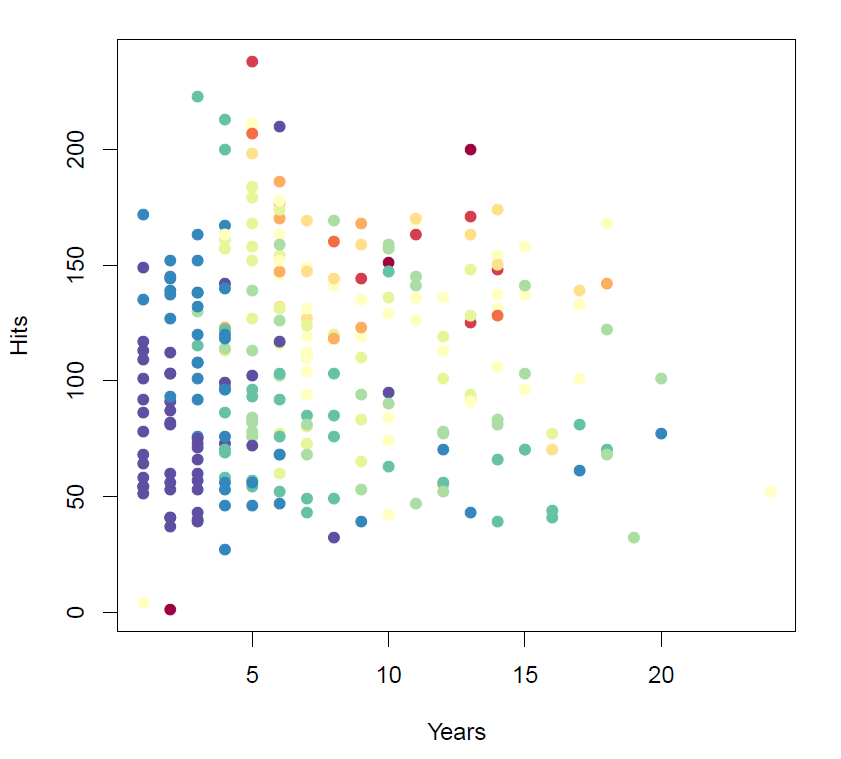 -->
<!-- ``` -->

<!-- ## Regression Trees -->

<!-- **Hitters dataset** -->

<!-- ```{r , echo=FALSE,  fig.align='center', out.width = '60%'} -->
<!-- 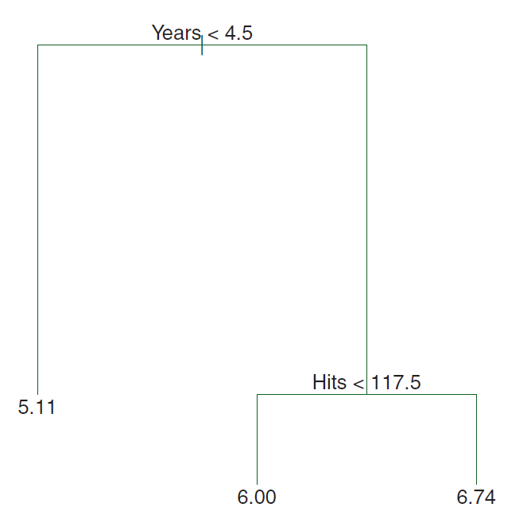 -->
<!-- ``` -->

<!-- ## Regression Trees -->

<!-- **Hitters dataset** -->

<!-- ```{r , echo=FALSE,  fig.align='center', out.width = '70%'} -->
<!-- 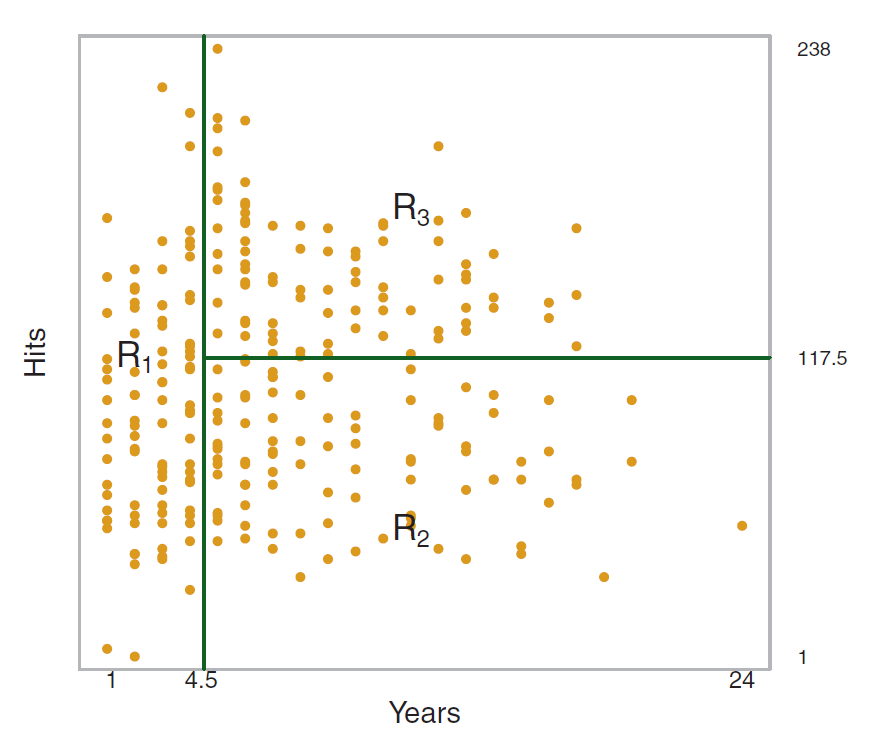 -->
<!-- ``` -->


## Terminology for Trees

* Every split is considered to be a **node**.

* We refer to the first node at the top of the tree as the **root node** (this node contains all of the training data). 

* The final nodes at the bottom of the tree are called the **terminal nodes** or **leaves**.

<!-- The regions $R_1$, $R_2$, and $R_3$ are known as **terminal nodes** or **leaves**. -->

* Decision trees are typically drawn **upside down**, in the sense that the leaves are at the bottom of the tree.

* The points along the tree where the predictor space is split are referred to as **internal nodes**, that is, every node in between the **root node** and **terminal nodes** is referred to as an **internal node**.

* The segments of the trees that connect the nodes are known as **branches**.


## Terminology for Trees

```{r , echo=FALSE,  fig.align='center', fig.cap="Adapted from HMLR, Boehmke & Greenwell", out.width = '100%'}
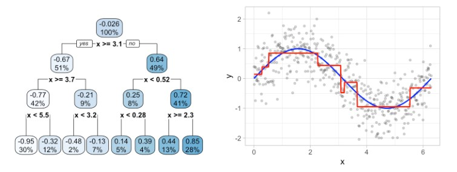
```


<!-- ## Interpretation of Trees -->

<!-- **Hitters dataset** -->

<!-- * **Years** is the most important factor in determining **Salary**, and players with less experience earn lower salaries than more experienced players. -->

<!-- * Given that a player is less experienced, the number of **Hits** that he made in the previous year seems to play little role in his **Salary**. -->

<!-- * But among players who have been in the major leagues for five or more years, the number of **Hits** made in the previous year does affect **Salary**, and players who made more **Hits** last year tend to have higher salaries. -->

<!-- * Surely an over-simplification, but compared to a regression model, it is easy to display, interpret and explain. -->

## Building a Tree and Prediction

<!-- Building a tree involves two steps. -->

The steps involved are:

1. Dividing the predictor space, that is, the set of possible values for $X_1, X_2, \ldots, X_p$ into $J$ distinct and non-overlapping regions, $R_1, R_2, \ldots, R_J$.

2. For every observation that falls into the region $R_j$, make the same prediction, which is 

  * the mean response of the training set observations in $R_j$ (for regression problems), 
  
  * majority vote response of the training set observations in $R_j$ (for classification problems).


## Building a Tree and Prediction

```{r , echo=FALSE,  fig.align='center', fig.cap="Adapted from HMLR, Boehmke & Greenwell", out.width = '100%'}
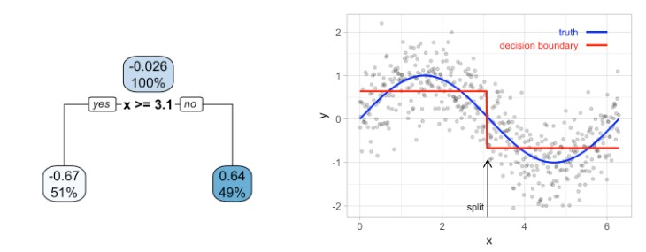
```


## Building a Tree and Prediction

**Default Dataset**

```{r, fig.align='center', fig.height=6, fig.width=8, echo=FALSE}
library(ISLR2)

data("Default")

ggplot(data = Default) +
  geom_point(aes(x = balance, y = income, color = default), shape = c(3), alpha = 10)
```


## Building a Tree and Prediction

**Default Dataset**

```{r, fig.align='center', fig.height=6, fig.width=8, echo=FALSE}
library(rpart)
library(rpart.plot)
t <- rpart(default ~ balance + income, data = Default, method = "class")
rpart.plot(t)
```


## Building a Tree and Prediction

```{r , echo=FALSE,  fig.align='center', fig.cap="Adapted from ISLR, James et al.", out.width = '60%'}
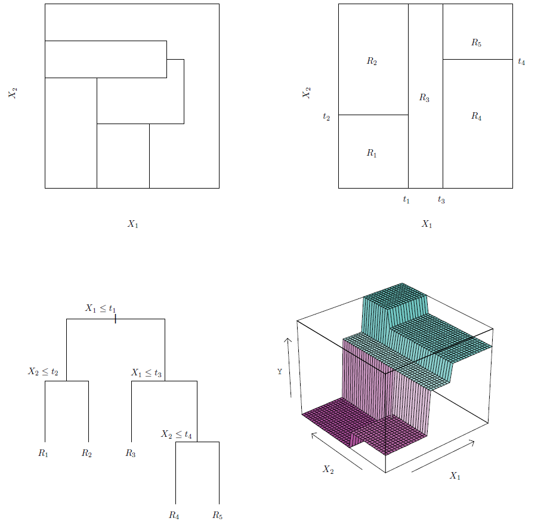
```


<!-- ## Building a Tree -->

<!-- * In theory, regions could have any shape. However, we -->
<!-- choose to divide the predictor space into **high-dimensional rectangles**, or **boxes**, for simplicity and for ease of interpretation of the resulting predictive model. -->

<!-- * **Objective**: Find boxes $R_1, R_2, \ldots R_J$ that minimize the $RSS$, -->

<!-- ```{r , echo=FALSE,  fig.align='center', out.width = '40%'} -->
<!-- 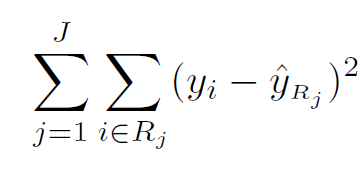 -->
<!-- ``` -->

<!-- where $\hat{y}_{R_j}$ is the mean response for the training observations within the $j^{th}$ box. -->

## Building a Tree

* It is computationally infeasible to consider every possible partition of the feature space into $J$ boxes.

* For this reason, we take a **top-down, greedy** approach known as **recursive binary splitting**.
    + **top-down** because it begins at the top of the tree and then successively splits the predictor space.
    + **greedy** because at each step of the tree-building process, the best split is made at that particular step, rather than looking ahead and picking a split that will lead to a better tree in some future step.


## Building a Tree

* First select the predictor $X_j$ and the cutpoint $s$ such that splitting the predictor space into the regions
$\{X|X_j < s\}$ and $\{X|X_j \ge s\}$ leads to the greatest possible reduction in RSS.

For any $j$ and $s$, define

```{r , echo=FALSE,  fig.align='center', out.width = '67%'}
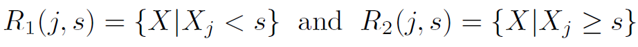
```

Find $j$ and $s$ that minimize

```{r , echo=FALSE,  fig.align='center', out.width = '67%'}
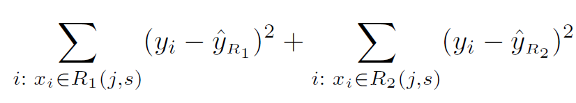
```

* Next, repeat the process, look for the best predictor and best cutpoint in order to split the data further.
However, this time, instead of splitting the entire predictor space, split one of the two previously identified regions.

* The process continues until a stopping criterion is reached; say, we may continue until no region contains more than five observations.


<!-- ## Building a Tree -->

<!-- ```{r , echo=FALSE,  fig.align='center', fig.cap="Adapted from HMLR, Boehmke & Greenwell", out.width = '100%'} -->
<!-- knitr::include_graphics("tree2.jpg") -->
<!-- ``` -->


## Tree Pruning

* The process described above may **overfit** the data.

* A smaller tree with fewer splits (that is, fewer regions $R_1,\ldots,R_J$) might lead to lower variance and better interpretation at the cost of a little bias.

* One possible alternative is to grow the tree only so long as the decrease in the $RSS$ due to each split exceeds some (high) threshold.

* This strategy will result in smaller trees, but is too short-sighted: a seemingly worthless split early on in the tree might be followed by a very good split, that is, a split that leads to a large reduction in $RSS$ later on.


## Tree Pruning

* A better strategy is **pruning**.

* Grow a very large tree $T_0$, and then **prune** it back to obtain a **subtree**.

* The technique uses is known as **cost complexity pruning** (also known as **weakest link pruning**).

* Consider a sequence of trees indexed by $\alpha$. For each $\alpha$, consider the tree $T \subset T_0$ that minimizes

```{r , echo=FALSE,  fig.align='center', out.width = '70%'}
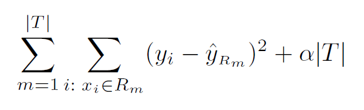
```

* Choose optimal $\alpha$ by CV.


## Building an Optimal Tree

```{r , echo=FALSE,  fig.align='center', out.width = '90%'}
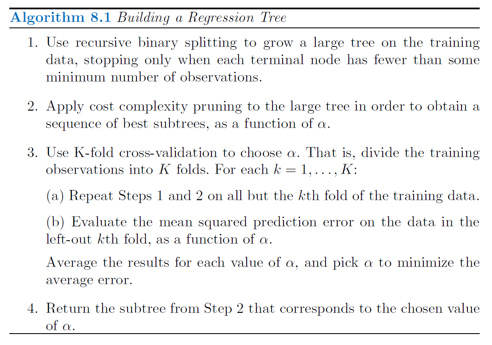
```

<!-- ## Building an Optimal Tree -->

<!-- **Hitters dataset** -->

<!-- ```{r , echo=FALSE,  fig.align='center', out.width = '70%'} -->
<!-- 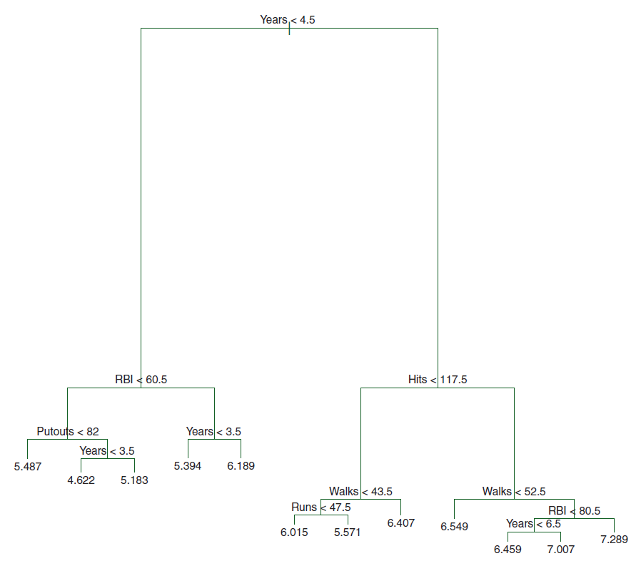 -->
<!-- ``` -->

<!-- ## Building an Optimal Tree -->

<!-- **Hitters dataset** -->

<!-- ```{r , echo=FALSE,  fig.align='center', out.width = '90%'} -->
<!-- 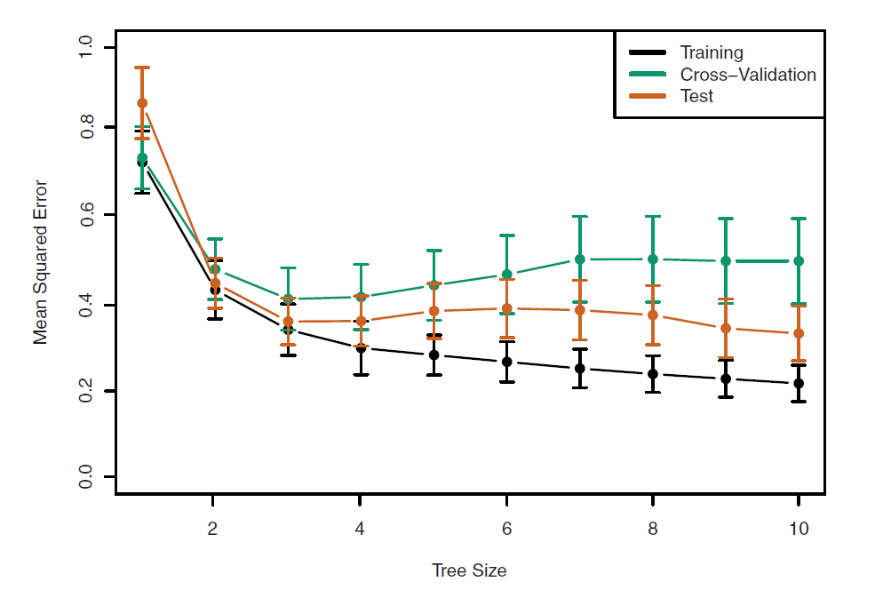 -->
<!-- ``` -->

## Regression Tree: Implementation

**Ames Housing Dataset**

```{r}
ames <- readRDS("AmesHousing.rds")   # load dataset

ames$Overall_Qual <- factor(ames$Overall_Qual, levels = c("Very_Poor", "Poor", "Fair", "Below_Average",
                                                  "Average", "Above_Average", "Good", "Very_Good",
                                                  "Excellent", "Very_Excellent"))
```

```{r}
# split data

set.seed(022123)   # set seed

index <- createDataPartition(y = ames$Sale_Price, p = 0.7, list = FALSE)   # consider 70-30 split

ames_train <- ames[index,]   # training data

ames_test <- ames[-index,]   # test data
```


## Regression Tree: Implementation

**Ames Housing Dataset**

```{r}
# create recipe and blueprint, prepare and apply blueprint

set.seed(022123)   # set seed

ames_recipe <- recipe(Sale_Price ~ ., data = ames_train)   # set up recipe

blueprint <- ames_recipe %>%
  step_nzv(Street, Utilities, Pool_Area, Screen_Porch, Misc_Val) %>%   # filter out zv/nzv predictors
  step_impute_mean(Gr_Liv_Area) %>%                                    # impute missing entries
  step_integer(Overall_Qual) %>%                                       # numeric conversion of levels of the predictors
  step_center(all_numeric(), -all_outcomes()) %>%                      # center (subtract mean) all numeric predictors
  step_scale(all_numeric(), -all_outcomes()) %>%                       # scale (divide by standard deviation) all numeric predictors
  step_other(Neighborhood, threshold = 0.01, other = "other") %>%      # lumping required predictors
  step_dummy(all_nominal(), one_hot = TRUE)                            # one-hot/dummy encode nominal categorical predictors


prepare <- prep(blueprint, data = ames_train)    # estimate feature engineering parameters based on training data


baked_train <- bake(prepare, new_data = ames_train)   # apply the blueprint to training data for building final/optimal model

baked_test <- bake(prepare, new_data = ames_test)    # apply the blueprint to test data for future use
```


## Regression Tree: Implementation

**Ames Housing Dataset**

Implement CV to tune the hyperparameter.

```{r}
set.seed(022123)   # set seed

cv_specs <- trainControl(method = "repeatedcv", number = 5, repeats = 5)   # CV specifications


library(rpart)

tree_cv <- train(blueprint,
                   data = ames_train,
                   method = "rpart",  
                   trControl = cv_specs,
                   tuneLength = 20,                   # considers a grid of 20 possible tuning parameter values
                   metric = "RMSE")
```


```{r}
# results from the CV procedure

tree_cv$bestTune    # optimal hyperparameter

min(tree_cv$results$RMSE)   # optimal CV RMSE
```


## Regression Tree: Implementation {.smaller}

**Ames Housing Dataset**

Results from the CV procedure.

```{r, fig.align='center', fig.height=6, fig.width=8}
ggplot(tree_cv)   
```


## Regression Tree: Implementation

**Ames Housing Dataset**

```{r}
# build final model

final_model <- rpart(Sale_Price ~ .,
                  data = baked_train,
                  cp = tree_cv$bestTune$cp,
                  xval = 0,                 # no further CV
                  method = "anova")         # for regression
```


```{r}
# obtain predictions and test set RMSE

final_model_preds <- predict(final_model, newdata = baked_test)    # obtain test set predictions

sqrt(mean((final_model_preds - baked_test$Sale_Price)^2))   # calculate test set RMSE
```


## Regression Tree: Implementation 

**Ames Housing Dataset**

```{r, fig.align='center', fig.height=6, fig.width=8}
library(rpart.plot)
rpart.plot(final_model)    
```


## Regression Tree: Implementation {.smaller}

**Ames Housing Dataset**

```{r, fig.align='center', fig.height=6, fig.width=8}
# variable importance

vip(object = tree_cv, num_features = 20, method = "model")
```


## Regression Tree: Implementation

**Ames Housing Dataset**

```{r}
# build full grown tree (no pruning)

final_model_no_prune <- rpart(Sale_Price ~ .,
                            data = baked_train,
                            cp = 0,                   # no pruning
                            xval = 0,                 # no CV
                            method = "anova")         # for regression
```


```{r}
# obtain predictions and test set RMSE

final_model_no_prune_preds <- predict(final_model_no_prune, newdata = baked_test)    # obtain test set predictions

sqrt(mean((final_model_no_prune_preds - baked_test$Sale_Price)^2))   # calculate test set RMSE
```


## Regression Tree: Implementation 

**Ames Housing Dataset**

```{r, fig.align='center', fig.height=6, fig.width=8}
rpart.plot(final_model_no_prune)    
```


<!-- ## Regression Tree: Boston Data Example  {.smaller} -->


<!-- ```{r} -->
<!-- library(MASS) -->

<!-- data("Boston")   # load dataset -->

<!-- set.seed(05172022) -->

<!-- ## investigate dataset -->

<!-- str(Boston)  # check variable types -->
<!-- ``` -->


<!-- ## Regression Tree: Boston Data Example  {.smaller} -->

<!-- ```{r} -->
<!-- summary(Boston) -->
<!-- ``` -->

<!-- ## Regression Tree: Boston Data Example  {.smaller} -->


<!-- ```{r} -->
<!-- sum(is.na(Boston))   # check for missing values -->

<!-- nearZeroVar(Boston, saveMetrics = TRUE)   # check for zv/nzv features -->
<!-- ``` -->


<!-- ## Regression Tree: Boston Data Example   -->


<!-- ```{r} -->
<!-- # split the data into training and test sets -->

<!-- train_index <- createDataPartition(Boston$medv, p = 0.8, list = FALSE)   # 80-20 split -->

<!-- Boston_train <- Boston[train_index, ]   # training set -->

<!-- Boston_test <- Boston[-train_index, ]   # test set -->


<!-- # create feature preprocessing blueprint -->

<!-- blueprint <- recipe(medv ~ ., data = Boston_train) %>% -->
<!--   step_normalize(all_numeric_predictors()) -->

<!-- prepare <- prep(blueprint, training = Boston_train) -->

<!-- baked_train <- bake(prepare, new_data = Boston_train) -->

<!-- baked_test <- bake(prepare, new_data = Boston_test) -->
<!-- ``` -->


<!-- ## Regression Tree: Boston Data Example   -->


<!-- ```{r} -->
<!-- # implement CV -->

<!-- cv_specs <- trainControl(method = "repeatedcv", number = 5, repeats = 5) -->

<!-- tree_cv <- train(blueprint, -->
<!--                  data = Boston_train, -->
<!--                  method = "rpart", -->
<!--                  trControl = cv_specs, -->
<!--                  tuneLength = 20,     # considers a grid of 20 possible tuning parameter values -->
<!--                  metric = "RMSE") -->

<!-- tree_cv$bestTune   # optimal tuning parameter -->

<!-- min(tree_cv$results$RMSE)   # CV RMSE -->
<!-- ``` -->

<!-- ## Regression Tree: Boston Data Example   -->

<!-- ```{r} -->
<!-- tree_cv$finalModel$variable.importance   # importance of features -->
<!-- ``` -->


<!-- ## Regression Tree: Boston Data Example   -->


<!-- ```{r} -->
<!-- # fit final optimal model -->

<!-- tree_fit <- rpart(medv ~ ., -->
<!--                   data = baked_train, -->
<!--                   cp = tree_cv$bestTune$cp, -->
<!--                   xval = 0, -->
<!--                   method = "anova") -->


<!-- preds_tree <- predict(tree_fit, newdata = baked_test)   # obtain predictions on test set -->

<!-- sqrt(mean((preds_tree - baked_test$medv)^2))   # test RMSE -->
<!-- ``` -->

<!-- ## Regression Tree: Boston Data Example   -->


<!-- ```{r, fig.align='center'} -->
<!-- rpart.plot(tree_fit, cex = 0.75) -->
<!-- ``` -->


<!-- ## Regression Tree: Boston Data Example   -->


<!-- ```{r} -->
<!-- # fit full grown tree (with no pruning) for comparison -->

<!-- tree_fit1 <- rpart(medv ~ ., -->
<!--                    data = baked_train, -->
<!--                    cp = 0,  -->
<!--                    xval = 0, -->
<!--                    method = "anova") -->
<!-- ``` -->


<!-- ## Regression Tree: Boston Data Example   -->


<!-- ```{r, fig.align='center'} -->
<!-- rpart.plot(tree_fit1, cex = 0.75) -->
<!-- ``` -->


<!-- ## Classification Trees -->

<!-- * Very similar to a regression tree, except that it is used to predict a qualitative response rather than a quantitative one. -->

<!-- * For a classification tree, we predict that each observation belongs to the **most commonly occurring class** of training observations in the region to which it belongs. -->


<!-- * However, classification error is not sufficiently sensitive for tree-growing. -->

<!-- ## Classification Trees -->

<!-- * Another measure is the **Gini Index** -->

<!-- ```{r , echo=FALSE,  fig.align='center', out.width = '50%'} -->
<!-- 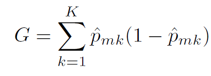 -->
<!-- ``` -->

<!-- measures the total variance across the $K$ classes. It is referred to as a measure of **node purity**. -->

<!-- * An alternative to the Gini index is **entropy** -->

<!-- ```{r , echo=FALSE,  fig.align='center', out.width = '50%'} -->
<!-- 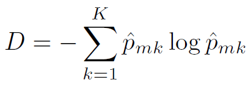 -->
<!-- ``` -->

<!-- ## Classification Trees -->

<!-- **Heart dataset** -->

<!-- ```{r, echo=FALSE} -->
<!-- Heart=read.csv("Heart.csv") -->
<!-- Heart$X=NULL -->
<!-- head(Heart) -->
<!-- ``` -->

<!-- ## Classification Trees -->

<!-- **Heart dataset** -->

<!-- ```{r , echo=FALSE,  fig.align='center', out.width = '100%'} -->
<!-- 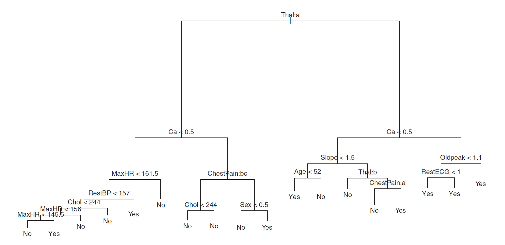 -->
<!-- ``` -->

<!-- ## Classification Trees -->

<!-- **Heart dataset** -->

<!-- ```{r , echo=FALSE,  fig.align='center', out.width = '100%'} -->
<!-- 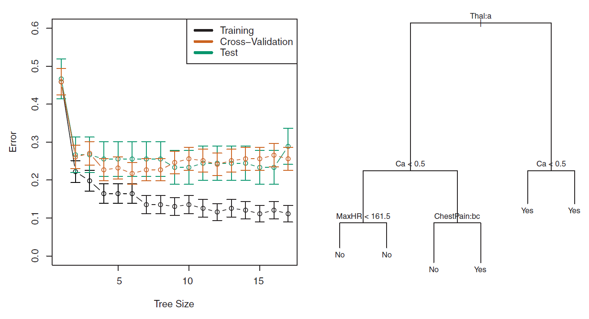 -->
<!-- ``` -->

<!-- ## Trees vs Linear Models -->

<!-- ```{r , echo=FALSE,  fig.align='center', out.width = '70%'} -->
<!-- 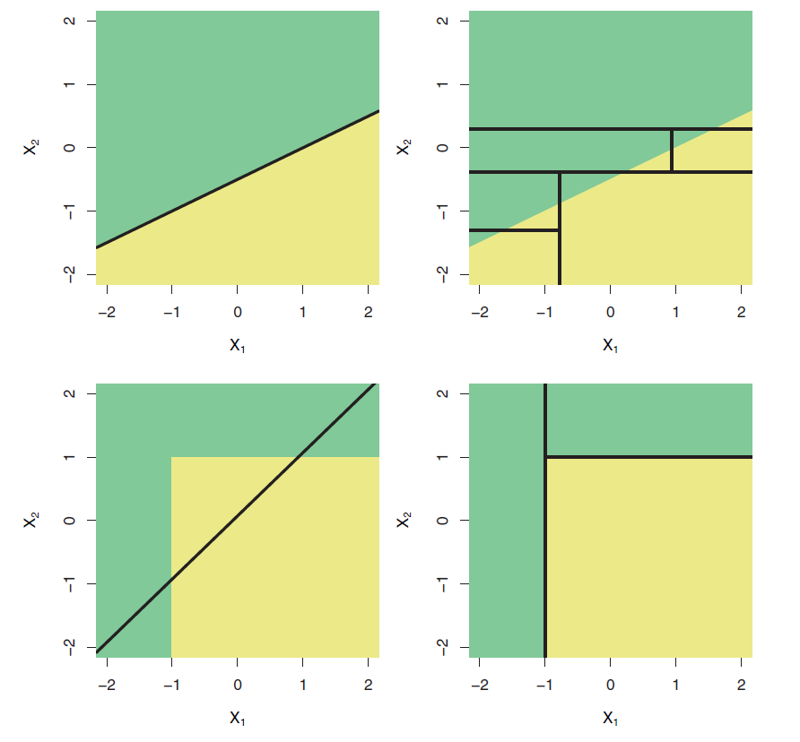 -->
<!-- ``` -->

## Trees

**Advantages**

* Easy to explain.

* Closely mirror human decision-making.

* Can be displayed graphically, and are easily interpreted by non-experts.

* Handle qualitative predictors without creating dummy variables. Does not require standardization of predictors.

**Disadvantages**

* Do not have same level of prediction accuracy.

* Can be very non-robust.


## Regression Tree: Implementation

**Ames Housing Dataset** (minimal feature engineering)

```{r}
# create recipe and blueprint, prepare and apply blueprint

set.seed(022123)   # set seed

ames_recipe <- recipe(Sale_Price ~ ., data = ames_train)   # set up recipe

blueprint_new <- ames_recipe %>%
  step_impute_mean(Gr_Liv_Area)                                    # impute missing entries


prepare_new <- prep(blueprint_new, data = ames_train)    # estimate feature engineering parameters based on training data


baked_train_new <- bake(prepare_new, new_data = ames_train)   # apply the blueprint to training data for building final/optimal model

baked_test_new <- bake(prepare_new, new_data = ames_test)    # apply the blueprint to test data for future use
```


## Regression Tree: Implementation

**Ames Housing Dataset**

Implement CV to tune the hyperparameter.

```{r}
set.seed(022123)   # set seed

cv_specs <- trainControl(method = "repeatedcv", number = 5, repeats = 5)   # CV specifications


tree_cv_min_fe <- train(blueprint_new,
                   data = ames_train,
                   method = "rpart",  
                   trControl = cv_specs,
                   tuneLength = 20,                   # considers a grid of 20 possible tuning parameter values
                   metric = "RMSE")
```


```{r}
# results from the CV procedure

tree_cv_min_fe$bestTune    # optimal hyperparameter

min(tree_cv_min_fe$results$RMSE)   # optimal CV RMSE
```


## Regression Tree: Implementation

**Ames Housing Dataset**

```{r}
# build final model

final_model_min_fe <- rpart(Sale_Price ~ .,
                  data = baked_train_new,
                  cp = tree_cv_min_fe$bestTune$cp,
                  xval = 0,                 # no CV
                  method = "anova")         # for regression
```


```{r}
# obtain predictions and test set RMSE

final_model_min_fe_preds <- predict(final_model_min_fe, newdata = baked_test_new)    # obtain test set predictions

sqrt(mean((final_model_min_fe_preds - baked_test_new$Sale_Price)^2))   # calculate test set RMSE
```


## Regression Tree: Implementation

**Ames Housing Dataset**


```{r, fig.align='center', fig.height=6, fig.width=8}
# variable importance

vip(object = tree_cv_min_fe, num_features = 20, method = "model")          
```


## Classification Trees

* Still use **recursive binary splitting** to grow a classification tree.

* $RSS$ can be replaced by 

    - **classification error rate**, the fraction of the training observations in that region that do not belong to the most common class.
    
    $$E = 1 - \max_k \left(\hat{p}_{mk}\right)$$
    
  - **Gini index**,  a measure of node purity—a small value indicates that a node contains predominantly observations from a single class.
    
    
  $$G = \displaystyle \sum_{k=1}^{K} \hat{p}_{mk}\left(1-\hat{p}_{mk}\right)$$
    
    

<!-- ```{r , echo=FALSE,  fig.align='center', out.width = '50%'} -->
<!-- 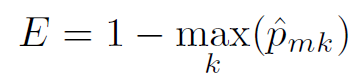 -->
<!-- ``` -->


Here $\hat{p}_{mk}$ represents the proportion of training observations in the $m^{th}$ region that are from the $k^{th}$ class.


## <span style="color:blue">Your Turn!!!</span> {.smaller}

You will work with the `iris` dataset which contains measurements in centimeters of four variables for 50 flowers from each of 3 species of iris: setosa, versicolor, and virginica. Please load the dataset using the following code. 

```{r}
data(iris)    # load dataset
```

We are interested in predicting `Species` using the rest of the variables in the dataset. Compare the performance (in terms of **Accuracy**) of the following models:

* A logistic regression model;

* A $K$-NN model with optimal $K$ chosen by CV;

* A classification tree with optimal hyperparameter chosen by CV. Use `tuneLength = 20`.

* A classification tree with minimal feature engineering. Use CV to choose the optimal hyperparameter. Use `tuneLength = 20`.


**Perform the following tasks.**

* Investigate the dataset and complete any necessary tasks. 

* Split the data into training and test sets (75-25).

* Perform required data preprocessing and create the blueprint. If using `step_dummy()`, set `one_hot = FALSE`. Prepare the blueprint on the training data. Obtain the modified training and test datasets. 

* Implement 10-fold CV repeated 5 times for each of the models above. 

* Report the optimal CV Accuracy of each model. Report the optimal hyperparameters for each model. Which model performs best in this situation? 

* Build the final model. Obtain class label predictions on the test set. Create the corresponding confusion matrix and report the test set accuracy. Based on your optimal final model, consult the help page for either `predict.knn3` or `predict.rpart` functions.


## <span style="color:blue">Your Turn!!!</span> {.smaller}

```{r}
glimpse(iris)   # all features are numerical
```

```{r}
summary(iris)   # summary of variables
```

```{r}
sum(is.na(iris))  # no missing entries
```


## <span style="color:blue">Your Turn!!!</span>

```{r}
set.seed(022123)   # set seed

# split the data into training and test sets

index <- createDataPartition(iris$Species, p = 0.75, list = FALSE)

iris_train <- iris[index, ]

iris_test <- iris[-index, ]
```


```{r}
nearZeroVar(iris_train, saveMetrics = TRUE)  # no zv/nzv features
```


## <span style="color:blue">Your Turn!!!</span>

```{r}
set.seed(022123)   # set seed

# create recipe and blueprint, prepare and apply blueprint

blueprint <- recipe(Species ~ ., data = iris_train) %>%
  step_normalize(all_predictors())

prepare <- prep(blueprint, training = iris_train)

baked_train <- bake(prepare, new_data = iris_train)

baked_test <- bake(prepare, new_data = iris_test)
```


## <span style="color:blue">Your Turn!!!</span> 

```{r}
set.seed(022123)   # set seed

cv_specs <- trainControl(method = "repeatedcv", number = 10, repeats = 5)   # CV specifications
```

```{r, eval = FALSE}
logistic_cv <- train(blueprint,
                     data = iris_train, 
                     method = "glm",
                     family = "binomial",
                     trControl = cv_specs,
                     metric = "Accuracy")

# The code above will throw an error since this is a 3-class classification problem and 
# logistic regression (with family = binomial) works for a binary (2-class) problem.
```


## <span style="color:blue">Your Turn!!!</span> 

```{r}
set.seed(022123)   # set seed

# CV for KNN

k_grid <- expand.grid(k = seq(1, 101, by = 10))

knn_cv <- train(blueprint,
                data = iris_train, 
                method = "knn",
                trControl = cv_specs,
                tuneGrid = k_grid,
                metric = "Accuracy")
```

```{r}
set.seed(022123)   # set seed

# CV with tree

tree_cv <- train(blueprint,
                 data = iris_train,
                 method = "rpart",
                 trControl = cv_specs,
                 tuneLength = 20,
                 metric = "Accuracy")
```


## <span style="color:blue">Your Turn!!!</span> 

```{r}
set.seed(022123)   # set seed

# CV with tree (minimal feature engineering, no engineering in this case)

tree_cv_min_fe <- train(Species ~ .,
                 data = iris_train,
                 method = "rpart",
                 trControl = cv_specs,
                 tuneLength = 20,
                 metric = "Accuracy")
```


## <span style="color:blue">Your Turn!!!</span> 

```{r}
# optimal CV Accuracies

max(knn_cv$results$Accuracy)     # for KNN

max(tree_cv$results$Accuracy)     # for classification tree

max(tree_cv_min_fe$results$Accuracy)     # for classification tree with minimal feature engineering
```

```{r}
# optimal hyperparameters

knn_cv$bestTune$k    # for KNN

tree_cv$bestTune$cp    # for classification tree

tree_cv_min_fe$bestTune$cp    # for classification tree with minimal feature engineering
```


## <span style="color:blue">Your Turn!!!</span> {.smaller}

```{r}
# final model

final_model <- knn3(Species ~ ., data = baked_train, k = knn_cv$bestTune$k)
```

```{r}
# obtain probability and class label predictions

final_model_prob_preds <- predict(final_model, newdata = baked_test, type = "prob")   # probability predictions

final_model_class_preds <- predict(final_model, newdata = baked_test, type = "class")   # class label predictions

confusionMatrix(data = final_model_class_preds, reference = baked_test$Species)
```


## Ensemble Methods

Single regression or classification trees usually have poor predictive performance.

**Ensemble Methods** use a collection of multiple trees to improve the predictive performance at the cost of interpretability. 

* Bagging

* Random Forests

* Boosting

```{r , echo=FALSE,  fig.cap="Adapted from ISLR, James et al.", fig.align='center', out.width = '70%'}
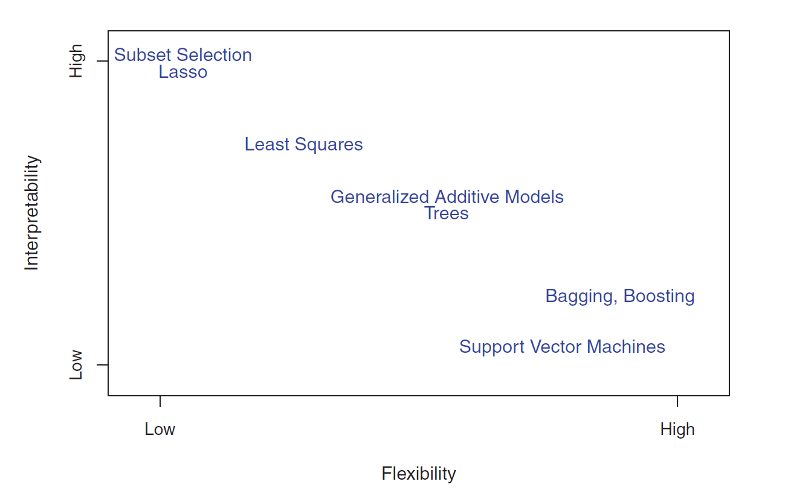
```


## Bagging

* **Bootstrap aggregation** or **bagging** is a general-purpose procedure for reducing the variance of a statistical learning method.

* **Idea**: Build multiple trees and average their results.

* **Result**: Given a set of $n$ independent observations (random variables) $Z_1, \ldots, Z_n$, each with variance $\sigma^2$, the variance of the mean/average $\bar{Z} = \displaystyle \dfrac{Z_1 + Z_2 + \cdots + Z_n}{n}$ of the observations is $\sigma^2/n$.

In other words, **averaging a set of observations reduces variance**.

* In reality, we do not have multiple training datasets.


## Bagging

**Bootstrapping**

```{r , echo=FALSE, fig.cap="Adapted from ISLR, James et al.", fig.align='center', out.width = '70%'}
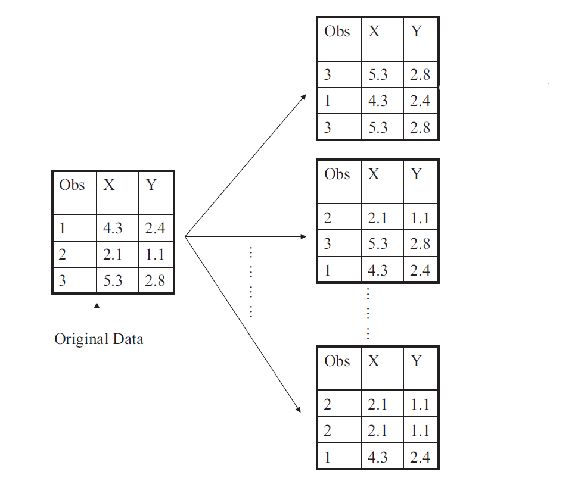
```

## Bagging

* Take repeated bootstrap samples (say $B$) from the original (single) available dataset.

* Build a tree on each bootstrap sample and obtain predictions $\hat{f}^{*b}(x), \ b=1, 2, \ldots, B$.

* Average all the predictions.

```{r , echo=FALSE,  fig.align='center', out.width = '40%'}
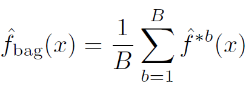
```

* Individual trees are grown deep and are not pruned. They have high variance, but low bias.

* For classification trees, take **majority vote**: the overall prediction is the most commonly occurring class among the $B$ predictions.


## Out-of-Bag Error Estimation

* A straightforward way to estimate the test error of a bagged model, without performing CV.

* It can be shown that on average, each bagged tree (constructed on each bootstrap sample) makes use of around two-thirds of the observations. 

<!-- (Exercise 2 from Chapter 5) -->

* Remaining one-third observations not used train a bagged tree are referred to as **out-of-bag (OOB)** observations.

* For $i^{th}$ observation, use the trees in which that observation was OOB. This will yield around $B/3$ predictions for the $i^{th}$ observation. Take their average to obtain a single prediction.

* Equivalent to LOOCV if $B$ is large.


## Variable Importance Measures

* Bagging improves prediction accuracy at the expense of interpretability.

* However, one can still obtain an overall summary of the importance of each predictor.


<!-- ## Variable Importance Measures -->

* To measure feature importance, the reduction in the loss function (e.g., RSS) attributed to each variable at each split is tabulated. In some instances, a single variable could be used multiple times in a tree; consequently, the total reduction in the loss function across all splits by a variable are summed up and used as the total feature importance.

* A large value indicates an important predictor.

<!-- ```{r , echo=FALSE,  fig.align='center', out.width = '50%'} -->
<!-- 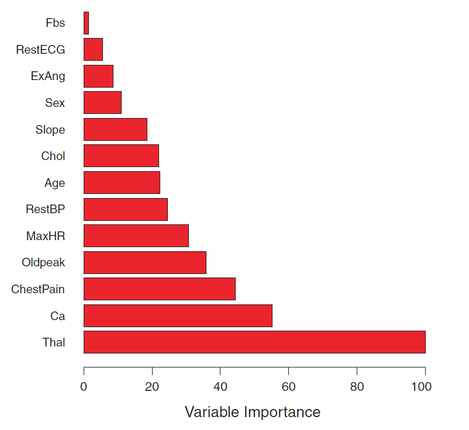 -->
<!-- ``` -->


## Bagging: Implementation

**Ames Housing Dataset**

```{r, echo=FALSE}
ames <- readRDS("AmesHousing.rds")   # load dataset

ames$Overall_Qual <- factor(ames$Overall_Qual, levels = c("Very_Poor", "Poor", "Fair", "Below_Average",
                                                  "Average", "Above_Average", "Good", "Very_Good",
                                                  "Excellent", "Very_Excellent"))
```

```{r, echo=FALSE}
# split data

set.seed(022123)   # set seed

index <- createDataPartition(y = ames$Sale_Price, p = 0.7, list = FALSE)   # consider 70-30 split

ames_train <- ames[index,]   # training data

ames_test <- ames[-index,]   # test data
```

```{r, echo=FALSE}
# create recipe and blueprint, prepare and apply blueprint

set.seed(022123)   # set seed

ames_recipe <- recipe(Sale_Price ~ ., data = ames_train)   # set up recipe

blueprint <- ames_recipe %>%
  step_nzv(Street, Utilities, Pool_Area, Screen_Porch, Misc_Val) %>%   # filter out zv/nzv predictors
  step_impute_mean(Gr_Liv_Area) %>%                                    # impute missing entries
  step_integer(Overall_Qual) %>%                                       # numeric conversion of levels of the predictors
  step_center(all_numeric(), -all_outcomes()) %>%                      # center (subtract mean) all numeric predictors
  step_scale(all_numeric(), -all_outcomes()) %>%                       # scale (divide by standard deviation) all numeric predictors
  step_other(Neighborhood, threshold = 0.01, other = "other") %>%      # lumping required predictors
  step_dummy(all_nominal(), one_hot = TRUE)                            # one-hot/dummy encode nominal categorical predictors


prepare <- prep(blueprint, data = ames_train)    # estimate feature engineering parameters based on training data


baked_train <- bake(prepare, new_data = ames_train)   # apply the blueprint to training data for building final/optimal model

baked_test <- bake(prepare, new_data = ames_test)    # apply the blueprint to test data for future use
```

Data splitting and feature engineering has been done in the previous slides.

```{r}
set.seed(022123)   # set seed

library(ipred)

bag_fit <- bagging(Sale_Price ~ ., 
                  data = baked_train,
                  nbagg = 500,                             # number of trees to grow (bootstrap samples) usually 500
                  coob = TRUE,                             # yes to computing OOB error estimate
                  control = rpart.control(minsplit = 2,    # split a node if at least 2 observations present
                                          cp = 0,          # no pruning (let the trees grow tall)
                                          xval = 0))       # no CV 
                  

bag_fit

```


## Bagging: Implementation

**Ames Housing Dataset**

CV with bagging (NOT recommended since computationally expensive)

```{r, eval=FALSE}
set.seed(022123)   # set seed

cv_specs <- trainControl(method = "repeatedcv", number = 5, repeats = 5)   # CV specifications

library(ipred)
library(e1071)

bagging_cv <- train(blueprint,
                   data = ames_train,
                   method = "treebag",  
                   trControl = cv_specs,
                   nbagg = 500,                   
                   control = rpart.control(minsplit = 2, cp = 0),    
                   metric = "RMSE")
```


<!-- ```{r, echo=FALSE} -->
<!-- data("Boston") -->

<!-- train_index <- createDataPartition(Boston$medv, p = 0.8, list = FALSE) -->
<!-- Boston_train <- Boston[train_index, ] -->
<!-- Boston_test <- Boston[-train_index, ] -->

<!-- blueprint <- recipe(medv ~ ., data = Boston_train) %>% -->
<!--   step_normalize(all_numeric_predictors()) -->

<!-- prepare <- prep(blueprint, training = Boston_train) -->

<!-- baked_train <- bake(prepare, new_data = Boston_train) -->
<!-- baked_test <- bake(prepare, new_data = Boston_test) -->
<!-- ``` -->

<!-- ```{r} -->
<!-- bag_fit <- bagging(medv ~ .,  -->
<!--                   data = baked_train, -->
<!--                   nbagg = 500,   # number of trees to grow (bootstrap replications) -->
<!--                   coob = TRUE,   # yes to computing OOB error estimate -->
<!--                   control = rpart.control(minsplit = 2, cp = 0, xval = 0))  # details of each tree -->


<!-- bag_fit -->
<!-- ``` -->

## Bagging: Implementation

```{r}
# obtain predictions on the test set

final_model_preds <- predict(bag_fit, newdata = baked_test)     # use 'type = "class"' for classification trees

sqrt(mean((final_model_preds - baked_test$Sale_Price)^2))   # test set RMSE
```


```{r}
# variable importance

imp <- varImp(bag_fit)      # look at the object created
```


## Bagging: Disadvantages

* Bagging improves the prediction accuracy for high variance (and low bias) models at the expense of interpretability and computational speed.

* However, although the model building steps are independent, the trees in bagging are not completely independent of each other since all the original features are considered at every split of every tree. Rather, trees from different bootstrap samples typically have similar structure to each other (especially at the top of the tree) due to any underlying strong relationships.

* This characteristic is known as **tree correlation** and prevents bagging from further reducing the variance of the individual models. **Random forests** extend and improve upon bagged decision trees by reducing this correlation and thereby improving the accuracy of the overall ensemble.


## Bagging: Disadvantages

**Tree Correlation in Bagging**

```{r , echo=FALSE,  fig.align='center', fig.cap="Adapted from HMLR, Boehmke & Greenwell", out.width = '100%'}
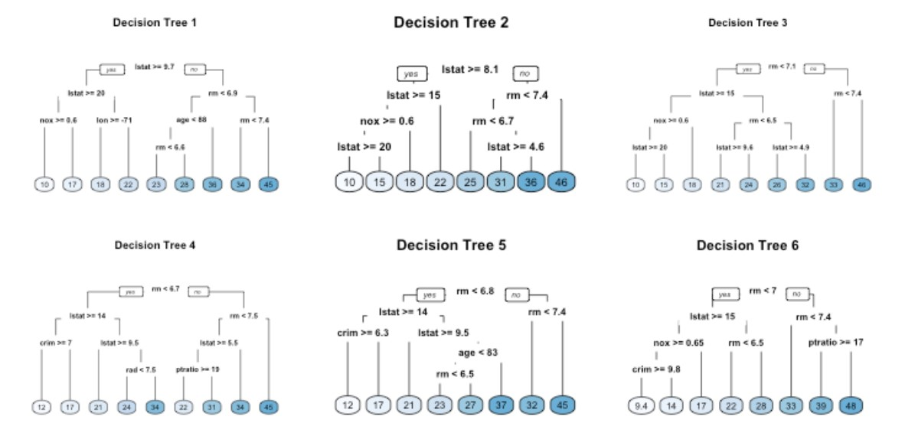
```


## Random Forests

* Provide an improvement over bagged trees by reducing the variance further (by **decorrelating**) when we average the trees.

* As in bagging, we build a number of decision trees on bootstrapped training samples.

* For each tree, each time a split is considered, a **random selection of $m$ predictors** is chosen (split candidates) from the full set of $p$ predictors. The split is allowed to use only one of those $m$ predictors. Note that in bagging, each split for each tree considers all $p$ predictors as split candidates.

* A fresh sample of $m$ predictors is taken at each split. Typical default values are $m = p/3$ (regression) and $m = \sqrt{p}$ (classification) but this should be considered a tuning parameter, to be chosen by CV.


## Random Forests: Implementation  {.smaller}

**Ames Housing Dataset**

```{r, echo=FALSE}
ames <- readRDS("AmesHousing.rds")   # load dataset

ames$Overall_Qual <- factor(ames$Overall_Qual, levels = c("Very_Poor", "Poor", "Fair", "Below_Average",
                                                  "Average", "Above_Average", "Good", "Very_Good",
                                                  "Excellent", "Very_Excellent"))
```

```{r, echo=FALSE}
# split data

set.seed(022123)   # set seed

index <- createDataPartition(y = ames$Sale_Price, p = 0.7, list = FALSE)   # consider 70-30 split

ames_train <- ames[index,]   # training data

ames_test <- ames[-index,]   # test data
```

```{r, echo=FALSE}
# create recipe and blueprint, prepare and apply blueprint

set.seed(022123)   # set seed

ames_recipe <- recipe(Sale_Price ~ ., data = ames_train)   # set up recipe

blueprint <- ames_recipe %>%
  step_nzv(Street, Utilities, Pool_Area, Screen_Porch, Misc_Val) %>%   # filter out zv/nzv predictors
  step_impute_mean(Gr_Liv_Area) %>%                                    # impute missing entries
  step_integer(Overall_Qual) %>%                                       # numeric conversion of levels of the predictors
  step_center(all_numeric(), -all_outcomes()) %>%                      # center (subtract mean) all numeric predictors
  step_scale(all_numeric(), -all_outcomes()) %>%                       # scale (divide by standard deviation) all numeric predictors
  step_other(Neighborhood, threshold = 0.01, other = "other") %>%      # lumping required predictors
  step_dummy(all_nominal(), one_hot = TRUE)                            # one-hot/dummy encode nominal categorical predictors


prepare <- prep(blueprint, data = ames_train)    # estimate feature engineering parameters based on training data


baked_train <- bake(prepare, new_data = ames_train)   # apply the blueprint to training data for building final/optimal model

baked_test <- bake(prepare, new_data = ames_test)    # apply the blueprint to test data for future use
```


Data splitting and feature engineering has been done in the previous slides.


```{r}
set.seed(022123)   # set seed

cv_specs <- trainControl(method = "cv", number = 5)   # CV specifications


library(ranger)
library(e1071)


param_grid <- expand.grid(mtry = seq(1, 30, 1),     # sequence of 1 to at least half the number of predictors
                          splitrule = "variance",   # use "gini" for classification
                          min.node.size = 2)        # for each tree

rf_cv <- train(blueprint,
               data = ames_train,
               method = "ranger",
               trControl = cv_specs,
               tuneGrid = param_grid,
               metric = "RMSE")

rf_cv$bestTune$mtry   # optimal tuning parameter

min(rf_cv$results$RMSE)   # optimal CV RMSE
```


## Random Forests: Implementation

**Ames Housing Dataset**

```{r}
# fit final model

final_model <- ranger(Sale_Price ~ .,
                      data = baked_train,
                      num.trees = 500,
                      mtry = rf_cv$bestTune$mtry,
                      splitrule = "variance",
                      min.node.size = 2, 
                      importance = "impurity")
```

```{r}
# obtain predictions on the test set

final_model_preds <- predict(final_model, data = baked_test, type = "response")  # predictions on test set

sqrt(mean((final_model_preds$predictions - baked_test$Sale_Price)^2))  # test set RMSE
```


## Random Forests: Implementation {.smaller}

**Ames Housing Dataset**

```{r}
# variable importance

head(sort(final_model$variable.importance, decreasing = TRUE), 10)      # top 10 most important features
```


## <span style="color:blue">Your Turn!!!</span> {.smaller}

You will work with the `vowels.rds` data. The task is to predict `letter` (five vowels) using the rest of the variables in the data (predictors).

```{r}
vowels <- readRDS("vowels.rds")    # load dataset
```


Compare the performance (in terms of **Accuracy**) of the following models. Choose the optimal hyperparameters using CV.

* A $K$-NN classifier

* A single classification tree (use `tuneLength = 20`)

* A bagged model

* A random forest model


**Perform the following tasks.**

* Investigate the dataset and complete any necessary tasks. 

* Split the data into training and test sets (70-30).

* Perform required data preprocessing and create the blueprint. If using `step_dummy()`, set `one_hot = FALSE`. Prepare the blueprint on the training data. Obtain the modified training and test datasets. 

* Implement 5-fold CV repeated 5 times for each of the models above. 

* Report the optimal CV (or, OOB) Accuracy of each model. Report the optimal hyperparameters for each model. Which model performs best in this situation? 

* Build the final model. Obtain class label predictions on the test set. Create the corresponding confusion matrix and report the test set accuracy. 


## <span style="color:blue">Your Turn!!!</span>

```{r}
glimpse(vowels)   # all features are numerical
```

## <span style="color:blue">Your Turn!!!</span> {.smaller}

```{r}
sum(is.na(vowels))  # no missing entries
```

```{r}
summary(vowels)   # summary of variables
```


## <span style="color:blue">Your Turn!!!</span>  {.smaller}

```{r}
set.seed(022123)   # set seed

# split the data into training and test sets

index <- createDataPartition(vowels$letter, p = 0.7, list = FALSE)

vowels_train <- vowels[index, ]

vowels_test <- vowels[-index, ]
```


```{r}
nearZeroVar(vowels_train, saveMetrics = TRUE)  # no zv/nzv features
```


## <span style="color:blue">Your Turn!!!</span>

```{r}
set.seed(022123)   # set seed

# create recipe and blueprint, prepare and apply blueprint

blueprint <- recipe(letter ~ ., data = vowels_train) %>%
  step_normalize(all_predictors())

prepare <- prep(blueprint, training = vowels_train)

baked_train <- bake(prepare, new_data = vowels_train)

baked_test <- bake(prepare, new_data = vowels_test)
```


## <span style="color:blue">Your Turn!!!</span> 

```{r}
set.seed(022123)   # set seed

cv_specs <- trainControl(method = "repeatedcv", number = 5, repeats = 5)   # CV specifications
```

```{r}
set.seed(022123)   # set seed

# CV for KNN

k_grid <- expand.grid(k = seq(1, 101, by = 10))

knn_cv <- train(blueprint,
                data = vowels_train, 
                method = "knn",
                trControl = cv_specs,
                tuneGrid = k_grid,
                metric = "Accuracy")
```

```{r}
set.seed(022123)   # set seed

# CV with tree

tree_cv <- train(blueprint,
                 data = vowels_train,
                 method = "rpart",
                 trControl = cv_specs,
                 tuneLength = 20,
                 metric = "Accuracy")
```


## <span style="color:blue">Your Turn!!!</span> 

```{r}
set.seed(022123)   # set seed

# bagging

bag_fit <- bagging(letter ~ ., 
                   data = baked_train,
                   nbagg = 500,   
                   coob = TRUE,   
                   control = rpart.control(minsplit = 2,
                                           cp = 0,    
                                           xval = 0)) 
```

```{r}
set.seed(022123)   # set seed

# CV with random forests

param_grid <- expand.grid(mtry = seq(1, 16, 1),    # 16 features in baked_train
                          splitrule = "gini",   
                          min.node.size = 2)        

rf_cv <- train(blueprint,
               data = vowels_train,
               method = "ranger",
               trControl = cv_specs,
               tuneGrid = param_grid,
               metric = "Accuracy")
```


## <span style="color:blue">Your Turn!!!</span> {.smaller}

```{r}
# optimal CV Accuracies

max(knn_cv$results$Accuracy)     # for KNN

max(tree_cv$results$Accuracy)     # for classification tree

1-bag_fit$err     # for bagging

max(rf_cv$results$Accuracy)     # for random forests
```

```{r}
# optimal hyperparameters

knn_cv$bestTune$k    # for KNN

tree_cv$bestTune$cp    # for classification tree

rf_cv$bestTune$mtry    # for random forests
```


## <span style="color:blue">Your Turn!!!</span>

```{r}
# build final model

final_model <- ranger(letter ~ .,
                      data = baked_train,
                      num.trees = 500,
                      mtry = rf_cv$bestTune$mtry,
                      splitrule = "gini",
                      min.node.size = 2, 
                      importance = "impurity")
```


```{r}
# obtain predictions on test data

final_model_preds <- predict(final_model, data = baked_test, type = "response")  # predictions on test set
```


## <span style="color:blue">Your Turn!!!</span> {.smaller}

```{r}
# confusion matrix

confusionMatrix(data = final_model_preds$predictions, reference = baked_test$letter)
```


<!-- * Step 1: Investigate the dataset -->

<!-- * Step 2: Split the data into training and test sets (a 70-30) -->

<!-- * Step 3: Perform required data preprocessing and create the blueprint.  -->

<!-- * Step 4: Implement 5-fold CV repeated 5 times to compare the performance of the following models. Use `metric = "Accuracy"`. -->

<!--     - a single classification tree  -->

<!--     - a bagged model -->

<!--     - a random forests model -->

<!-- How do the models compare in terms of the `Accuracy` obtained from CV/OOB? -->


<!-- Typically $m \approx \sqrt{p}$. -->

<!-- ## Bagging and Random Forests -->

<!-- **Heart dataset** -->

<!-- ```{r , echo=FALSE,  fig.align='center', out.width = '70%'} -->
<!-- 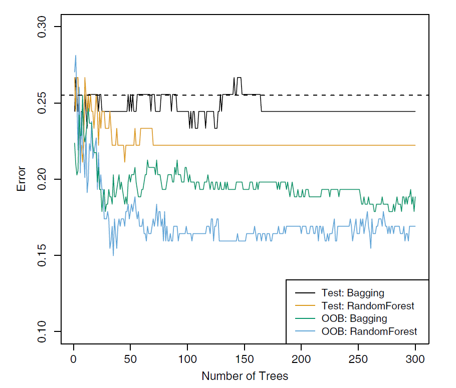 -->
<!-- ``` -->

<!-- ## Bagging and Random Forests -->

<!-- **Cancer Gene Expression dataset** -->

<!-- * High-dimensional dataset with $p=4718$ genes and $n=349$ patients. -->

<!-- * Classification problem with $K=15$. -->

<!-- * Consider 500 genes that have the largest variance in the training set. -->

<!-- * Randomly divide available data into training and test set. Random forests applied to training set with different values of $m$. -->

<!-- ## Bagging and Random Forests -->

<!-- **Cancer Gene Expression dataset** -->

<!-- ```{r , echo=FALSE,  fig.align='center', out.width = '70%'} -->
<!-- 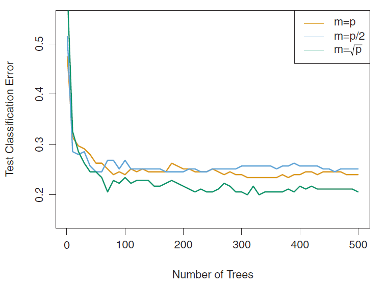 -->
<!-- ``` -->


<!-- ## Boosting -->

<!-- * Boosting is a general approach that can be applied to many statistical learning methods for regression or classification. -->

<!-- * In boosting trees are grown **sequentially**: each tree is grown using information from previously grown trees. -->

<!-- * Boosting <span style="color:red">**does not**</span> involve bootstrap sampling, instead each tree is fit on a modified version of the original dataset. -->

<!-- ## Boosting -->

<!-- ```{r , echo=FALSE,  fig.align='center', out.width = '86%'} -->
<!-- 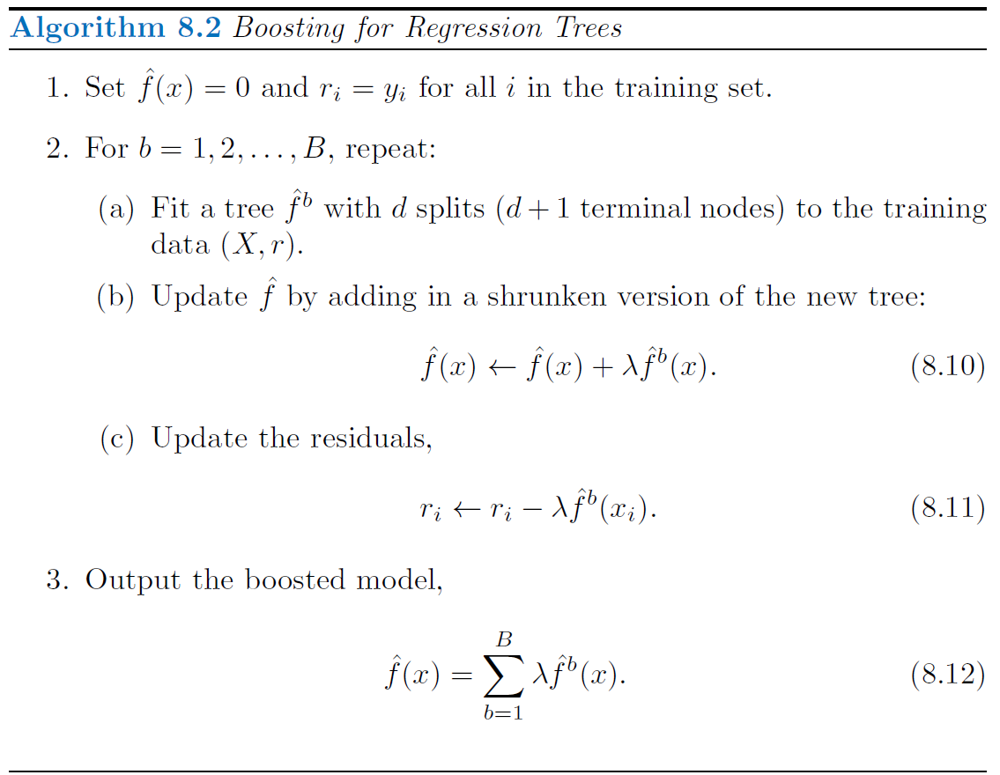 -->
<!-- ``` -->

<!-- ## Boosting -->

<!-- * Growing a single large tree **fits the data hard** and tends to **overfit**. Boosting instead **learns slowly**. -->

<!-- * Fit a decision tree to the residuals from the current model (tree). Add this new decision tree into the fitted function in order to update the residuals. -->

<!-- * Each tree can be rather small, with just a few -->
<!-- terminal nodes, determined by the parameter $d$ in the -->
<!-- algorithm. -->

<!-- * Fitting small trees to the residuals slowly improves $\hat{f}$ in areas where it does not perform well. The shrinkage parameter $\lambda$ slows the process down even further, allowing more and different shaped trees to attack the residuals. -->

<!-- * Construction of each tree depends strongly on the trees that have already been grown. -->

<!-- ## Boosting -->

<!-- Boosting has three **tuning parameters**. -->

<!-- * Number of trees $B$: Can overfit if $B$ is too large. Use CV. -->

<!-- * Shrinkage parameter $\lambda$: Small positive number, controls the pace of the boosting process. Typically, $\lambda=0.01$ or $\lambda=0.001$. Small $\lambda$ requires a large $B$. -->

<!-- * Depth $d$: Number of splits in each tree. Controls complexity of the ensemble. $d=1$ refers to a single split (**stump**). More generally $d$ is known as the **interaction depth**, and controls the interaction order of the boosted model, since $d$ splits can involve at most $d$ variables. -->

<!-- ## Boosting -->

<!-- **Cancer Gene Expression dataset** -->

<!-- ```{r , echo=FALSE,  fig.align='center', out.width = '70%'} -->
<!-- 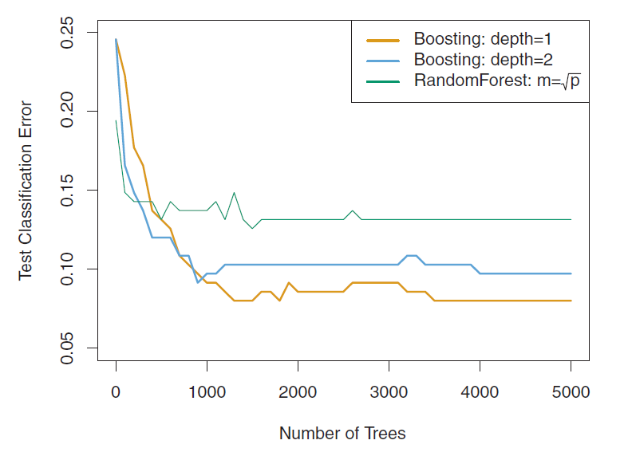 -->
<!-- ``` -->


<!-- ## Chapter 8 Summary -->

<!-- * Decision trees are simple and interpretable models for -->
<!-- regression and classification. -->

<!-- * However they are often not competitive with other -->
<!-- methods in terms of prediction accuracy. -->

<!-- * Bagging, random forests and boosting are good methods -->
<!-- for improving the prediction accuracy of trees. They work -->
<!-- by growing many trees on the training data and then -->
<!-- combining the predictions of the resulting ensemble of trees. -->

<!-- * Random forests and Boosting are among the state-of-the-art methods for supervised learning. However their results can be difficult to interpret. -->
