# Support Vector Machines (SVM)

* One of the best "out of the box" classifiers.

* Mostly intended for two-class classification problems.

Idea: **Try and find a plane that separates the classes in feature space**.

* We will talk about
    + Maximal Margin Classifier
    + Support Vector Classifier
    + Support Vector Machine

## Hyperplane

* In $p$-dimensions,  a **hyperplane** is a flat affine subspace of dimension $p-1$.

* Mathematical form of a hyperplane

```{r , echo=FALSE,  fig.align='center', out.width = '70%'}
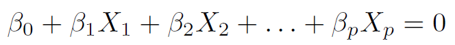
```

* When $p=2$, a hyperplane is a line.

```{r , echo=FALSE,  fig.align='center', out.width = '40%'}
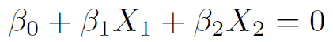
```

* If $\beta_0=0$, the hyperplane goes through the origin, otherwise not.

* A hyperplane divides the $p$-dim space into 2 halves.

```{r , echo=FALSE,  fig.align='center', out.width = '50%'}
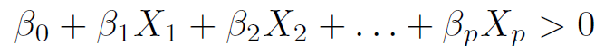
```

```{r , echo=FALSE,  fig.align='center', out.width = '50%'}
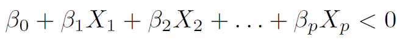
```

## Hyperplane

**Hyperplane in 2-dimensions: $1+2X_1+3X_2$=0**

```{r , echo=FALSE,  fig.align='center', out.width = '70%'}
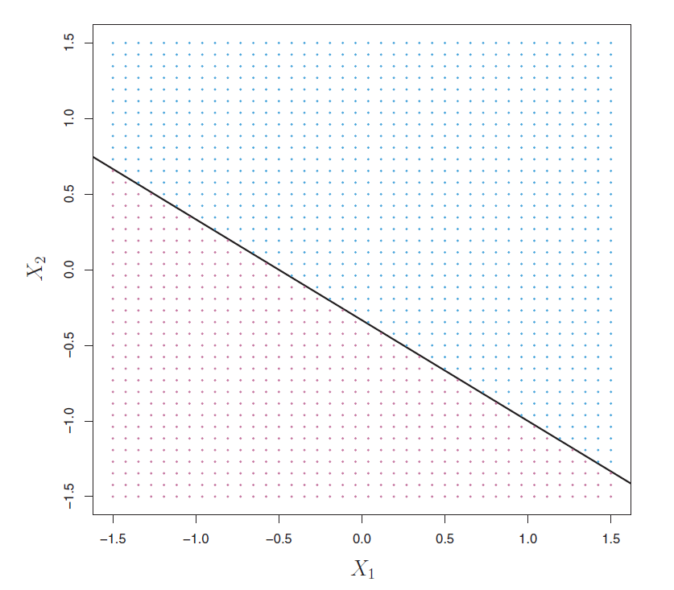
```


## Hyperplane

**Hyperplane in 3-dimensions: $1+2X_1+3X_2-X_3=0$**

```{r, echo=FALSE, fig.align='center'}
## color, theme, function set ##############################################################################

dark2 <- RColorBrewer::brewer.pal(8, "Dark2")
set1 <- RColorBrewer::brewer.pal(9, "Set1")

# Plotting function; modified from svmpath::svmpath()
plot_svmpath <- function(x, step = max(x$Step), main = "") {
  
  # Extract model info
  object <- x
  f <- predict(object, lambda = object$lambda[step], type = "function")
  x <- object$x
  y <- object$y
  Elbow <- object$Elbow[[step]]
  alpha <- object$alpha[, step]
  alpha0 <- object$alpha0[step]
  lambda <- object$lambda[step]
  df <- as.data.frame(x[, 1L:2L])
  names(df) <- c("x1", "x2")
  df$y <- norm2d$y
  beta <- (alpha * y) %*% x
  
  # Construct plot
  ggplot(df, aes(x = x1, y = x2)) +
    geom_point(aes(shape = y, color = y), size = 3, alpha = 0.75) +
    xlab("Income (standardized)") +
    ylab("Lot size (standardized)") +
    xlim(-3, 3) +
    ylim(-2, 2) +
    coord_fixed() +
    theme(legend.position = "none") +
    theme_bw() +
    scale_shape_discrete(
      name = "Owns a riding\nmower?",
      breaks = c(1, -1),
      labels = c("Yes", "No")
    ) +
    scale_color_brewer(
      name = "Owns a riding\nmower?",
      palette = "Dark2",
      breaks = c(1, -1),
      labels = c("Yes", "No")
    ) +
    geom_abline(intercept = -alpha0/beta[2], slope = -beta[1]/beta[2], 
                color = "black") +
    geom_abline(intercept = lambda/beta[2] - alpha0/beta[2], 
                slope = -beta[1]/beta[2], 
                color = "black", linetype = 2) +
    geom_abline(intercept = -lambda/beta[2] - alpha0/beta[2], 
                slope = -beta[1]/beta[2], 
                color = "black", linetype = 2) +
    geom_point(data = df[Elbow, ], size = 3) +
    ggtitle(main)
  
}

## Fig 14.1 ##############################################################################

# Construct data for plotting
x1 <- x2 <- seq(from = 0, to = 1, length = 100)
xgrid <- expand.grid(x1 = x1, x2 = x2)
y1 <- -(1/3) + (-2/3) * x1
y2 <- 1 + 2 * xgrid$x1 + 3 * xgrid$x2

# Hyperplane: p = 2
p1 <- lattice::xyplot(
  x = y1 ~ x1, 
  type = "l", 
  col = "black", 
  xlab = expression(X[1]), 
  ylab = expression(X[2]),
  main = expression({f(X)==1+2*X[1]+3*X[2]}==0),
  scales = list(tck = c(1, 0))
)

# Hyperplane: p = 3
p2 <- lattice::wireframe(
  x = y2 ~ xgrid$x1 * xgrid$x2, 
  xlab = expression(X[1]), 
  ylab = expression(X[2]),
  zlab = expression(X[3]),
  main = expression({1+2*X[1]+3*X[2]-X[3]}==0),
  drape = TRUE,
  colorkey = FALSE,
  col = dark2[1],
  scales = list(arrows = FALSE)
  # par.settings = list(axis.line = list(col = "transparent"))
)
p2
```


## Separating Hyperplane {.smaller}

For a two-class problem, suppose that it is possible to construct a hyperplane that separates the training observations perfectly according to their class labels.

Such a hyperplane is known as a **separating hyperplane**.

<!-- ```{r , echo=FALSE,  fig.align='center', out.width = '80%'} -->
<!-- 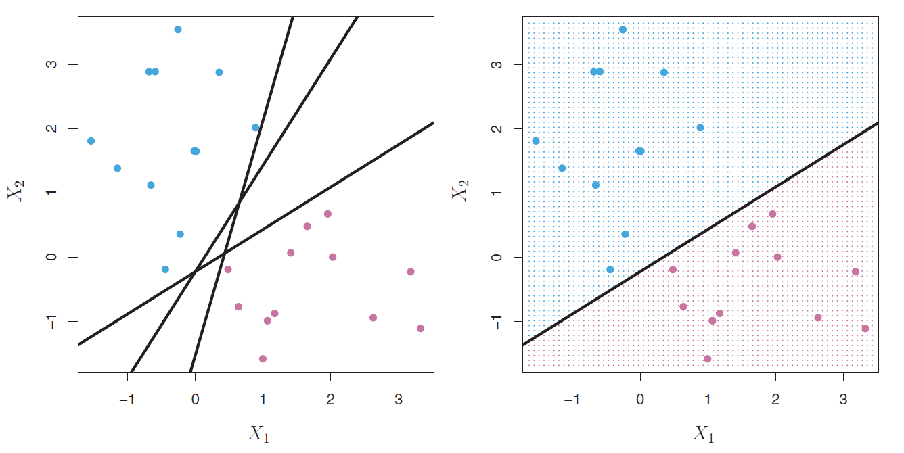 -->
<!-- ``` -->

<!-- Henceforth, $f(x_i)=\beta_0+\beta_1 \ x_{i1}+\beta_2 \ x_{i2} + \ldots + \beta_p \ x_{ip}$. -->


```{r, echo=FALSE, fig.align='center'}
## Fig 14.2 ##############################################################################

# Simulate data
set.seed(805)
norm2d <- as.data.frame(mlbench::mlbench.2dnormals(
  n = 100,
  cl = 2,
  r = 4,
  sd = 1
))
names(norm2d) <- c("x1", "x2", "y")  # rename columns
# str(norm2d)
norm2d$x1 <- as.numeric(scale(norm2d$x1))
norm2d$x2 <- as.numeric(scale(norm2d$x2))
# summary(norm2d); sd(norm2d$x1); sd(norm2d$x2)
norm2d$Y <- as.factor(ifelse(norm2d$y == "1", "1", "-1"))
norm2d$y <- NULL
names(norm2d) <- c("x1", "x2", "y")  # rename columns
norm2d$y <- factor(norm2d$y, levels = c("1", "-1"))

# Scatterplot
p1 <- ggplot(norm2d, aes(x = x1, y = x2)) +
  geom_point(aes(shape = y, color = y), size = 3, alpha = 0.75) +
  xlab("Income (standardized)") +
  ylab("Lot size (standardized)") +
  xlim(-3, 3) +  # used to be -6 to 6
  ylim(-2, 2) +  # used to be -6 to 6
  coord_fixed() +
  theme(legend.position = "none") +
  theme_bw() +
  scale_shape_discrete(
    name = "Owns a riding\nmower?",
    breaks = c(1, -1),
    labels = c("Yes", "No")
  ) +
  scale_color_brewer(
    name = "Owns a riding\nmower?",
    palette = "Dark2",
    breaks = c(1, -1),
    labels = c("Yes", "No")
  )

p1

```


## Separating Hyperplane

For a $p$-dimensional two-class problem,

```{r , echo=FALSE,  fig.align='center', out.width = '80%'}
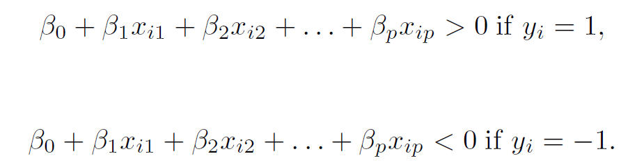
```

Equivalently, for $i=1,2,\ldots,n$

```{r , echo=FALSE,  fig.align='center', out.width = '70%'}
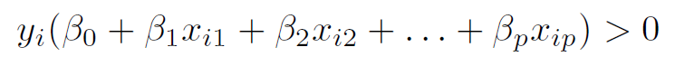
```

Consider a test observation $x^*$, we compute $f(x^*)$.

A classifier based on a separating hyperplane leads to a linear decision boundary.


## Optimal Separating Hyperplane

This is also known as the **maximal margin classifier** or **hard margin classifier**.

* One that makes the biggest gap or **margin** between the two classes.

* One that is farthest from the training observations.

**Margin**: The minimal (perpendicular) distance from the observations to the hyperplane. Denoted by $M$.

The maximal margin hyperplane is the separating hyperplane for which the margin is largest, that is, the hyperplane that has the farthest minimum distance to the training observations.

## Optimal Separating Hyperplane

```{r, echo=FALSE,  fig.align='center', message=FALSE}
library(kernlab)

fit_hmc1 <- ksvm(  # use ksvm() to find the OSH
  x = data.matrix(norm2d[c("x1", "x2")]),
  y = as.factor(norm2d$y), 
  kernel = "vanilladot",  # no fancy kernel, just ordinary dot product
  C = Inf,                # to approximate hard margin classifier
  prob.model = TRUE       # needed to obtain predicted probabilities
)

# Support vectors
sv <- norm2d[fit_hmc1@alphaindex[[1L]], c("x1", "x2")]  # 16-th and 97-th observations

# Compute the perpendicular bisector of the line segment joining the two support 
# vectors
slope <- -1 / ((sv[2L, 2L] - sv[1L, 2L]) / (sv[2L, 1L] - sv[1L, 1L]))
midpoint <- apply(sv, 2, mean)

# Scatterplot with convex hulls, etc.
ggplot(norm2d, aes(x = x1, y = x2)) +
  
  # # Convex hulls
  # geom_polygon(
  #   data = norm2d[norm2d$y == 1, c("x1", "x2")][hpts1, c("x1", "x2")],
  #   color = "black",
  #   fill = "transparent"
  # ) +
  # geom_polygon(
  #   data = norm2d[norm2d$y == 2, c("x1", "x2")][hpts2, c("x1", "x2")],
  #   color = "black",
  #   fill = "transparent"
  # ) +
  
  # Scatterplot
  geom_point(aes(shape = y, color = y), size = 3, alpha = 0.75) +
  xlab("Income (standardized)") +
  ylab("Lot size (standardized)") +
  xlim(-10, 10) +
  ylim(-10, 10) +
  # coord_fixed() +
  theme(legend.position = "none") +
  theme_bw() +
  scale_shape_discrete(
    name = "Owns a riding\nmower?",
    breaks = c(1, -1),
    labels = c("Yes", "No")
  ) +
  scale_color_brewer(
    name = "Owns a riding\nmower?",
    palette = "Dark2",
    breaks = c(1, -1),
    labels = c("Yes", "No")
  ) +
  
  # Decision boundary
  geom_abline(
    intercept = -slope * midpoint[1L] + midpoint[2L], 
    slope = slope
  ) +
  
  # Margin boundaries (shaded in)
  geom_abline(
    intercept = -slope * sv[1L, 1L] + sv[1L, 2L], 
    slope = slope,
    linetype = 2
  ) +
  geom_abline(
    intercept = -slope * sv[2L, 1L] + sv[2L, 2L], 
    slope = slope,
    linetype = 2
  ) +
  annotate(
    geom = "polygon", 
    x = c(-7, -7, 7, 7), 
    y = c(-slope * sv[1L, 1L] + sv[1L, 2L] - 7 * slope, 
          -slope * midpoint[1L] + midpoint[2L] - 7 * slope, 
          -slope * midpoint[1L] + midpoint[2L] + 7 * slope,
          -slope * sv[1L, 1L] + sv[1L, 2L] + 7 * slope),
    alpha = 0.1, 
    color = "transparent",
    fill = dark2[2]
  ) +
  annotate(
    geom = "polygon", 
    x = c(-7, -7, 7, 7), 
    y = c(-slope * sv[2L, 1L] + sv[2L, 2L] - 7 * slope,
          -slope * midpoint[1L] + midpoint[2L] - 7 * slope,
          -slope * midpoint[1L] + midpoint[2L] + 7 * slope,
          -slope * sv[2L, 1L] + sv[2L, 2L] + 7 * slope), 
    alpha = 0.1, 
    color = "transparent",
    fill = dark2[2]
  ) +
  
  # Arrows, labels, etc.
  annotate("segment",
           x = sv[1L, 1L], y = sv[1L, 2L], xend = sv[2L, 1L], yend = sv[2L, 2L], 
           # alpha = 0.5,
           linetype = 3
           # arrow = arrow(length = unit(0.03, units = "npc"), ends = "both")
  ) +
  geom_curve(x = -3, y = 4.5, xend = 0, yend = 5, 
             arrow = arrow(length = unit(0.03, units = "npc"))) +
  annotate("text", label = "Width = M", x = 0.45, y = 5.45, size = 5) +
  geom_curve(x = 2, y = -3, xend = 0, yend = -5, 
             arrow = arrow(length = unit(0.03, units = "npc"))) +
  annotate("text", label = "Width = M", x = 0, y = -5.35, size = 5) +
  
  # Support vectors
  annotate("point", x = sv$x1[1], y = sv$x2[1], shape = 17, color = "red", 
           size = 3) +
  annotate("point", x = sv$x1[2], y = sv$x2[2], shape = 16, color = "red", 
           size = 3) +
  # geom_point(data = cbind(sv, y = c("2", "1")), aes(shape = y),
  #            size = 4, color = "red") +
  
  # Zoom in
  coord_fixed(xlim = c(-3, 3), ylim = c(-2, 2))   # used to be from -6 to 6

```

<!-- ## Maximal Margin Classifier -->

<!-- ```{r , echo=FALSE,  fig.align='center', out.width = '70%'} -->
<!-- 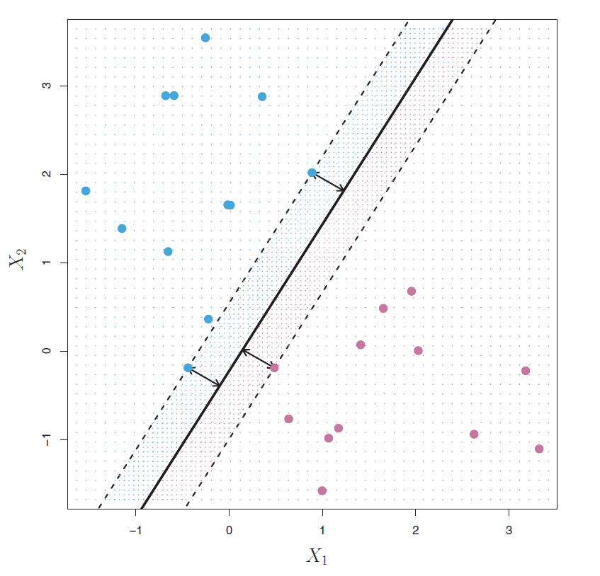 -->
<!-- ``` -->

## Optimal Separating Hyperplane

```{r , echo=FALSE,  fig.align='center', out.width = '100%'}
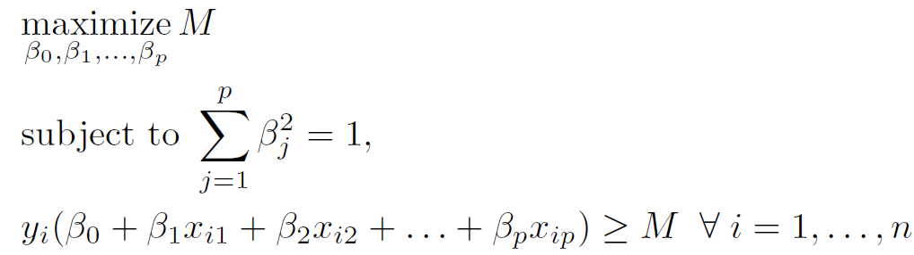
```

The second constraint guarantees that each observation will be on the correct side of the hyperplane ($M$ positive).

The first constraint ensures that the perpendicular distance from $i^{th}$ observation to the hyperplane is
$$y_i \left( \beta_0+\beta_1 \ x_{i1}+\beta_2 \ x_{i2} + \ldots + \beta_p \ x_{ip}\right)$$


## Optimal Separating Hyperplane: Issue 1

The optimal separating hyperplane fits the data too hard.

<!-- ```{r , echo=FALSE,  fig.align='center', out.width = '100%'} -->
<!-- knitr::include_graphics("SVMissue1.png") -->
<!-- ``` -->


```{r, echo=FALSE, fig.align='center', message=FALSE, results='hide'}
## Fig 14.4 and 14.5 ##############################################################################

# Add an outlier
# norm2da <- data.frame("x1" = 0.13, "x2" = 0.32, "y" = -1)
norm2da <- data.frame("x1" = 0.2, "x2" = 0.5, "y" = -1)
norm2d <- rbind(norm2d, norm2da)

p1a <- ggplot(norm2d, aes(x = x1, y = x2)) +
  geom_point(aes(shape = y, color = y), size = 3, alpha = 0.75) +
  xlab("Income (standardized)") +
  ylab("Lot size (standardized)") +
  xlim(-3, 3) +  # used to be -6 to 6
  ylim(-2, 2) +  # used to be -6 to 6
  coord_fixed() +
  theme(legend.position = "none") +
  theme_bw() +
  scale_shape_discrete(
    name = "Owns a riding\nmower?",
    breaks = c(1, -1),
    labels = c("Yes", "No")
  ) +
  scale_color_brewer(
    name = "Owns a riding\nmower?",
    palette = "Dark2",
    breaks = c(1, -1),
    labels = c("Yes", "No")
  )


fit_hmc2 <- ksvm(  # use ksvm() to find the OSH
  x = data.matrix(norm2d[c("x1", "x2")]),
  y = as.factor(norm2d$y), 
  kernel = "vanilladot",  # no fancy kernel, just ordinary dot product
  C = Inf,                # to approximate hard margin classifier
  prob.model = TRUE       # needed to obtain predicted probabilities
)

# fit_hmc <- ksvm(y ~ ., data = norm2d,
#   kernel = "vanilladot",  # no fancy kernel, just ordinary dot product
#   C = Inf,                # to approximate hard margin classifier
#   prob.model = TRUE       # needed to obtain predicted probabilities
# )

# Grid over which to evaluate decision boundaries
npts <- 500
xgrid <- expand.grid(
  x1 = seq(from = -2, 2, length = npts),
  x2 = seq(from = -2, 2, length = npts)
)

# Predicted probabilities (as a two-column matrix)
# prob_glm <- predict(fit_glm, newdata = xgrid, type = "response")
# prob_glm <- cbind("1" = 1 - prob_glm, "2" = prob_glm)
# prob_lda <- predict(fit_lda, newdata = xgrid)$posterior
prob_hmc1 <- predict(fit_hmc1, newdata = xgrid, type = "probabilities")
prob_hmc2 <- predict(fit_hmc2, newdata = xgrid, type = "probabilities")

# Add predicted class probabilities
xgrid2 <- xgrid %>%
  cbind(
    # "GLM" = prob_glm[, 1L], 
    #     "LDA" = prob_lda[, 1L], 
    "OSH1" = prob_hmc1[, 1L],
    "OSH2" = prob_hmc2[, 1L]) %>%
  tidyr::gather(Model, Prob, -x1, -x2)

# Scatterplot
p2a <- ggplot(norm2d, aes(x = x1, y = x2)) +
  
  # # Label outlier
  # geom_curve(x = tail(norm2d, n = 1)$x1 - 0.2, y = tail(norm2d, n = 1)$x2 - 0.2, 
  #            xend = -4, yend = 3, curvature = -0.5, angle = 90,
  #            arrow = arrow(length = unit(0.03, units = "npc"))) +
  # annotate("text", label = "Outlier?", x = -4, y = 3.5, size = 5) +
  
  # Scatterplot, etc.
  geom_point(aes(shape = y, color = y), size = 3, alpha = 0.75) +
  xlab("Income (standardized)") +
  ylab("Lot size (standardized)") +
  xlim(-3, 3) +
  ylim(-2, 2) +
  coord_fixed() +
  theme(legend.position = "none") +
  theme_bw() +
  scale_shape_discrete(
    name = "Owns a riding\nmower?",
    breaks = c(1, -1),
    labels = c("Yes", "No")
  ) +
  scale_color_brewer(
    name = "Owns a riding\nmower?",
    palette = "Dark2",
    breaks = c(1, -1),
    labels = c("Yes", "No")
  ) +
  stat_contour(data = xgrid2, aes(x = x1, y = x2, z = Prob, linetype = Model), 
               breaks = 0.5, color = "black") 

gridExtra::grid.arrange(p1a, p2a, nrow = 1)
```


## Optimal Separating Hyperplane: Issue 2

An optimal separating hyperplane may not always be possible to construct, that is, non-separable data. This is often the case, unless $n<p$.

```{r, echo=FALSE, fig.align='center'}
norm2db <- data.frame("x1" = c(0.5, 1.1, -0.5, 1.7), 
                      "x2" = c(1,  0.9, -1, 1.1), 
                      "y" = c(-1, -1, 1, -1))
norm2d <- rbind(norm2d, norm2db)

p1b <- ggplot(norm2d, aes(x = x1, y = x2)) +
  geom_point(aes(shape = y, color = y), size = 3, alpha = 0.75) +
  xlab("Income (standardized)") +
  ylab("Lot size (standardized)") +
  xlim(-3, 3) +  # used to be -6 to 6
  ylim(-2, 2) +  # used to be -6 to 6
  coord_fixed() +
  theme(legend.position = "none") +
  theme_bw() +
  scale_shape_discrete(
    name = "Owns a riding\nmower?",
    breaks = c(1, -1),
    labels = c("Yes", "No")
  ) +
  scale_color_brewer(
    name = "Owns a riding\nmower?",
    palette = "Dark2",
    breaks = c(1, -1),
    labels = c("Yes", "No")
  )

p1b
```

<!-- ## Non-separable Data -->

<!-- ```{r , echo=FALSE,  fig.align='center', out.width = '80%'} -->
<!-- 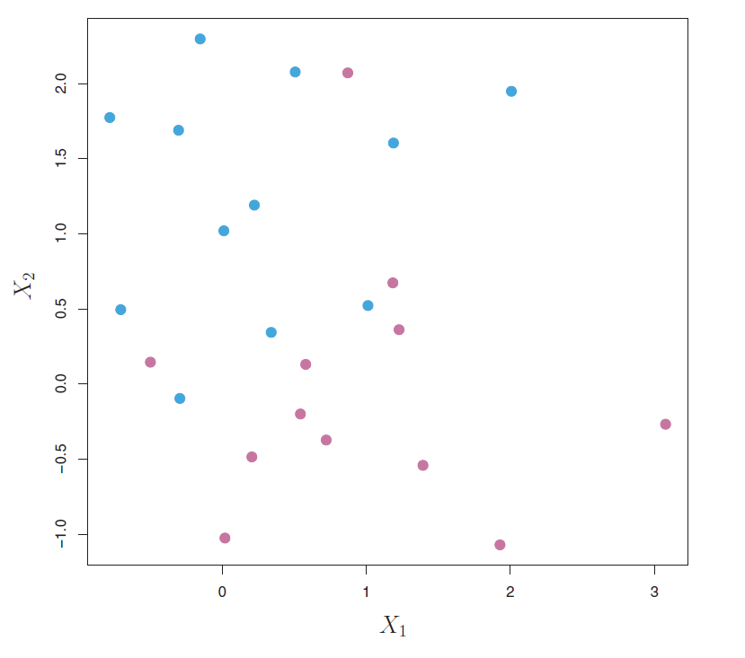 -->
<!-- ``` -->

<!-- The data are not separable by a linear boundary. This is often the case, unless $n<p$. -->

<!-- ## Noisy Data -->

<!-- ```{r , echo=FALSE,  fig.align='center', out.width = '100%'} -->
<!-- 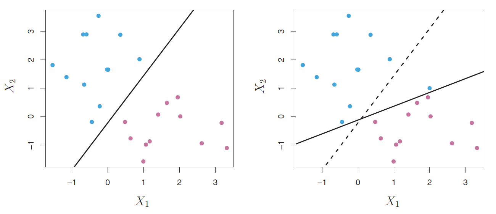 -->
<!-- ``` -->

<!-- The data are separable, but noisy. Leads to an unsatisfactory maximal margin hyperplane. -->

## Support Vector Classifier

We might be willing to misclassify a few observations for

* greater robustness to individual observations, and

* better classify **most** of the observations.

This leads us to the **support vector classifier**. Also called the **soft margin classifier**.

The margin is **soft** because it can be violated by some of the training observations.

<!-- ## Support Vector Classifier -->

<!-- ```{r , echo=FALSE,  fig.align='center', out.width = '100%'} -->
<!-- 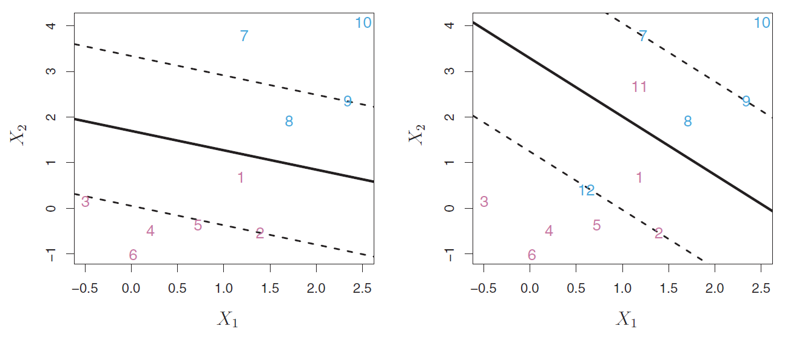 -->
<!-- ``` -->

## Support Vector Classifier

```{r , echo=FALSE,  fig.align='center', out.width = '100%'}
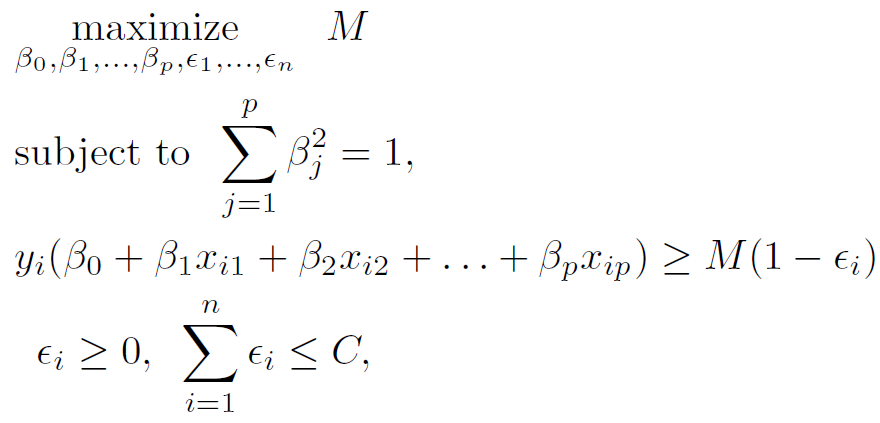
```

$M$: width of the margin

$\epsilon_1, \ldots, \epsilon_n$: **Slack variables**

$C$: **Budget** (tuning parameter)

<!-- ## Support Vector Classifier -->

<!-- * $\epsilon_i=0$: -->

<!-- * $\epsilon_i>0$: -->

<!-- * $\epsilon_i>1$: -->

<!-- * $C=0$: -->

<!-- * $C>0$: -->

<!-- * Support vectors: -->

<!-- ## Support Vector Classifier: Bias-Variance Trade-Off {.smaller} -->

<!-- ```{r , echo=FALSE,  fig.align='center', out.width = '70%'} -->
<!-- 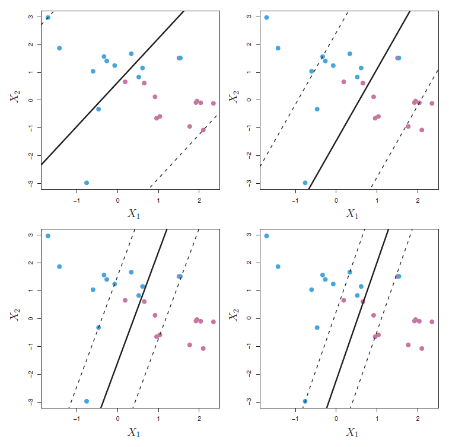 -->
<!-- ``` -->


## Support Vector Classifier  {.smaller}

```{r, echo=FALSE}
svcdata <- norm2d
```


```{r, message=FALSE}
set.seed(022823)   # set seed

library(kernlab)  # load library

# implement CV to find optimal C
svc_cv <- train(y ~ ., 
                data = svcdata,
                method = "svmLinear",               
                trControl = trainControl(method = "repeatedcv", number = 10, repeats = 5),
                tuneLength = 20,
                metric = "Accuracy")

svc_cv$bestTune   # optimal C

# fit model with optimal C
final_model_svc <- ksvm(y ~ .,
                        data = svcdata,
                        kernel = "vanilladot",  
                        C = svc_cv$bestTune$C,                
                        prob.model = TRUE)       # needed to obtain predicted probabilities

```


## Support Vector Classifier

```{r, echo=FALSE, fig.align='center'}
# values considered for plotting
npts <- 500
xgrid <- expand.grid(x1 = seq(from = -2, 2, length = npts),
                     x2 = seq(from = -2, 2, length = npts))

# fitted probabilities
prob_svc <- predict(final_model_svc, newdata = xgrid, type = "probabilities")

# add predicted class probabilities
xgrid2 <- xgrid %>% cbind(Prob = prob_svc[, 1L]) 

# scatterplot
ggplot(norm2d, aes(x = x1, y = x2)) +
  geom_point(aes(shape = y, color = y), size = 3, alpha = 0.75) +
  xlab("Income (standardized)") +
  ylab("Lot size (standardized)") +
  xlim(-3, 3) +
  ylim(-2, 2) +
  coord_fixed() +
  theme(legend.position = "none") +
  theme_bw() +
  scale_shape_discrete(
    name = "Owns a riding\nmower?",
    breaks = c(1, -1),
    labels = c("Yes", "No")
  ) +
  scale_color_brewer(
    name = "Owns a riding\nmower?",
    palette = "Dark2",
    breaks = c(1, -1),
    labels = c("Yes", "No")
  ) +
  stat_contour(data = xgrid2, aes(x = x1, y = x2, z = Prob), 
               breaks = 0.5, color = "black") 
```


## Support Vector Classifier

```{r}
final_model_svc   # number of support vectors

alphaindex(final_model_svc)   # which observations are support vectors
```

## Support Vector Classifier

```{r, fig.align='center'}
plot(final_model_svc)
```


## Non-linear Boundaries

**Why support vector classifiers fail?**

<!-- ```{r , echo=FALSE,  fig.align='center', out.width = '100%'} -->
<!-- 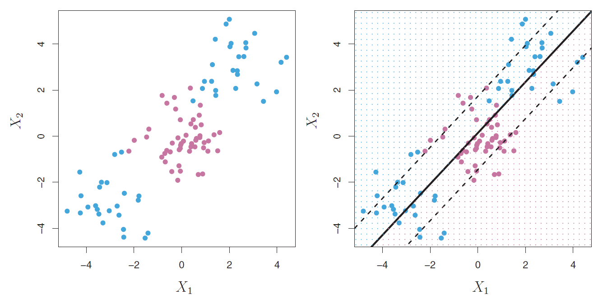 -->
<!-- ``` -->


```{r, echo=FALSE, fig.align='center'}
## Fig 14.6 ##############################################################################

# Simulate data
set.seed(1432)
circle <- as.data.frame(mlbench::mlbench.circle(
  n = 200,
  d = 2
))
names(circle) <- c("x1", "x2", "y")  # rename columns

ggplot(circle, aes(x = x1, y = x2)) +
  geom_point(aes(shape = y, color = y), size = 3, alpha = 0.75) +
  xlab(expression(X[1])) +
  ylab(expression(X[2])) +
  xlim(-1.25, 1.25) +
  ylim(-1.25, 1.25) +
  coord_fixed() +
  theme(legend.position = "none") +
  theme_bw() 

# +
#   stat_contour(data = xgrid2, aes(x = x1, y = x2, z = Prob), 
#                breaks = 0.5, color = "black") 

```


## Feature Expansion

* The problem of non-linear boundaries can be solved by enlarging the feature space (like in linear regression) using transformations of predictors.

* Fit a support vector classifier in the enlarged space.

* Results in non-linear boundaries in the original space.

<!-- Consider $p$ original features $X_1, X_2, \ldots, X_p$ -->

<!-- Make $2p$ features $X_1, X^2_1, X_2, X^2_2, \ldots, X_p, X^2_p$ -->

<!-- Then, we have -->
<!-- $$\beta_0+\beta_{11} \ x_{i1}+\beta_{12} \ x^2_{i1}+\beta_{21} \ x_{i2}+\beta_{22} \ x^2_{i2}+ \ldots + \beta_{p1} \ x_{ip}+\beta_{p2} \ x^2_{ip}$$ -->

## Feature Expansion

```{r, echo=FALSE, fig.align='center'}
## self created example #################################################################

set.seed(1)
x=rnorm(5,0,1)
y=c(1,1,2,2,1)
d1=data.frame(x1=x,x2=0,y=y)
d2=data.frame(x1=x,x2=x^2,y=y)

par(mfrow=c(1,2))
plot(d1$x1,d1$x2,col=y, main="d=1", xlab="x", ylab="", yaxt='n')
plot(d2$x1,d2$x2,col=y, main="d=2", xlab="x", ylab="x^2")

# g1 <- ggplot(data = d1, aes(x = x1, y = 0)) +
#   geom_point(aes(color = as.factor(y))) +
#   theme(legend.title = element_blank()) + 
#   labs(title = "original feature space", x = expression(x), y = "")
# g1
# 
# g2 <- ggplot(data = d2, aes(x = x1, y = x2)) +
#   geom_point(aes(color = as.factor(y))) +
#   theme(legend.title = element_blank()) + 
#   labs(title = "enlarged feature space", x = expression(x), y = expression(x^2))
# g2
# 
# grid.arrange(g1, g2, nrow = 1)
# 
```


## Feature Expansion

A **kernel function** quantifies the similarity between two observations. It helps in transforming the original feature space to an enlarged feature space where the data points can be separated by a linear boundary.

Commonly used **kernel funtions** are

* **Polynomial Kernel of degree $d$**

$$k(x_i, x_{i'}) = \left(1+scale\sum_{j=1}^{p} x_{ij} \ x_{i'j} \right)^{degree}$$

<!-- ```{r , echo=FALSE,  fig.align='center', out.width = '50%'} -->
<!-- 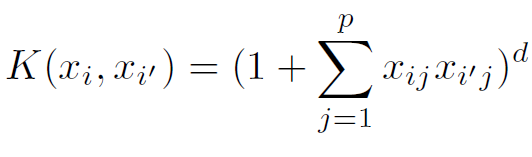 -->
<!-- ``` -->

* **Radial Basis Function Kernel**

$$k(x_i, x_{i'}) = \text{exp}\left(-\sigma\sum_{j=1}^{p} (x_{ij} - x_{i'j})^2 \right)$$


<!-- ```{r , echo=FALSE,  fig.align='center', out.width = '60%'} -->
<!-- 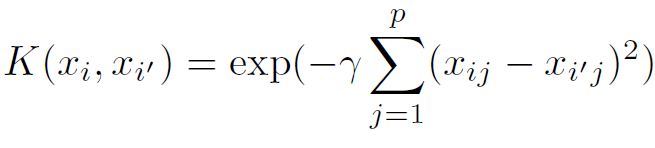 -->
<!-- ``` -->


A support vector classifier with a non-linear kernel is known as a **support vector machine**.


<!-- ## Feature Expansion -->


<!-- ```{r, echo=FALSE, fig.align='center'} -->
<!-- p2a <- ggplot(circle, aes(x = x1, y = x2)) + -->
<!--   geom_point(aes(shape = y, color = y), size = 3, alpha = 0.75) + -->
<!--   xlab(expression(X[1])) + -->
<!--   ylab(expression(X[2])) + -->
<!--   xlim(-1.25, 1.25) + -->
<!--   ylim(-1.25, 1.25) + -->
<!--   coord_fixed() + -->
<!--   theme(legend.position = "none") + -->
<!--   theme_bw() -->

<!-- circle_3d <- circle -->
<!-- circle_3d$x3 <- circle_3d$x1^2 + circle_3d$x2^2 -->

<!-- # 3-D scatterplot -->
<!-- p2b <- cloud( -->
<!--   x = x3 ~ x1 * x2,  -->
<!--   data = circle_3d,  -->
<!--   groups = y, -->
<!--   color = y,  -->
<!--   main = "Enlarged feature space", -->
<!--   par.settings = list( -->
<!--     superpose.symbol = list( -->
<!--       pch = 19, -->
<!--       cex = 1, -->
<!--       col = y -->
<!--     ) -->
<!--   ) -->
<!-- ) -->
<!-- # adjustcolor(dark2[1L:2L], alpha.f = 0.5) -->
<!-- # Combine plots -->
<!-- gridExtra::grid.arrange(p2a, p2b, nrow = 1) -->
<!-- ``` -->


## Non-linear Boundaries: Circle dataset {.smaller}

We train an SVM with the polynomial kernel.

```{r}
set.seed(022823)   # set seed

# implement CV to find optimal parameters
param_grid_poly <- expand.grid(degree = c(1, 2, 3, 4),
                          scale = c(0.5, 1, 2), 
                          C = c(0.001, 0.1, 1, 10, 10))

svm_poly_cv <- train(y ~ ., 
                     data = circle,
                     method = "svmPoly", 
                     trControl = trainControl(method = "repeatedcv", number = 10, repeats = 5),
                     tuneGrid = param_grid_poly,
                     metric = "Accuracy")
                     

svm_poly_cv$bestTune

max(svm_poly_cv$results$Accuracy)
```


## Non-linear Boundaries: Circle dataset {.smaller}


```{r}
# fit model with optimal parameters
final_model_svm_poly <- ksvm(y ~ ., 
                             data = circle,
                             kernel = "polydot",
                             kpar = list(degree = svm_poly_cv$bestTune$degree,
                                         scale = svm_poly_cv$bestTune$scale,
                                         offset = 1),
                             C = svm_poly_cv$bestTune$C,
                             prob.model = TRUE)

final_model_svm_poly
```


## Non-linear Boundaries: Circle dataset

```{r, echo=FALSE, fig.align='center'}
# Grid over which to evaluate decision boundaries
npts <- 500
xgrid <- expand.grid(
  x1 = seq(from = -1.25, 1.25, length = npts),
  x2 = seq(from = -1.25, 1.25, length = npts)
)

# Predicted probabilities (as a two-column matrix)
prob_svm_poly <- predict(final_model_svm_poly, newdata = xgrid, type = "probabilities")

xgrid2 <- xgrid %>%
  cbind(
    # "RF" = prob_rfo[, 1L], 
    Prob = prob_svm_poly[, 1L]) 


ggplot(circle, aes(x = x1, y = x2)) +
  geom_point(aes(shape = y, color = y), size = 3, alpha = 0.75) +
  xlab(expression(X[1])) +
  ylab(expression(X[2])) +
  xlim(-1.25, 1.25) +
  ylim(-1.25, 1.25) +
  coord_fixed() +
  theme(legend.position = "none") +
  theme_bw() +
  stat_contour(data = xgrid2, aes(x = x1, y = x2, z = Prob), 
               breaks = 0.5, color = "black") 

```


## Non-linear Boundaries: Spirals dataset

```{r, echo=FALSE, fig.align='center'}
## Fig 14.6 ##############################################################################
library(mlbench)

# Simulate train and test sets
set.seed(0841)
spirals <- as.data.frame(
  mlbench.spirals(300, cycles = 2, sd = 0.09)
)
names(spirals) <- c("x1", "x2", "classes")

ggplot(spirals, aes(x = x1, y = x2)) +
  geom_point(aes(shape = classes, color = classes), size = 3, alpha = 0.75) +
  xlab(expression(X[1])) +
  ylab(expression(X[2])) +
  xlim(-2, 2) +
  ylim(-2, 2) +
  coord_fixed() +
  theme(legend.position = "none") +
  theme_bw()
```


## Non-linear Boundaries: Spirals dataset  {.smaller}

We train an SVM with the radial basis function kernel.


```{r}
set.seed(022823)   # set seed

# implement CV to find optimal parameters
param_grid_radial <- expand.grid(sigma = c(0.5, 1, 1.5, 2),
                                 C = c(0.001, 0.01, 1, 5, 10, 100))

svm_radial_cv <- train(classes ~ .,
                       data = spirals,
                       method = "svmRadial",
                       tuneGrid = param_grid_radial,
                       trControl = trainControl(method = "repeatedcv", number = 10, repeats = 5),
                       metric = "Accuracy")

svm_radial_cv$bestTune

max(svm_radial_cv$results$Accuracy)
```

## Non-linear Boundaries: Spirals dataset {.smaller}

```{r}
# fit model with optimal parameters
final_model_svm_radial <- ksvm(classes ~ ., 
                               data = spirals, 
                               kernel = "rbfdot",
                               kpar = list(sigma = svm_radial_cv$bestTune$sigma),
                               C = svm_radial_cv$bestTune$C, 
                               prob.model = TRUE)
 
final_model_svm_radial
```


## Non-linear Boundaries: Spirals dataset


```{r, echo=FALSE, fig.align='center'}
# Grid over which to evaluate decision boundaries
npts <- 500
xgrid <- expand.grid(
  x1 = seq(from = -2, 2, length = npts),
  x2 = seq(from = -3, 2, length = npts)
)

# Predicted probabilities (as a two-column matrix)
# prob_rfo <- predict(spirals_rfo, data = xgrid)$predictions
prob_svm <- predict(final_model_svm_radial, newdata = xgrid, type = "probabilities")


xgrid2 <- xgrid %>%
  cbind(Prob = prob_svm[, 1L]) 

# Scatterplots with decision boundaries
ggplot(spirals, aes(x = x1, y = x2)) +
  geom_point(aes(shape = classes, color = classes), size = 3, alpha = 0.75) +
  xlab(expression(X[1])) +
  ylab(expression(X[2])) +
  xlim(-2, 2) +
  ylim(-3, 2) +
  coord_fixed() +
  theme(legend.position = "none") +
  theme_bw() +
  stat_contour(data = xgrid2, aes(x = x1, y = x2, z = Prob), 
               breaks = 0.5, color = "black")
```


<!-- ```{r , echo=FALSE,  fig.align='center', out.width = '100%'} -->
<!-- 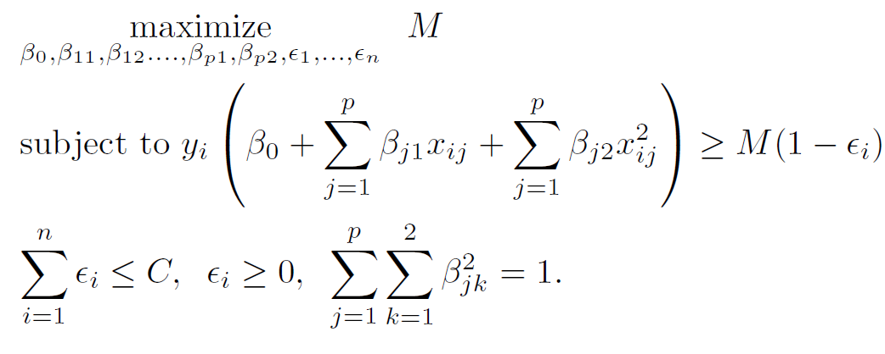 -->
<!-- ``` -->

<!-- Computations can become unmanageable if we end up with huge number of features. SVM leads to efficient computations through the use of **kernels**. -->


<!-- ## Inner Products -->

<!-- The **inner product** of two $p$-dimensional vectors $a$ and $b$ is $$\langle a,b \rangle=\displaystyle \sum_{j=1}^{p} a_j \ b_j=a_1b_1+a_2b_2+\ldots+a_pb_p$$ -->

<!-- For two observations $x_i$ and $x_{i'}$, we have, -->
<!-- $$\langle x_i,x_{i'} \rangle=\displaystyle \sum_{j=1}^{p} x_{ij} \ x_{i'j}$$ -->

<!-- It turns out that the solution to the support vector classifier problem involves only the **inner products** of the observations. -->

<!-- ## Inner Products and Support Vector Classifier -->

<!-- The linear support vector classifier can be represented as -->

<!-- ```{r , echo=FALSE,  fig.align='center', out.width = '40%'} -->
<!-- 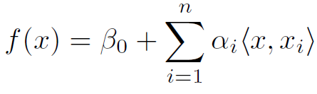 -->
<!-- ``` -->

<!-- To estimate the parameters $\alpha_1,\ldots,\alpha_n$ and $\beta_0$, we need $n \choose 2$ inner products $\langle x_i,x_{i'} \rangle$ between all pairs of observations. -->

<!-- It turns out that $\alpha_i$ is nonzero only for the support vectors in the solution. If $\mathcal{S}$ denotes the collection of indices of support vectors, -->

<!-- ```{r , echo=FALSE,  fig.align='center', out.width = '50%'} -->
<!-- 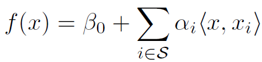 -->
<!-- ``` -->


<!-- ## Inner Products and Support Vector Classifier -->

<!-- For a test data point $x^*$, we have (say $p=2$ and $n=3$) -->
<!-- $$f(x^*)=\beta_0+\displaystyle\sum_{i \in \mathcal{S}} \alpha_i \ \langle x^*,x_i \rangle \ \ \text{and} \ \ f(x^*)=\beta_0+\beta_1 \ x^*_1+\beta_2 \ x^*_2$$ -->

<!-- ## Kernels -->

<!-- Replace inner products $\langle x_i,x_{i'} \rangle$ with **kernels**. -->

<!-- ```{r , echo=FALSE,  fig.align='center', out.width = '20%'} -->
<!-- 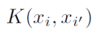 -->
<!-- ``` -->

<!-- We then have -->

<!-- ```{r , echo=FALSE,  fig.align='center', out.width = '50%'} -->
<!-- 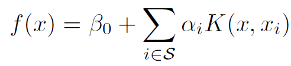 -->
<!-- ``` -->

<!-- A kernel quantifies the similarity between two observations. -->

<!-- A support vector classifier is a special case if -->

<!-- ```{r , echo=FALSE,  fig.align='center', out.width = '40%'} -->
<!-- 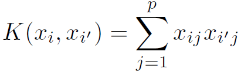 -->
<!-- ``` -->


<!-- ## Kernels -->

<!-- **Polynomial Kernel of degree $d$** -->

<!-- ```{r , echo=FALSE,  fig.align='center', out.width = '50%'} -->
<!--  -->
<!-- ``` -->

<!-- **Radial Kernel** -->

<!-- ```{r , echo=FALSE,  fig.align='center', out.width = '60%'} -->
<!--  -->
<!-- ``` -->


<!-- A support vector classifier with a non-linear kernel is known as a **support vector machine**. -->

<!-- ## Support Vector Machines (SVM) -->

<!-- ```{r , echo=FALSE,  fig.align='center', out.width = '100%'} -->
<!-- 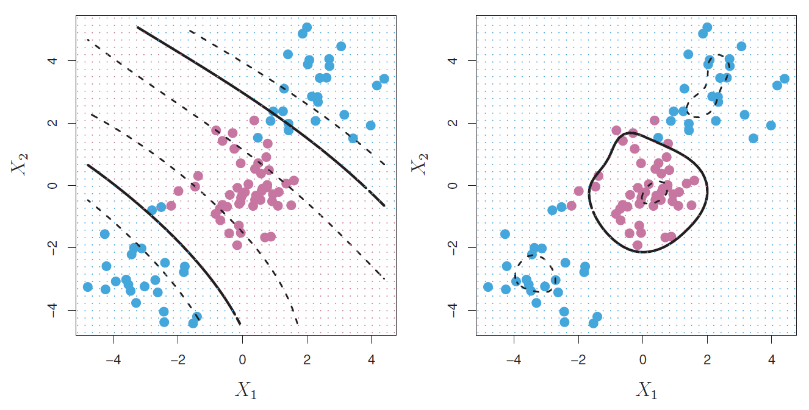 -->
<!-- ``` -->

<!-- ## Support Vector Machines (SVM) -->

<!-- **Heart dataset** -->

<!-- ```{r , echo=FALSE,  fig.align='center', out.width = '100%'} -->
<!-- 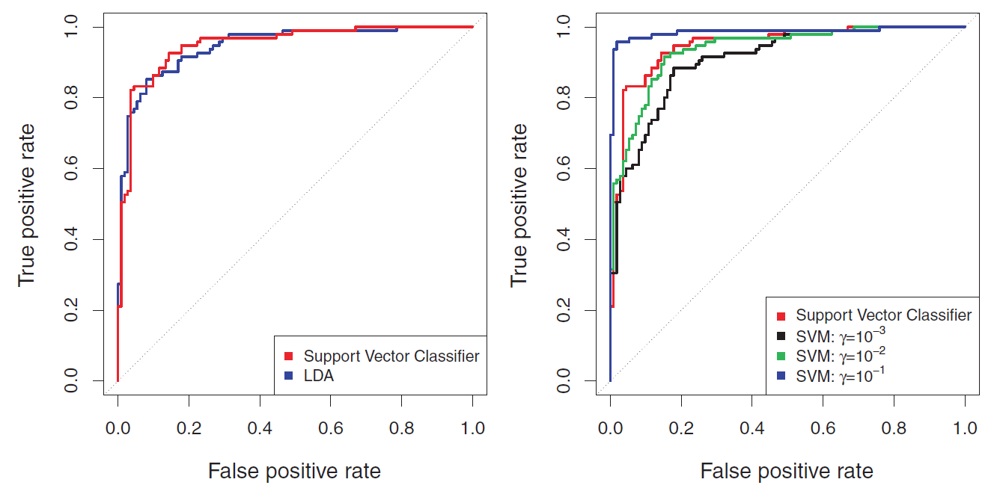 -->
<!-- ``` -->

<!-- ## Support Vector Machines (SVM) -->

<!-- **Heart dataset** -->

<!-- ```{r , echo=FALSE,  fig.align='center', out.width = '100%'} -->
<!-- 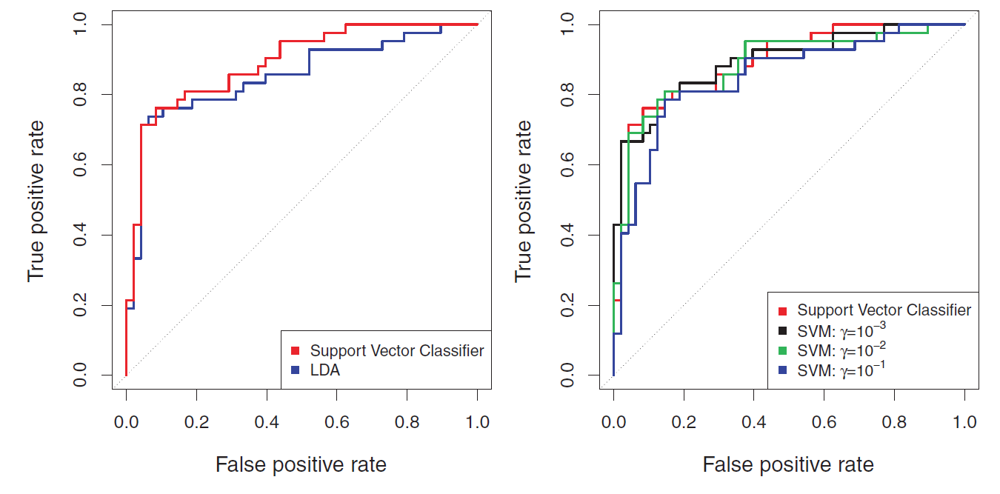 -->
<!-- ``` -->


<!-- ## SVMs with More than Two Classes -->

<!-- * **One-vs-One Classification**: Construct $K \choose 2$ SVMs for each pair of classes. Classify $x^*$ to the class that wins the most pairwise competitions. -->

<!-- * **One-vs-All Classification**: Construct $K$ different 2-class SVMs. Classify $x^*$ to the class for which $\hat{f}_k(x^*)$ is largest. -->

## Summary

* SVMs are black-box algorithms. Lack interpretability.

* One of the best methods for two-class classification problems.

<!-- * SVMs have a close relationship with logistic regression. (Section 9.5) -->

* If we wish to estimate probabilities, logistic regression is the way to go.

* For non-linear boundaries, SVMs are popular.


## <span style="color:blue">Your Turn!!!</span> 

You will work with the `Sonar` data from the `mlbench` package. The task is to predict `Class` ('R' if the object is a rock and 'M' if it is a mine (metal cylinder)) using the rest of the variables in the data (predictors).

```{r}
library(mlbench)   # load library

data(Sonar)     # load dataset
```

Compare the performance of the following support vector-based models: 

* a support vector classifier,

* a support vector machine with polynomial kernel,

* a support vector machine with radial basis function kernel.


## <span style="color:blue">Your Turn!!!</span>

**Perform the following tasks.**

* Investigate the dataset and complete any necessary tasks. 

* Split the data into training and test sets (70-30).

* Perform required data preprocessing and create the blueprint. If using `step_dummy()`, set `one_hot = FALSE`. Prepare the blueprint on the training data. Obtain the modified training and test datasets. 

* Implement 5-fold CV (no repeats) for each of the models above. 

* Report the optimal CV Accuracy of each model. Report the optimal hyperparameters for each model. Which model performs best in this situation? 

* Build the final model. Obtain class label predictions on the test set. Create the corresponding confusion matrix and report the test set accuracy. See help page for `predict.ksvm` function.


## <span style="color:blue">Your Turn!!!</span>  

```{r, eval=FALSE}
glimpse(Sonar)   # all features are numerical (output not displayed here)
```


```{r}
sum(is.na(Sonar))  # no missing entries
```


## <span style="color:blue">Your Turn!!!</span> 

```{r}
set.seed(022823)   # set seed

# split the data into training and test sets

index <- createDataPartition(Sonar$Class, p = 0.7, list = FALSE)

Sonar_train <- Sonar[index, ]

Sonar_test <- Sonar[-index, ]
```


```{r, eval = FALSE}
nearZeroVar(Sonar_train, saveMetrics = TRUE)  # no zv/nzv features (output not displayed here)
```


## <span style="color:blue">Your Turn!!!</span>

```{r}
set.seed(022823)   # set seed

# create recipe and blueprint, prepare and apply blueprint

blueprint <- recipe(Class ~ ., data = Sonar_train) %>%
  step_normalize(all_predictors())

prepare <- prep(blueprint, training = Sonar_train)

baked_train <- bake(prepare, new_data = Sonar_train)

baked_test <- bake(prepare, new_data = Sonar_test)
```


## <span style="color:blue">Your Turn!!!</span> 

```{r}
set.seed(022823)   # set seed

cv_specs <- trainControl(method = "cv", number = 5)   # CV specifications
```

```{r}
set.seed(022823)   # set seed

# CV with support vector classifier

param_grid_linear <- expand.grid(C = c(0.001, 0.1, 1, 5, 10, 100))

svc_cv <- train(blueprint, 
                data = Sonar_train,
                method = "svmLinear",               
                trControl = cv_specs,
                tuneGrid = param_grid_linear,
                metric = "Accuracy")
```


## <span style="color:blue">Your Turn!!!</span>   {.smaller}


```{r}
set.seed(022823)   # set seed

# CV with support vector machine with polynomial kernel

param_grid_poly <- expand.grid(degree = c(1, 2, 3, 4),
                               scale = c(0.5, 1, 1.5, 2),
                               C = c(0.001, 0.1, 1, 5, 10, 100))

svm_poly_cv <- train(blueprint, 
                     data = Sonar_train,
                     method = "svmPoly", 
                     trControl = cv_specs,
                     tuneGrid = param_grid_poly,
                     metric = "Accuracy")
```


```{r}
set.seed(022823)   # set seed

# CV with support vector machine with radial basis function kernel

param_grid_radial <- expand.grid(sigma = c(0.5, 1, 1.5, 2),
                                 C = c(0.001, 0.1, 1, 5, 10, 100))

svm_radial_cv <- train(blueprint,
                       data = Sonar_train,
                       method = "svmRadial",
                       tuneGrid = param_grid_radial,
                       trControl = cv_specs,
                       metric = "Accuracy")
```


## <span style="color:blue">Your Turn!!!</span> 

```{r}
# optimal CV Accuracies

max(svc_cv$results$Accuracy)   # SVC

max(svm_poly_cv$results$Accuracy)   # SVM with polynomial kernel

max(svm_radial_cv$results$Accuracy)    # SVM with radial basis function kernel
```


## <span style="color:blue">Your Turn!!!</span> 


```{r}
# optimal hyperparameters

svc_cv$bestTune     # SVC

svm_poly_cv$bestTune    # SVM with polynomial kernel

svm_radial_cv$bestTune   # SVM with radial basis function kernel
```


## <span style="color:blue">Your Turn!!!</span>

```{r}
# build final model

final_model <- ksvm(Class~., 
                     data = baked_train,
                     kernel = "polydot",
                     kpar = list(degree = svm_poly_cv$bestTune$degree,
                                 scale = svm_poly_cv$bestTune$scale,
                                 offset = 1),
                     C = svm_poly_cv$bestTune$C,
                     prob.model = TRUE)
```


```{r}
# obtain predictions on test data

final_model_class_preds <- predict(final_model, newdata = baked_test, type = "response")  # predictions on test set
```


## <span style="color:blue">Your Turn!!!</span> {.smaller}

```{r}
# confusion matrix

confusionMatrix(data = final_model_class_preds, reference = baked_test$Class)
```


<!-- ## <span style="color:blue">Your Turn!!!</span> -->

<!-- You will work with the `Sonar` data from the `mlbench` package. The task is to predict `Class` ("R" if the object is a rock and "M" if it is a mine (metal cylinder)) using the rest of the variables in the data (predictors). -->

<!-- ```{r, eval=FALSE} -->
<!-- library(mlbench) -->

<!-- data(Sonar) -->
<!-- ``` -->


<!-- * Step 1: Investigate the dataset -->

<!-- * Step 2: Split the data into training and test sets. -->

<!-- * Step 3: Perform required data preprocessing and create the blueprint.  -->

<!-- ## <span style="color:blue">Your Turn!!!</span> -->

<!-- * Step 4: Implement 5-fold CV repeated 5 times to compare the performance of the following models. Use `metric = "Accuracy"`. -->

<!--     - a support vector classifier (`method = "svmLinear"`) with -->

<!--     - a support vector machine with polynomial kernel -->

<!--     - a support vector machine with radial basis function kernel -->

<!-- Use -->

<!-- ```{r} -->
<!-- param_grid_linear <- expand.grid(C = c(0.001, 0.1, 1, 5, 10, 100)) -->

<!-- param_grid_poly <- expand.grid(degree = c(1, 2, 3, 4), -->
<!--                           scale = c(0.5, 1, 1.5, 2),  -->
<!--                           C = c(0.001, 0.1, 1, 5, 10, 100)) -->

<!-- param_grid_radial <- expand.grid(sigma = c(0.5, 1, 1.5, 2), -->
<!--                           C = c(0.001, 0.1, 1, 5, 10, 100)) -->

<!-- ``` -->


<!-- How do the models compare in terms of the `Accuracy` obtained from CV? -->


## Summary of Supervised Learning Methods


| Technique     | Regression    | Classification | Tuning Parameters |
| ------------- |:-------------:| -----|-----|
|  |  |  |   |
|  |  |  |   |
|  |  |  |   |
|  |  |  |   |
|  |  |  |   |
|  |  |  |   |
|  |  |  |   |


## Neural Networks

**MNIST Handwritten Digits**

We will work with the famous [MNIST handwritten digits](http://yann.lecun.com/exdb/mnist/) dataset. We will attempt to use a neural network to classify images into digits.

```{r, eval = FALSE}
library(dslabs)   # load library

mnist <- read_mnist()    # load dataset

mnist_train_x <- mnist$train$images   # training set features
mnist_train_y <- mnist$train$labels   # training set responses

mnist_test_x <- mnist$test$images     # test set features
mnist_test_y <- mnist$test$labels     # test set responses
```


## Neural Networks

**MNIST Handwritten Digits**

```{r , echo=FALSE,  fig.align='center', out.width = '70%', fig.cap="From ISLR2"}
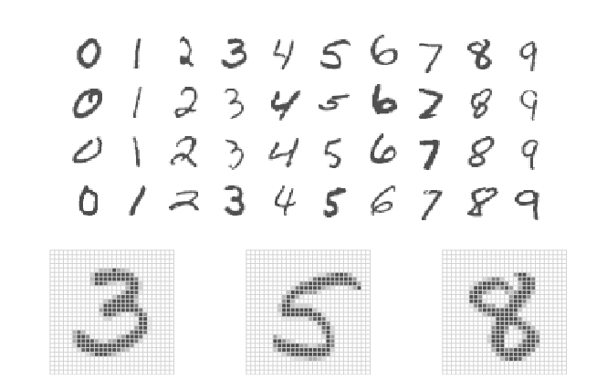
```


## Biological Neural Networks


```{r , echo=FALSE,  fig.align='center', out.width = '70%', fig.cap="From Wikipedia"}
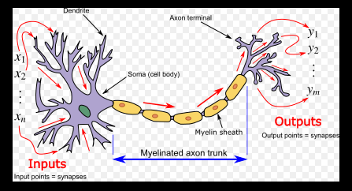
```


## Artificial Neural Networks

Deep Neural Networks (DNN) perform learning by mapping features to targets through a process of simple data transformations and feedback signals.

At their most basic levels, neural networks have three layers

* an input layer, 

* a hidden layer, and 

* an output layer.

The input layer consists of all of the original input features. The majority of the learning takes place in the hidden layer, and the output layer outputs the final predictions.

**In 1958, psychologist Frank Rosenblatt invented the `perceptron`, the first artificial neural network.**


## Neural Networks

```{r , echo=FALSE,  fig.align='center', out.width = '70%', fig.cap="From ISLR2"}
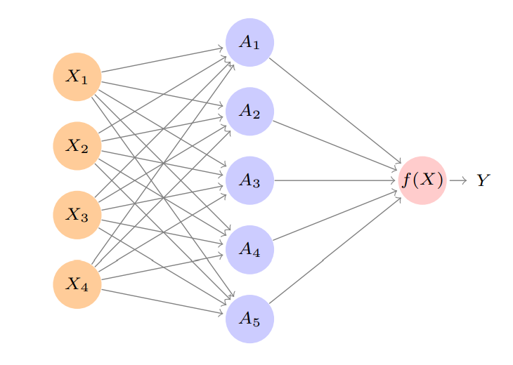
```


## Neural Networks  {.smaller}

**What is `deep` in deep neural nets?**

Most machine learning algorithms only have the ability to use one or two layers of data transformation to learn the output representation. We call these **shallow models** since they only use 1–2 representations of the feature space. 

As data sets continue to grow in the dimensions of the feature space, finding the optimal output representation with a shallow model is not always possible. 

Deep learning provides a multi-layer approach to learn data representations, typically performed with a multi-layer neural network. DNNs place an emphasis on learning successive layers of meaningful representations. 

DNNs perform successive non-linear transformations across each layer, allowing DNNs to model very complex and non-linear relationships. This can make DNNs suitable machine learning approaches for traditional regression and classification problems as well. But it is important to keep in mind that deep learning thrives when dimensions of your data are sufficiently large (e.g., very large training sets). As the number of observations $n$ and feature inputs $p$ decrease, shallow machine learning approaches tend to perform just as well, if not better, and are more efficient.


## Neural Networks

* Consider a linear combination of the input features, that is,

$$w_{k0} + w_{k1} \ X_1 + w_{k2} \ X_2 + w_{k3} \ X_3 + w_{k4} \ X_4$$

This happens for each hidden layer node $A_k$, $k=1, \ldots, 5$.

* Consider a **non-linear activation function** to transform the linear combination of input features, that is,

$$A_k = g\left(w_{k0} + w_{k1} \ X_1 + w_{k2} \ X_2 + w_{k3} \ X_3 + w_{k4} \ X_4\right)$$

* Finally, the output is a linear combination of $A_k$'s, that is,

$$\hat{Y} = \hat{f}(X) = \beta_0 + \beta_1 \ A_1 + \beta_2 \ A_2 + \beta_3 \ A_3 + \beta_4 \ A_4 + \beta_5 \ A_5$$


## <span style="color:blue">Your Turn!!!</span>

Suppose we have two input features $X_1$ and $X_2$. Consider the parameters

$$\beta_0 = 0 \ \ \ \ \ \beta_1 = \frac{1}{4} \ \ \ \ \ \beta_2 = -\frac{1}{4}$$

$$w_{10} = 0 \ \ \ \ \ w_{11} = 1 \ \ \ \ \ w_{12} = 1$$

$$w_{20} = 0 \ \ \ \ \ w_{21} = 1 \ \ \ \ \ w_{22} = -1$$

and the activation function $g(z)=z^2$.

What is $\hat{f}(X_1, X_2)$?

You can use the fact that $(a+b)^2 = a^2 + 2ab + b^2$.


## Neural Networks

There are multiple activation funtions to choose from but the most common ones include

```{r , echo=FALSE,  fig.align='center', out.width = '90%', fig.cap="From ISLR2"}
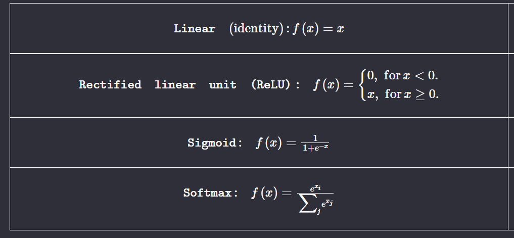
```


## Neural Networks

To build a feedforward DNN we need four key components:

* Input data (the $X$'s);

* A pre-defined network architecture;

* A feedback mechanism to help the network learn;

* A model training approach.


## Neural Networks: Input Data

* Feedforward DNNs require all feature inputs to be numeric. 

* Due to the data transformation process that DNNs perform, they are highly sensitive to the individual scale of the feature values. Consequently, we should standardize our features first. 

* Since we are working with a multinomial response (0–9), `keras` requires our response to be a one-hot encoded matrix, which can be accomplished with the keras function `to_categorical`.

```{r, eval = FALSE}
library(keras)

mnist_train_y <- to_categorical(mnist_train_y, num_classes = 10)    # one-hot encode response

p <- ncol(mnist_train_x)  # get number of features, to be used later
```


## Neural Networks: Network Architecture

It involves deciding the 

* number of layers and nodes

* activation function

Layers are considered **dense** (fully connected) when all the nodes in each successive layer are connected. Consequently, the more layers and nodes you add the more opportunities for new features to be learned (commonly referred to as the model's **capacity**).

The choice of output layer is driven by the modeling task. For regression problems, your output layer will contain one node that outputs the final predicted value. For binary classification problems, the output layer will still contain only one node and that node will predict the probability of success (however you define success). For multi-class classification probelms, the output layer will contain the same number of nodes as the number of classes being predicted.

For the output layers we use the linear activation function for regression problems, the sigmoid activation function for binary classification problems, and softmax for multi-class classification problems.


## Neural Networks: Network Architecture

```{r, eval = FALSE}
model <- keras_model_sequential() %>%
         layer_dense(units = 256, activation = "relu", input_shape = p) %>%
         layer_dense(units = 128, activation = "relu") %>%
         layer_dense(units = 10, activation = "softmax")
```


## Neural Networks: Network Architecture

```{r , echo=FALSE,  fig.align='center', out.width = '70%', fig.cap="From ISLR2"}
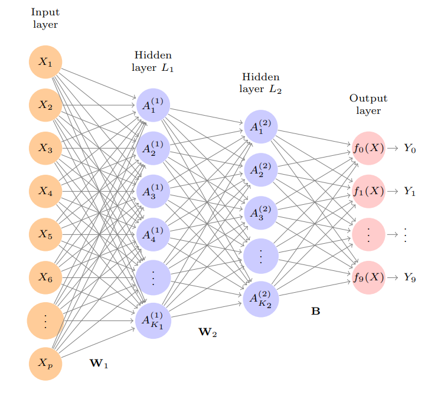
```


## Neural Networks: Feedback Mechanism

On the first run (or forward pass), the DNN will select a batch of observations, randomly assign weights across all the node connections, and predict the output. The engine of neural networks is how it assesses its own accuracy and automatically adjusts the weights across all the node connections to improve that accuracy. This process is called **backpropagation**. To perform backpropagation we need two things:

* An objective function

    - mean squared error (coded as `mse`)
    - categorical cross entropy (coded as `categorical_crossentropy`)
    
* An optimizer

    - stochastic gradient descent (coded as `sgd`)
    - Adam (coded as `adam`)
    - RMSProp (coded as `rmsprop`)
    


## Neural Networks: Feedback Mechanism

```{r, eval = FALSE}
model <- keras_model_sequential() %>%
         layer_dense(units = 256, activation = "relu", input_shape = p) %>%
         layer_dense(units = 128, activation = "relu") %>%
         layer_dense(units = 10, activation = "softmax") %>%
         compile(loss = 'categorical_crossentropy',    # adjust for regression task
                 optimizer = optimizer_rmsprop(), 
                 metrics = c('accuracy'))              # adjust for regression task
```


## Neural Networks: Model Training

* **batch_size**: The DNN will take a batch of data to run through the optimizing process. Values are typically provided as a power of two. 

* **epochs**: An epoch describes the number of times the algorithm sees the entire data set. 

* **validation_split**: The model will hold out XX% of the data so that we can compute a more accurate estimate of an out-of-sample error rate.


## Neural Networks: Model Training


```{r, eval=FALSE}
model_fit <- model %>% 
              fit(x = mnist_train_x, 
                  y = mnist_train_y, 
                  epochs = 35, 
                  batch_size = 128, 
                  validation_split = 0.2, 
                  verbose = FALSE)
```


## Neural Networks: Further Topics

Other components in a neural net:

* batch normalization

* regularization and dropout

* adjusting learning rate of optimization


Other variations of neural nets include

* Convolutional Neural Networks (CNN)

* Recurrent Neural Networks (RNN)


