# Unsupervised Learning

* **Supervised learning** problems involve a set of $p$ features $X_1, X_2, \ldots, X_p$ and a response $Y$ measured on $n$ observations.
    + Objective is prediction and explain (if possible) the relation between response and predictors.

* In **unsupervised learning** problems, we observe only the features $X_1, X_2, \ldots, X_p$.
    + Objectives can be to visualize the data, or,
    + discover subgroups among variables or among observations.

We will discuss two methods:

* **Principal Components Analysis (PCA)**: Used for data visualization and pre-processing.

* **Clustering**: Discover unknown subgroups in data.


## Unsupervised Learning

* Unsupervised learning problems tend to be more subjective than supervised learning problems.

* Often performed as part of an **exploratory data analysis**.

* Difficult to assess the results obtained from unsupervised learning methods.

* It is easier to obtain **unlabeled data**.

## Principal Components Analysis (PCA)

PCA seeks a low-dimensional representation of a dataset that captures as much of the information as possible. PCA serves as a tool for

* Data compression
* Data visualization

The principal components are linear combinations of the $p$ original features subject to certain constraints.


## PCA: Example

**USArrests dataset**

```{r}
library(ISLR2)   # load package
data("USArrests")   # load dataset

head(USArrests)   # first six observations
```


## PCA: Example

**USArrests dataset**

```{r}
cor(USArrests)   # correlation matrix of variables
```


## PCA: Data Requirements

To perform dimension reduction techniques in R, generally, the data should be prepared as follows:

* Data are in tidy format per Wickham et al. (2014);

* Any missing values in the data must be removed or imputed;

* Typically, the data must all be numeric values (e.g., one-hot, label, ordinal encoding categorical features);

* Numeric data should be standardized (e.g., centered and scaled) to make features comparable.


## PCA: Toy Example

```{r, echo=FALSE, fig.align='center'}
df <- AmesHousing::make_ames() %>%
  dplyr::select(var1 = First_Flr_SF, var2 = Gr_Liv_Area) %>%
  filter(var1 != var2) %>%
  mutate_all(log) %>%
  scale() %>% 
  data.frame() %>%
  filter(var1 < 4)
ggplot(df, aes(var1, var2)) +
  geom_jitter(alpha = .2, size = 1, color = "dodgerblue") +
  # geom_segment(
  #   aes(x = 0, xend = 1.5 , y = 0, yend = 1.5),
  #   arrow = arrow(length = unit(0.25,"cm")), size = 0.75, color = "black"
  # ) +
  # annotate("text", x = 1, y = .2, label = "First principal component", size = 2.5, hjust = 0) +
  # annotate("text", x = -3, y = .8, label = "Second principal component", size = 2.5, hjust = 0) +
  # geom_segment(
  #   aes(x = 0, xend = -0.27 , y = 0, yend = .65),
  #   arrow = arrow(length = unit(0.25,"cm")), size = 0.75, color = "black"
  # ) +
  xlab(expression(X[1])) +
  ylab(expression(X[2])) +
  theme_bw()
```


## PCA: Toy Example

```{r, echo=FALSE, fig.align='center'}
ggplot(df, aes(var1, var2)) +
  geom_jitter(alpha = .2, size = 1, color = "dodgerblue") +
  geom_segment(
    aes(x = 0, xend = 1.5 , y = 0, yend = 1.5),
    arrow = arrow(length = unit(0.25,"cm")), size = 0.75, color = "black"
  ) +
  annotate("text", x = 1, y = .2, label = "First principal component", size = 2.5, hjust = 0) +
  annotate("text", x = -3, y = .8, label = "Second principal component", size = 2.5, hjust = 0) +
  geom_segment(
    aes(x = 0, xend = -0.27 , y = 0, yend = .65),
    arrow = arrow(length = unit(0.25,"cm")), size = 0.75, color = "black"
  ) +
  xlab(expression(X[1])) +
  ylab(expression(X[2])) +
  theme_bw()
```


## PCA: Toy Example

```{r , echo=FALSE,  fig.align='center', fig.cap="PCs with 3 features. [Adapted from HMLR, Boehmke & Greenwell]", out.width = '80%'}
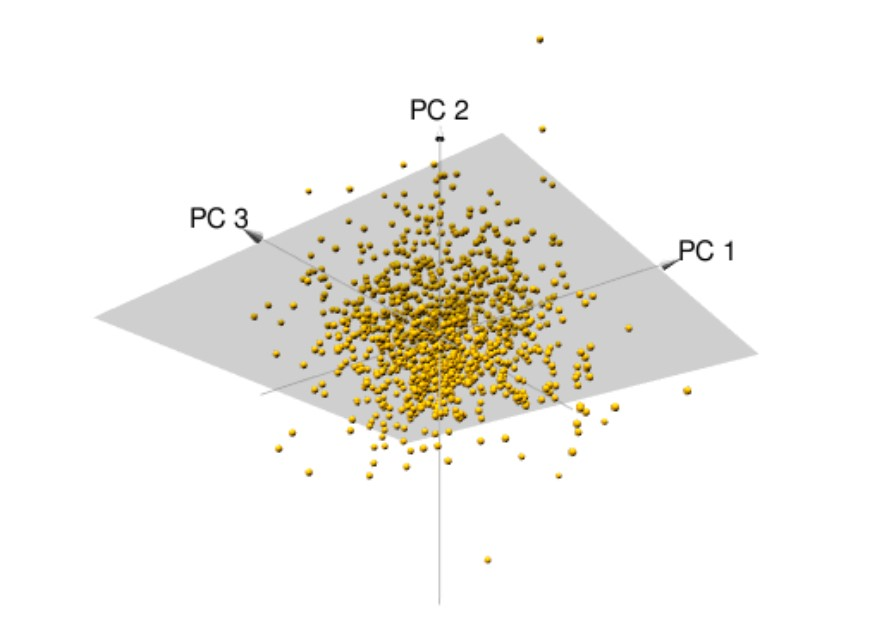
```


## PCA: First PC

The **first principal component** $Z_1$ of a set of features $X_1, X_2, \ldots, X_p$ is the normalized linear combination of the features that has the largest variance.

```{r , echo=FALSE,  fig.align='center', out.width = '80%'}
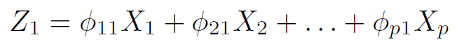
```

By **normalized**, we mean $\displaystyle \sum_{j=1}^p \phi^2_{j1}=1$.

For the $i^{th}$ observation,

```{r , echo=FALSE,  fig.align='center', out.width = '80%'}
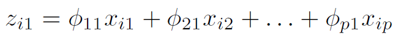
```

The elements $\phi_{11},\phi_{21}, \ldots, \phi_{p1}$ are **loadings of the first PC**. The loadings make up the **first PC loading vector** $\phi_1=(\phi_{11} \ \ \phi_{21} \ \ \ldots \ \ \phi_{p1})^T$.

$z_{11}, z_{21}, \ldots, z_{n1}$ are the **first PC scores**.


## PCA: First PC

Suppose an $n \times p$ feature matrix $\mathbf{X}$.

```{r , echo=FALSE,  fig.align='center', out.width = '40%'}
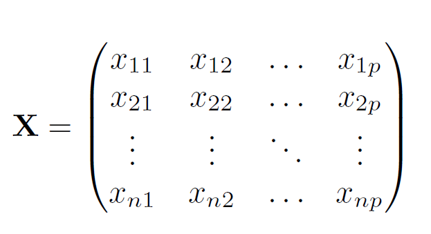
```

The first PC is obtained by solving

```{r , echo=FALSE,  fig.align='center', out.width = '80%'}
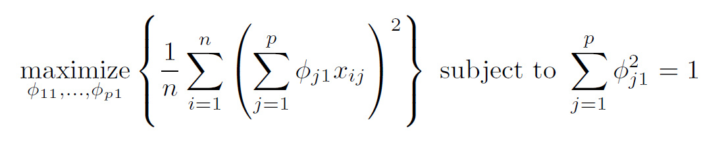
```


<!-- ## PCA: First PC -->

<!-- The loading vector $\phi_1$ defines a direction in feature space along which the data vary the most. -->

<!-- ```{r , echo=FALSE,  fig.align='center', out.width = '80%'} -->
<!-- 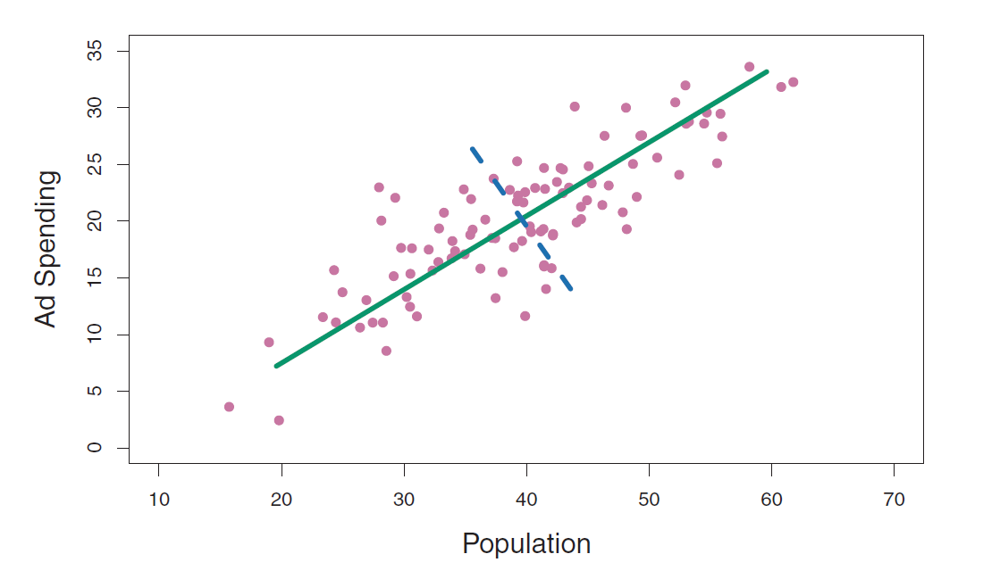 -->
<!-- ``` -->

<!-- ```{r , echo=FALSE,  fig.align='center', out.width = '70%'} -->
<!-- 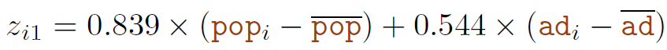 -->
<!-- ``` -->

<!-- ## PCA: First PC -->

<!-- ```{r , echo=FALSE,  fig.align='center', out.width = '100%'} -->
<!-- 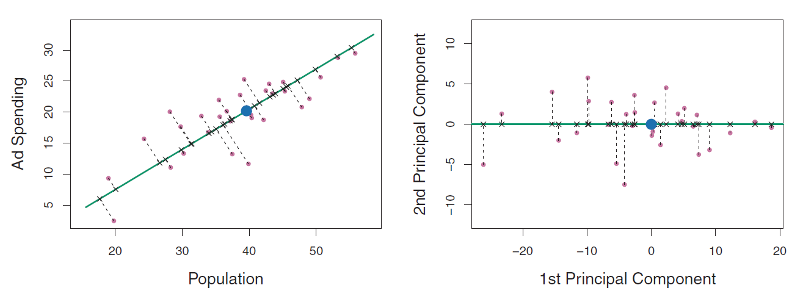 -->
<!-- ``` -->

<!-- The first PC scores are the projections of the $n$ data points onto the first PC direction. -->

<!-- ```{r , echo=FALSE,  fig.align='center', out.width = '70%'} -->
<!--  -->
<!-- ``` -->

## PCA: Second PC

The **second principal component** $Z_2$ is the linear combination of $X_1,\ldots,X_p$ that has maximal variance among all linear combinations that are **uncorrelated** with $Z_1$.

The second PC scores are $z_{12}, z_{22}, \ldots, z_{n2}$ where

```{r , echo=FALSE,  fig.align='center', out.width = '70%'}
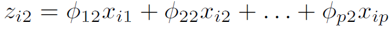
```

$\phi_2$ is the **second PC loading vector** with **loadings** $\phi_{12},\phi_{22}, \ldots, \phi_{p2}$.

$Z_2$ **uncorrelated** with $Z_1$ is equivalent to $\phi_2$ being orthogonal (perpendicular) with $\phi_1$.

<!-- ## PCA: Second PC -->

<!-- ```{r , echo=FALSE,  fig.align='center', out.width = '80%'} -->
<!--  -->
<!-- ``` -->

<!-- ```{r , echo=FALSE,  fig.align='center', out.width = '80%'} -->
<!-- 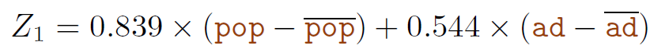 -->
<!-- ``` -->

<!-- ```{r , echo=FALSE,  fig.align='center', out.width = '80%'} -->
<!-- 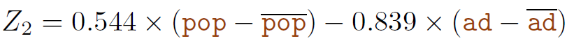 -->
<!-- ``` -->


<!-- ```{r , echo=FALSE,  fig.align='center', out.width = '70%'} -->
<!-- knitr::include_graphics("EFT/t10.1.png") -->
<!-- ``` -->

<!-- ## PCA: Example -->

<!-- ```{r , echo=FALSE,  fig.align='center', out.width = '73%'} -->
<!-- 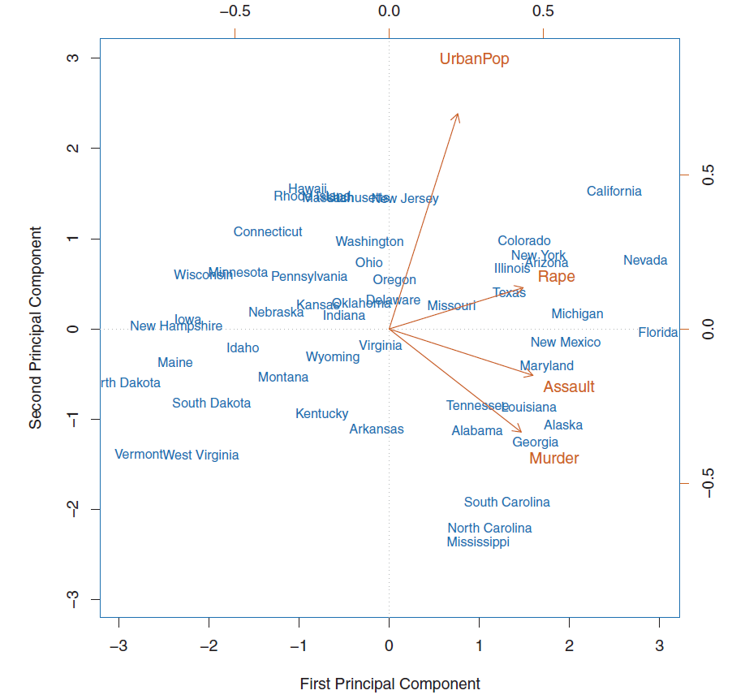 -->
<!-- ``` -->


<!-- ## PCA: Another Interpretation -->

<!-- PCs provide low-dimensional linear surfaces that are closest (using average squared Euclidean distance) to the observations. -->

<!-- ```{r , echo=FALSE,  fig.align='center', out.width = '100%'} -->
<!-- 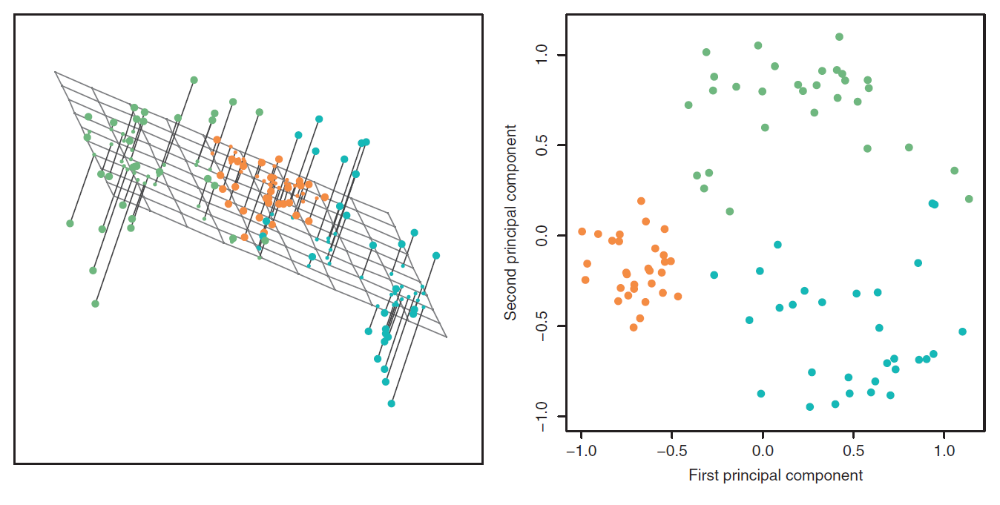 -->
<!-- ``` -->

<!-- ## PCA: Scaling the Variables -->

<!-- If the variables are in different units, scaling each to have standard deviation equal to one is recommended. -->

<!-- ```{r , echo=FALSE,  fig.align='center', out.width = '100%'} -->
<!-- 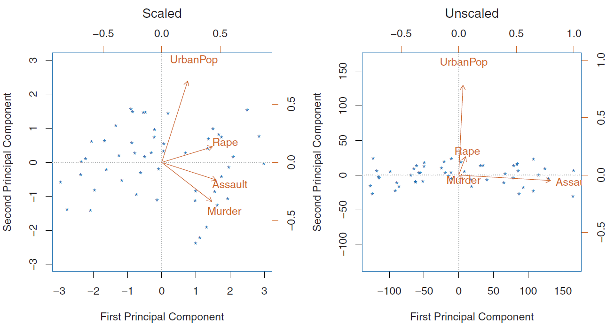 -->
<!-- ``` -->

<!-- ## PCA: Proportion of Variance Explained (PVE) -->

<!-- **Total variance** present in the dataset -->

<!-- ```{r , echo=FALSE,  fig.align='center', out.width = '40%'} -->
<!-- 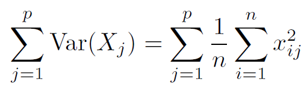 -->
<!-- ``` -->

<!-- Variance explained by the $m^{th}$ PC -->

<!-- ```{r , echo=FALSE,  fig.align='center', out.width = '50%'} -->
<!-- 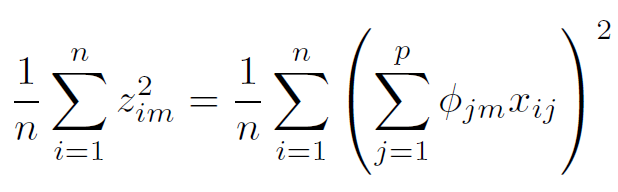 -->
<!-- ``` -->

<!-- The PVE of the $m^{th}$ PC is -->

<!-- ```{r , echo=FALSE,  fig.align='center', out.width = '40%'} -->
<!-- 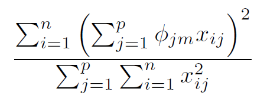 -->
<!-- ``` -->


<!-- ## PCA: Proportion of Variance Explained (PVE) -->

<!-- ```{r , echo=FALSE,  fig.align='center', out.width = '100%'} -->
<!-- 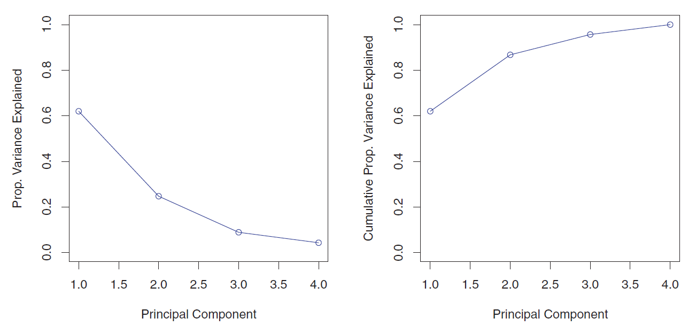 -->
<!-- ``` -->


## PCA: How Many PCs to Use?

* We would like to use the smallest number of PCs required to get a good understanding of the data.

* CV cannot be implemented to answer this question.

* Two common approaches in helping to make this decision (depends on the objective and analytic workflow):

    + Proportion of variance explained (PVE)
    + Screeplot. Look for an **elbow**.
    
    
    
## <span style="color:blue">Your Turn!!!</span>  {.smaller}

You will work with the `iris` dataset. Since we are in the unsupervised learning framework we will drop the `Species` variable which is commonly used as the response. 

```{r}
data("iris")   # load dataset

iris <- iris %>% dplyr::select(-Species)   # drop 'Species'
```

**(1)** Investigate the dataset.


```{r}
sum(is.na(iris))   # no missing entries
```

```{r}
summary(iris)    # all variables are numerical (need to be standardized)
```

## <span style="color:blue">Your Turn!!!</span>  

**(2)** Perform PCA on the dataset after required preprocessing.

```{r}
pca <- prcomp(iris, center = TRUE, scale = TRUE)   # perform PCA on scaled dataset
```

<!-- ## <span style="color:blue">Your Turn!!!</span> {.smaller} -->

**(3)** What proportion of variance is explained cumulatively by the first two principal components? 

```{r}
summary(pca)   # The first two PCs explain approximately 96% of the total variation.
```


## <span style="color:blue">Your Turn!!!</span> 

**(4)** What is the sum of squared loadings for the second PC loading vector? 

```{r}
pca   # obtain loading vectors
```

```{r}
sum(pca$rotation[,2]^2)   # sum of squared loadings for second PC
```


## <span style="color:blue">Your Turn!!!</span> {.smaller}

**(5)** Create a biplot for the analysis. From the biplot, the loading vector for the first PC places most of its weight on which variable(s)? Similarly, the loading vector for the second PC places most of its weight on which variable(s)?

```{r, fig.align='center', fig.height=4.5, fig.width=6}
biplot(pca, scale = 0, cex = 0.6)
```

<!-- * From the biplot, the loading vector for the first PC places most of its weight on which variable(s)? Similarly, the loading vector for the second PC places most of its weight on which variable(s)?  -->

<!-- ```{r} -->
The first loading vector places most if its weight on the variables `Sepal.Length`, `Petal.Length`, and `Petal.Width`. The second loading vector places most if its weight on the variable `Sepal.Width`.
<!-- ``` -->

## <span style="color:blue">Your Turn!!!</span> 

**(6)** From the biplot, which variables seem to be correlated with the variable `Sepal.Length`?

<!-- ```{r} -->
The variables `Petal.Length` and `Petal.Width` are highly correlated with `Sepal.Length`. One can also verify that from the correlation matrix below.

```{r}
cor(iris)   # correlation matrix
```
<!-- ``` -->

**(7)** From the biplot, which observation has the highest first PC score and which observation has the highest second PC score? 

<!-- ```{r} -->
Observation 119 has the highest score for the first PC, whereas observation 61 has the highest score for the second PC.
<!-- ``` -->


## Principal Components Regression (PCR) {.smaller}

PCA can be used to represent correlated variables with a smaller number of uncorrelated features (called principal components) and the resulting components can be used as predictors in a linear regression model. This two-step process is known as principal components regression (PCR).

```{r , echo=FALSE,  fig.align='center', fig.cap="PCR Workflow. [Adapted from HMLR, Boehmke & Greenwell]", out.width = '70%'}
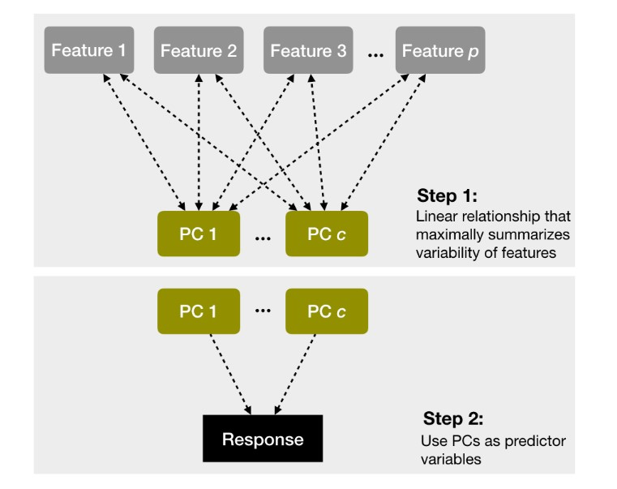
```


## Principal Components Regression (PCR)

There are two equivalent ways of using PCA in supervised learning problems.

* Include `step_pca()` in blueprint and use `method = "lm"` while training/implementing CV. Final model is an MLR model with PCs as predictors.

* directly use `method = "pcr"` while training/implementing CV to choose for the optimal number of PCs. Final model can be built with the `pcr` function from `pls` library.

Let's implement that on the **Ames Housing Dataset**.


<!-- ## PCR: Boston Dataset Example -->

<!-- ```{r} -->
<!-- library(MASS) -->
<!-- data(Boston) -->
<!-- head(Boston) -->
<!-- ``` -->

## Clustering

* Broad class of techniques for finding **subgroups** or **clusters** in a dataset.

* Partition the data into distinct groups so that observations within each group are similar to each other.

* Definition of similarity depends on the context and the dataset being studied.

* We will talk about:
    + K-means clustering
    + Hierarchical clustering


## Clustering: Applications

* Cancer research: $n$ observations correspond to tissue samples for patients with different types of cancer, $p$ features correspond to gene expression measurements.

* Market segmentation: $n$ observations on $p$ variables. Identify subgroups of people who might be more receptive to a particular form of advertising.

* Social network analysis, astronomical data analysis, organizing computing clusters etc.


## K-Means Clustering

Partition the dataset into a pre-specified number of $K$ distinct, non-overlapping clusters.

```{r , echo=FALSE,  fig.align='center', out.width = '100%'}
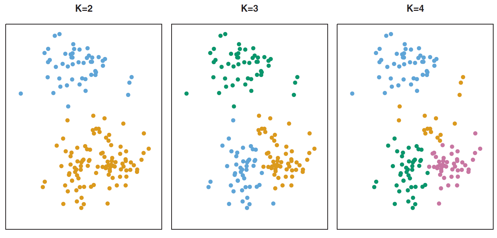
```

The coloring (ordering) of the clusters is arbitrary.

## K-Means Clustering

```{r , echo=FALSE,  fig.align='center', out.width = '70%'}
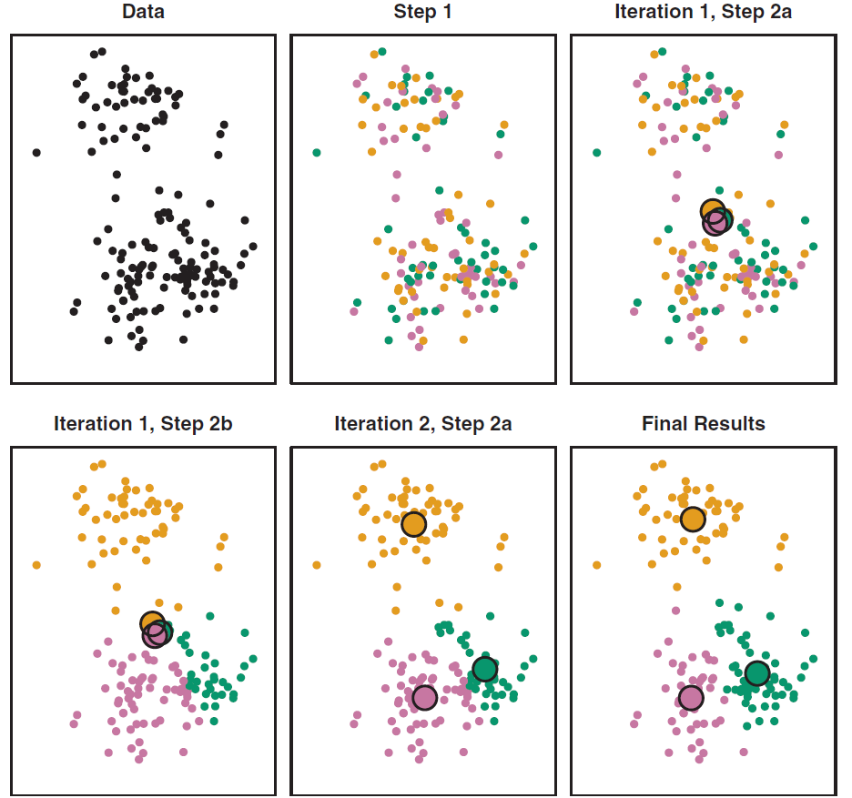
```

<!-- ## K-Means Clustering Formulation -->

## K-Means Clustering

<!-- Let $C_1,C_2, \ldots, C_K$ denote sets containing the indices of the observations in each cluster. These sets satisfy two properties: -->

<!-- ```{r , echo=FALSE,  fig.align='center', out.width = '100%'} -->
<!-- 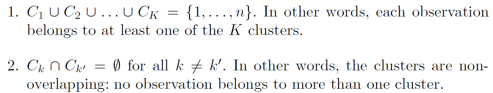 -->
<!-- ``` -->

<!-- If the $i^{th}$ observation is in the $k^{th}$ cluster, then $i \in C_k$. -->

The idea behind K-means clustering is that a **good clustering** is one for which the **within-cluster variation** is as small as possible. The resulting clusters are such that

* each observation belongs to at least one cluster, and

* clusters are non-overlapping, no observation belongs to more than one cluster.


## K-Means Clustering Formulation

The **within-cluster variation** for cluster $C_k$ is a measure $W(C_k)$ of the amount by which the observations within a cluster differ from each other. Thus the objective is to

```{r , echo=FALSE,  fig.align='center', out.width = '30%'}
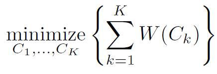
```

where

```{r , echo=FALSE,  fig.align='center', out.width = '55%'}
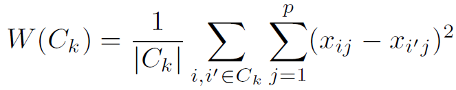
```

Combining, we have,

```{r , echo=FALSE,  fig.align='center', out.width = '60%'}
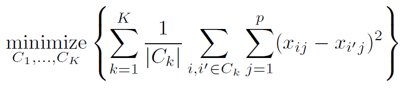
```


## K-Means Clustering Algorithm

```{r , echo=FALSE,  fig.align='center', out.width = '100%'}
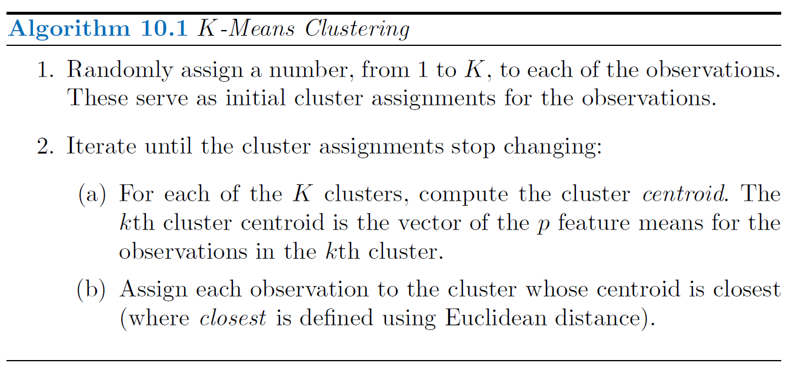
```


## K-Means Clustering Algorithm

* The algorithm is guaranteed to decrease the value of the objective at each step since

```{r , echo=FALSE,  fig.align='center', out.width = '90%'}
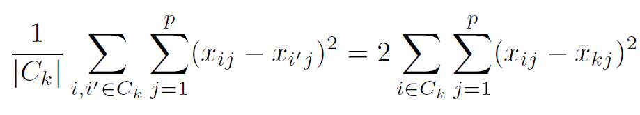
```

where $\bar{x}_{kj}=\frac{1}{|C_k|}\sum_{i \in C_k} x_{ij}$: mean of $j^{th}$ feature in cluster $C_k$.

* The algorithm is not guaranteed to find the global optimum.

* Results depend on the initial (random) cluster assignments. It is recommended to run the algorithm multiple times from different random initial configurations.


## K-Means Clustering Algorithm

```{r , echo=FALSE,  fig.align='center', out.width = '70%'}
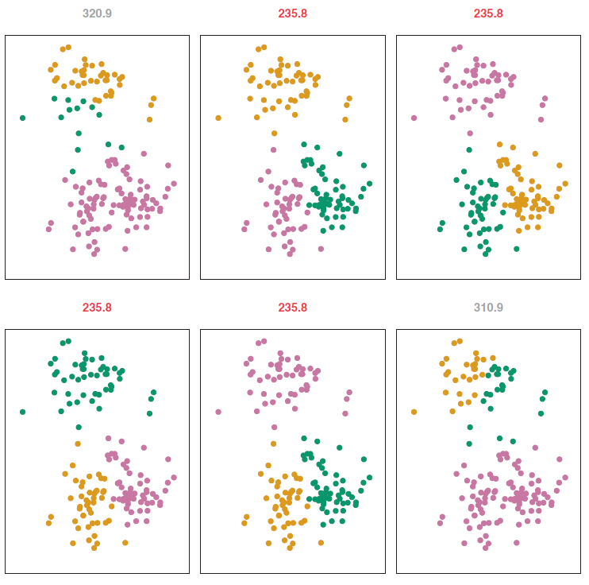
```


## Hierarchical Clustering

* K-means clustering requires us to pre-specify the number of clusters $K$. This can be a disadvantage.

* Hierarchical clustering is an alternative approach which does not require that we commit to a particular choice of $K$.

* Hierarchical clustering results in a tree-based representation of the observations, called a **dendrogram**.

* We discuss **bottom-up** or **agglomerative** clustering. This is the most common type of hierarchical
clustering. The dendrogram is built starting from the leaves (bottom) and combining clusters up to the trunk (top).


## Hierarchical Clustering

```{r , echo=FALSE,  fig.align='center', out.width = '70%'}
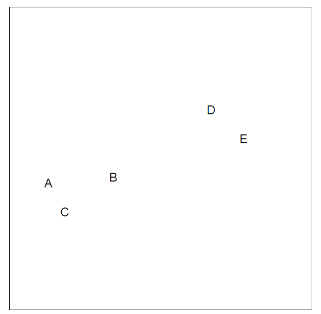
```


## Hierarchical Clustering

```{r , echo=FALSE,  fig.align='center', out.width = '100%'}
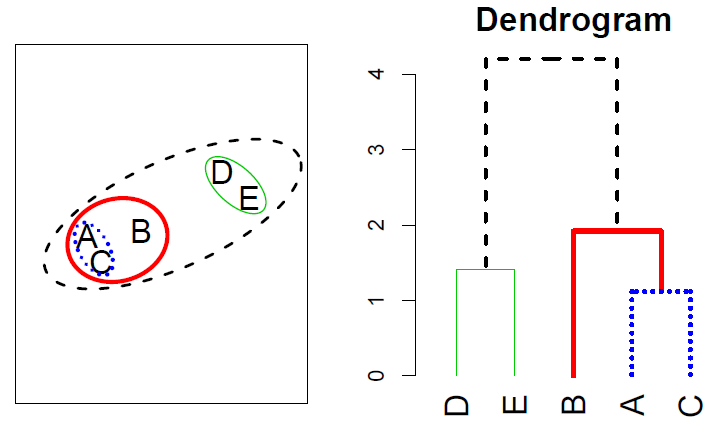
```

<!-- ## Hierarchical Clustering: Interpreting a Dendrogram -->

<!-- ```{r , echo=FALSE,  fig.align='center', out.width = '100%'} -->
<!-- 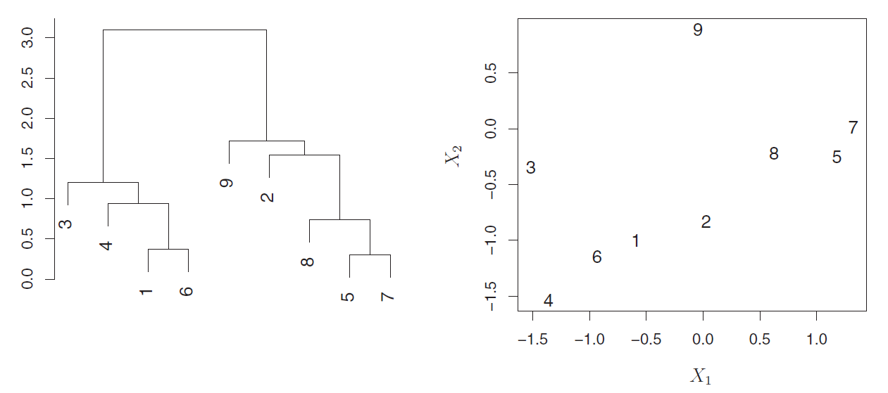 -->
<!-- ``` -->

<!-- ## Hierarchical Clustering: Example -->

<!-- **Simulated dataset** -->

<!-- ```{r , echo=FALSE,  fig.align='center', out.width = '60%'} -->
<!-- 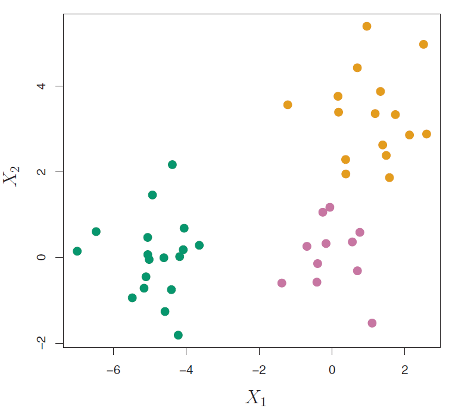 -->
<!-- ``` -->

<!-- ## Hierarchical Clustering: Example -->

<!-- **Dendrogram from simulated dataset** -->

<!-- ```{r , echo=FALSE,  fig.align='center', out.width = '100%'} -->
<!-- 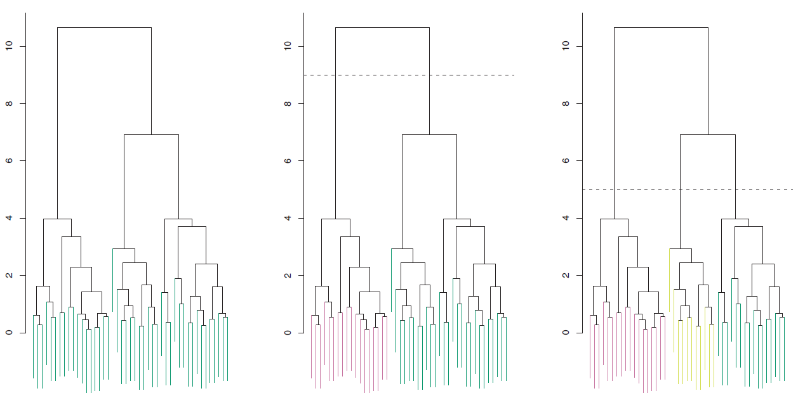 -->
<!-- ``` -->

## Hierarchical Clustering: Types of Linkage

```{r , echo=FALSE,  fig.align='center', out.width = '100%'}
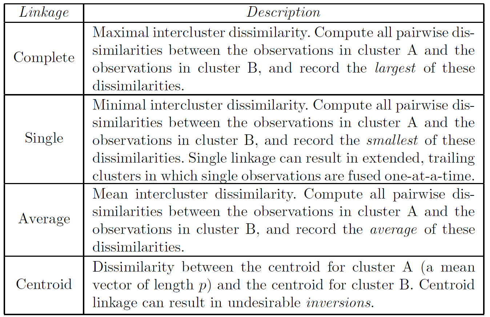
```

<!-- ## Hierarchical Clustering: Types of Linkage -->

<!-- ## Hierarchical Clustering: Types of Linkage -->

<!-- ```{r , echo=FALSE,  fig.align='center', out.width = '100%'} -->
<!-- 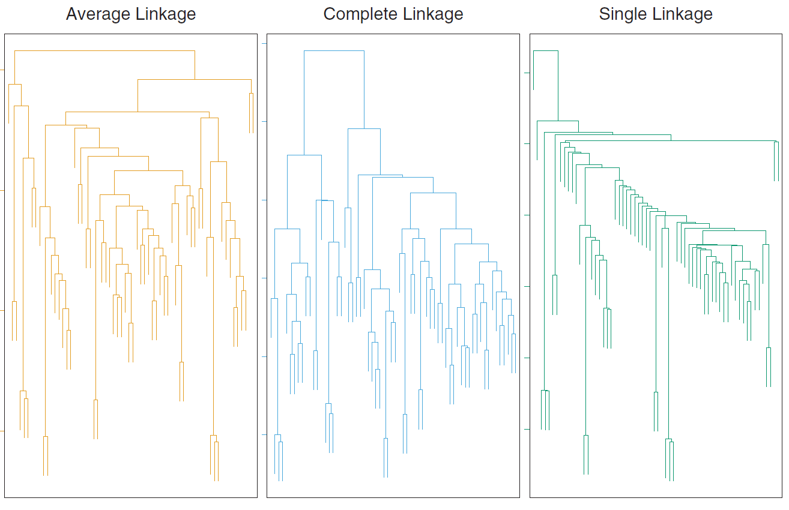 -->
<!-- ``` -->

## Hierarchical Clustering Algorithm

```{r , echo=FALSE,  fig.align='center', out.width = '100%'}
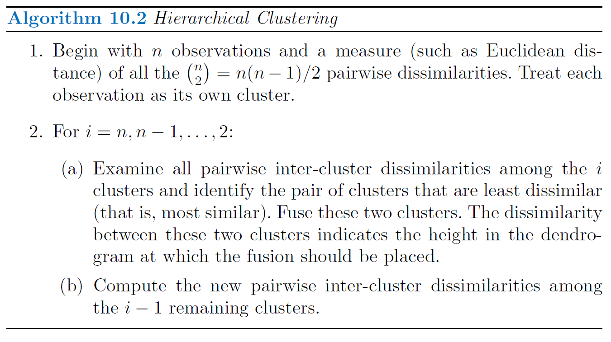
```

<!-- ## Hierarchical Clustering Algorithm -->

<!-- ```{r , echo=FALSE,  fig.align='center', out.width = '70%'} -->
<!-- 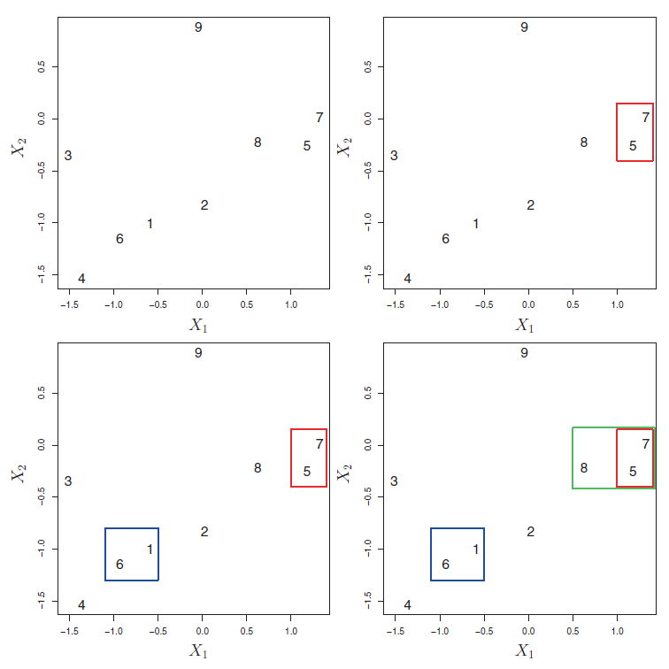 -->
<!-- ``` -->

## Hierarchical Clustering: Choice of Dissimilarity Measure

**Correlation-based distance** considers two observations to be similar if their features are highly correlated. It focuses on the shapes of dissimilarity profiles rather than their magnitudes.

```{r , echo=FALSE,  fig.align='center', out.width = '60%'}
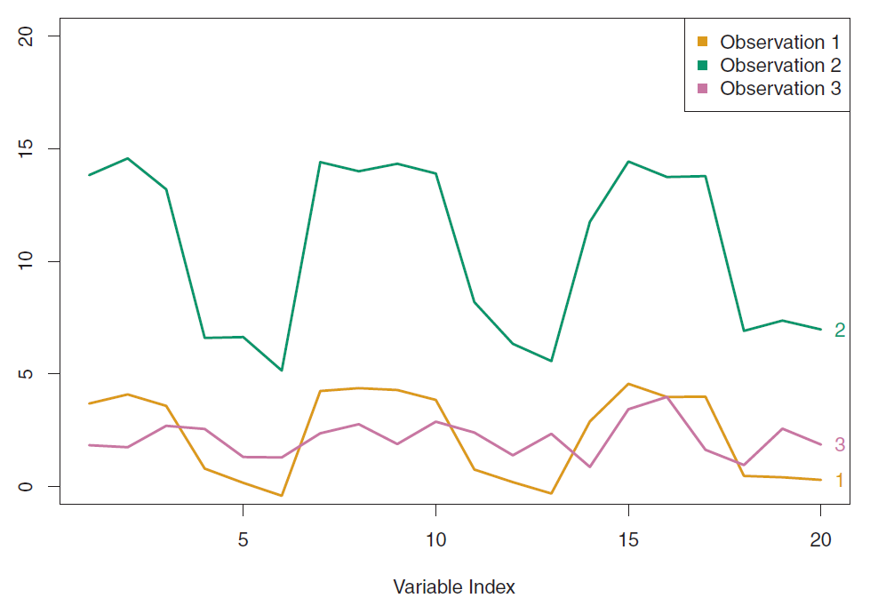
```


## Practical Issues in Clustering

* Scaling of the variables matters.

* Choices in hierarchical clustering.
    + Dissimilarity measure
    + Type of linkage
    + Where to cut the dendrogram?

* Choices in K-means clustering.
    + What should be the value of $K$?

* Clustering methods are not very robust to perturbations to the data.

* Which features should be used for clustering?

* For more details, see *Elements of Statistical Learning*, Chapter 14.


## <span style="color:blue">Your Turn!!!</span> 

You will work with the `USArrests` dataset. 

```{r}
library(ISLR2)   # load package
data("USArrests")   # load dataset
```

**(1)** Using `fviz_nbclust`, choose an appropriate number of clusters separately for K-means and hierarchical clustering.

**(2)** Implement K-means with your chosen number of clusters. Plot the resulting clusters. Mention any three states that are clustered together with Wisconsin.

**(3)** Implement hierarchical clustering (both `complete` and `single` linkage) with your chosen number of clusters. Observe the respective dendrograms. What do you see?


## <span style="color:blue">Your Turn!!!</span> 

Winter works at a juice-packing company where she uses a machine-learning model to predict the demand for different juice flavors. After training and evaluating the model, Winter was confident that it was ready for production. The model was deployed, and the company started using it to plan its production and distribution.

During the first few months, everything was working as expected. But then, the company noticed that the model consistently overestimated the demand for certain flavors. What could be the cause of the problem with the model?

* The model is underfitting and needs more complexity.

* The model is overfitting and needs more regularization.
* The model is suffering from data drift.
* The model is suffering from sampling bias.


## <span style="color:blue">Your Turn!!!</span> 

Winter's been working on a model to classify photos of food. Her company is building an application that will let users snap a picture of a plate at a restaurant and show them a potential recipe so they can cook it at home. After a year of work, Winter's model was working great. The company launched the model worldwide and started monitoring user feedback.

Unfortunately, users from an Asian country complained because the model wasn't working for them. What is the most likely reason for the problem?

* Winter's model didn't have enough complexity to learn all the data, so it's normal to have problems with certain regions.

* Winter needed to train the model for more time to fully capture the dataset's information.
* Winter's model is suffering from data drift.
* Winter's model is suffering from sampling bias.


## To Sum It All Up


```{r , echo=FALSE,  fig.align='center', out.width = '100%'}
knitr::include_graphics("EFT/MachineLearningAlgorithms.png")
```


## Next Steps

* Statistics and Data Science Minor

* Future readings

  + *Elements of Statistical Learning*, HTF
  + *Deep Learning*, GBC
  + Optimization Algorithms
  + Linear Algebra
  + Programming in Python